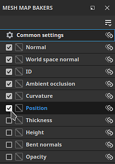

# Création de cartes de maillage

Le mode de cuisson dédié de Substance 3D Painter facilite la réalisation de cartes maillées qui peuvent alimenter de superbes matériaux intelligents et d’autres outils. Lisez ce qui suit ou regardez la vidéo ci-dessous pour apprendre à cuisiner avec Substance 3D Painter.

## 1 - Passer en mode cuisson

Par défaut, Painter démarre en mode Peinture lors de la création ou de l’ouverture d’un projet. Pour pouvoir créer des cartes de maillage, vous devez passer en mode Cuisson. Utilisez l’une des options suivantes pour passer en mode Cuisson :

* Utilisez le <b>bouton du mode Baking</b> (<b>icône Croissant</b>) dans la barre d&#39;outils contextuelle en haut à droite de la fenêtre d&#39;affichage

  

  >[!NOTE]
  >
  > Selon la disposition de votre espace de travail, il arrive que le bouton <b>Mode cuisson</b> soit masqué derrière d&#39;autres panneaux.
* Utilisez le menu Mode et sélectionnez <b>Créer des cartes de maillage.\
  </b>
* Utilisez le raccourci clavier <b>F8</b>.

### 2 - Sélectionner des ensembles de textures et des tuiles UV

Dans la <b>liste des ensembles de textures</b>, utilisez la case à cocher en regard de chaque ensemble de textures (et du numéro des carreaux UV, le cas échéant) pour sélectionner les parties à cuire :

### 3 - Sélectionner des boulangers

Dans la fenêtre Boulonneurs de cartes de maillage, utilisez les cases à cocher pour sélectionner les cartes que vous souhaitez boulonner :

### 4 - Modifier les paramètres courants

Dans le panneau Boulangers de cartes de maillage, cliquez sur les paramètres courants pour modifier les paramètres tels que la résolution de map bakée, la largeur de dilatation et les paramètres poly élevés, qui sont partagés sur toutes les cartes :

Dans les paramètres courants, vous pouvez définir les fichiers à utiliser comme maillages haute définition. La sélection de maillages haute définition vous permet de définir la façon dont la cage est générée pour vos maillages :

* Distance : dilatez les sommets à distance du maillage de manière uniforme sur le modèle pour créer une cage.
* Automatique (expérimental) : Painter analyse votre maillage et génère automatiquement une cage, en essayant de maintenir la cage près de la surface sans créer d&#39;intersections pour de meilleurs résultats.
* Fichier personnalisé : importez un fichier que vous avez créé pour l&#39;utiliser comme cage. Notez que les fichiers importés doivent avoir le même nombre de sommets que le maillage de base pour fonctionner correctement.

Si vous n&#39;utilisez pas un filet à haute teneur en poly, activez la case à cocher <b>Utiliser un filet à faible teneur en poly comme filet à haute teneur en poly</b>.

### 5 - Régler la cage

Différentes options sont disponibles pour ajuster la cage en fonction de la méthode de cage que vous utilisez. Avec une cage basée sur les distances, vous pouvez ajuster les distances Frontale et Arrière pour minimiser le degré d&#39;intersection entre la cage et votre maillage.

>[!NOTE]
>
> Des points rouges apparaissent lorsque la cage intersecte la géométrie du modèle. Une cage qui se croise génère généralement des artefacts et des problèmes dans la zone d&#39;intersection.

### 6 - Démarrer le processus de cuisson

En bas de la fenêtre, cliquez sur le bouton Cuire pour lancer le processus de cuisson.

### 7 - Inspect du journal de cuisson pour les erreurs

Une fois le processus de cuisson terminé, vous pouvez consulter la fenêtre Journal de cuisson pour vérifier s&#39;il y a des erreurs signalées.

S’il y en a, utilisez la flèche en regard du message d’erreur pour afficher les paramètres de boulangerie pertinents :

