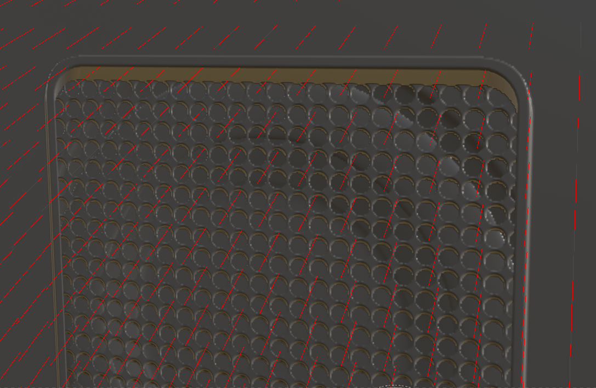

# Correction de la déviation

<table>
  <tr style="border: 0;">
    <td style="border: 0; width: 35%" valign="top"></td>
    <td style="border: 0; width: 65%" valign="top">Parfois, lors de la cuisson à bas-poly à partir d'un modèle à haut-poly, il est possible que les détails semblent déformés ou inclinés. Cela se produit généralement lorsque les normales de la cage et les normales de surface ne s'alignent pas correctement. La cuisson automatique projette le poly élevé sur le poly faible en fonction de ces valeurs normales. Par conséquent, si elles sont incorrectes, la cuisson produit de mauvais résultats. Heureusement, la correction de l'inclinaison (ou le mappage de l'inclinaison) est disponible pour aider à corriger ce type d'artefact. La correction d'inclinaison vous permet de peindre les valeurs directement sur le maillage en bas-poly pour rediriger la projection utilisée pendant la cuisson sans avoir besoin de créer une cage personnalisée.</td>
  </tr>
</table>

>[!NOTE]
>
> La correction d&#39;inclinaison est peinte dans le **mode de cuisson** et est stockée par ensemble de textures.

## Corrections d’inclinaison de la peinture

La peinture de correction d’inclinaison vous permet d’ajuster manuellement les normales de surface de votre filet, en particulier pour le cuisson. Même si vous pouvez peindre les corrections d&#39;inclinaison sans cuisson au four, il peut être utile de [cuire vos cartes de maillage en premier](how-to-bake-mesh-maps.md).

*Basculez en mode cuisson pour accéder aux paramètres de correction de l&#39;inclinaison.*

>[!IMPORTANT]
>
> La peinture de correction d’inclinaison nécessite les paramètres suivants :
>
> * Une scène High poly doit être sélectionnée. La peinture inclinée n&#39;est disponible que lors de la cuisson de haut en bas poly ; si l&#39;option **Utiliser un filet de bas poly comme filet de haut poly** est cochée, la peinture de correction d&#39;inclinaison **n&#39;est pas** disponible.
> * **La cage** doit être définie sur **en fonction de la distance**.
> * **Les normales moyennes** doivent être vérifiées.

Avec les paramètres ci-dessus, vous pouvez cliquer sur **Correction de l&#39;inclinaison de la peinture** dans le **panneau Paramètres communs** pour commencer à peindre. Lorsque vous passez en mode de peinture Correction d&#39;inclinaison pour la première fois, le **recadrage automatique** est automatiquement activé pour la couche normale. Si vous le souhaitez, vous pouvez désactiver le **recréation automatique** ou modifier le canal sélectionné dans le [**panneau Boulangers de cartes maillées**](../interface/baking-panels/mesh-map-bakers.md).

### Outils de peinture

Lorsque vous peignez des corrections d&#39;inclinaison, vous pouvez utiliser la plupart des outils et raccourcis habituels du mode Peinture, y compris les outils **Gomme** et **Remplissage polygonal**.

* Vous pouvez basculer entre **Pinceau**, **Gomme** et **Remplissage polygonal** à partir de la barre d&#39;outils, ou utiliser le [raccourci clavier](../interface/settings/shortcuts.md) standard à partir du mode Peinture.
* Lors de l&#39;utilisation des outils Pinceau ou Gomme, vous pouvez régler l&#39;épaisseur, le débit, l&#39;opacité et l&#39;espacement du pinceau à l&#39;aide des paramètres situés en haut de la **Fenêtre d&#39;affichage**. Vous pouvez également utiliser le [raccourci clavier](../interface/settings/shortcuts.md) pertinent, le cas échéant.

### Protection des bords

La protection des contours ignore la correction d’inclinaison peinte près des contours pour conserver un dégradé régulier des normales de surface. Vous pouvez activer/désactiver la **protection des contours** dans la section **Correction de l&#39;inclinaison**. Lorsque la **correction des contours** est activée, vous pouvez ajuster la distance et le contraste des contours pour obtenir des résultats optimaux.

* Distance du contour : contrôle la distance à laquelle la protection du contour prend effet.
* Contraste des contours : contrôle le dégradé de protection des contours. Un faible contraste produit un dégradé plus lisse.

>[!TIP]
>
> Les valeurs de **distance des contours** et de **contraste des contours** sont basées sur la taille du filet. Pour les maillages comportant très peu de détails par rapport au maillage, il peut être plus facile de saisir manuellement des valeurs faibles, plutôt que d’utiliser les curseurs.

>[!NOTE]
>
> La protection des contours est basée sur la carte de maillage **Contours nets**, qui est liée à la géométrie du maillage, et non aux bordures UV.

### Visualisation des vecteurs inclinés

Par défaut, lorsque vous commencez à peindre les corrections d&#39;inclinaison, les normales des surfaces maillées sont affichées dans la **fenêtre** sous forme de lignes rouges, jaunes et vertes. Vous pouvez modifier l&#39;apparence de ces lignes ou les désactiver complètement dans la section **Vecteurs d&#39;inclinaison** du menu **Visualisations** qui apparaît dans la **Fenêtre d&#39;affichage**.

* **Longueur des vecteurs** : ajustez la longueur des lignes dans la clôture. Des lignes plus longues peuvent faciliter la compréhension de la direction du vecteur.
* **Densité UV des vecteurs** : modifiez le nombre de lignes sur la surface du filet. Les vecteurs sont placés dans l’espace UV. Par conséquent, si la densité du maillage est incohérente, le nombre de vecteurs par unité de surface varie en fonction de la taille du polygone dans la carte UV.
* **Opacité des vecteurs** : rendez les vecteurs plus ou moins transparents.

La couleur des vecteurs indique la quantité de correction d’inclinaison appliquée à chaque position vectorielle.

* Les vecteurs rouges indiquent qu’aucune correction d’inclinaison n’est effectuée. Les normales de surface par défaut sont utilisées.
* Les vecteurs verts indiquent que les normales de surface sont entièrement corrigées et directement perpendiculaires à la surface.

*Peindre avec une faible valeur de débit permet de contrôler précisément l’intensité de la correction de l’inclinaison.*

## Optimisation des performances

### Organiser les UV

Le **recréation automatique** est optimisé pour tenter de limiter la recréation à la zone affectée par chaque coup de pinceau lors de la peinture des corrections d’inclinaison. Lorsque vous peignez un trait, l&#39;**effet de recadrage automatique** dessine un cadre de sélection autour du trait dans l&#39;espace UV et recadre tout le contenu du cadre. Cela signifie que si votre trait ne couvre qu&#39;une petite section de l&#39;espace UV, seule une petite zone sera reconstituée, ce qui rend l&#39;opération très efficace.

Cependant, si le contour croise deux Îlots UV de part et d’autre de l’espace UV, même un contour de petite taille peut nécessiter de recadrer la texture entière, ce qui annule l’optimisation.

Par conséquent, nous vous recommandons d’organiser les UV de maillage de sorte que les Îlots UV proches les uns des autres dans l’espace 3D le soient également dans l’espace UV. Cela améliore les performances de **recréation automatique**.

### Définir l’alignement sur UV

En général, la peinture des corrections d&#39;inclinaison avec **Projection > Alignement** défini sur UV est plus performante. Pour modifier l&#39;**alignement** :

1. Sélectionnez **Correction de l&#39;inclinaison de la peinture** et équipez-vous du **pinceau** ou de la **gomme**.
1. Cliquez avec le bouton droit de la souris dans la **fenêtre d&#39;affichage** pour ouvrir le **panneau des paramètres de pinceau**.
1. Faites défiler la page jusqu&#39;à **Projection**.
1. Définissez **Alignement** sur **UV**.

Avec l&#39;**alignement** défini sur **UV**, il est plus difficile de peindre des traits lisses sur les coutures d&#39;Îlot UV. Cependant, cela est généralement moins important lorsque vous peignez des corrections d&#39;inclinaison que lorsque vous texturez votre filet.

>[!NOTE]
>
> Les paramètres du **pinceau** et de la **gomme** sont stockés séparément. Pour optimiser les performances des deux outils, vous devez définir l&#39;**alignement** pour chacun d&#39;eux individuellement.

## Corrections d’inclinaison et pile d’annulation

La boulangerie et la peinture partagent un même historique des annulations. Basculer entre les modes de cuisson et de peinture est en soi une étape annulable. L’activation ou la désactivation de la correction d’inclinaison peut également être annulée. Lorsque vous annulez une opération de boulangerie en mode Peinture, le mode Boulangerie est automatiquement rouvert avant que ces étapes ne soient annulées. L’action n’est donc jamais annulée en dehors du mode dans lequel elle s’est produite.