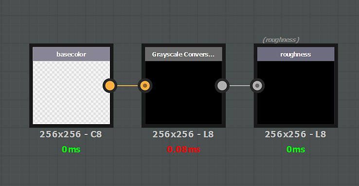

# Filtre spécifique au canal

Un effet peut être spécifique à une couche particulière. Dans ce cas, si vous voulez affecter un canal spécifique, vous devez créer une entrée ET une sortie qui identifie ce canal. En règle générale, la structure d&#39;entrée/sortie doit toujours respecter une règle 1:1. Si vous voulez entrer une couche spécifique, vous devez sortir la même couche.

Exemple de filtre affectant uniquement le canal **basecolor** :

>[!NOTE]
>
> Il n’est pas possible de combiner une configuration générique (nœuds d’entrée/sortie) et des canaux spécifiques (couleur de base/couleur de base).

## gestion des composants Alpha

Les couches stockées au format RVBA prennent en charge les couches alpha (couleur de base, par exemple). Pour ces couches, l’entrée/sortie alpha peut être stockée directement dans la sortie de la couleur de Substance. Cependant, le moteur de Substance de données ne prend pas en charge l’Alpha pour les images en niveaux de gris : il doit être géré à l’aide d’un mappage secondaire. Pour obtenir la composante alpha d’une couche spécifique dans un graphique Substance, créez une entrée en niveaux de gris nommée « **nom\_Alpha** », par exemple : **couleur\_Alpha**, **rugosité\_Alpha**, etc.\
Pour générer ce composant alpha, créez un nœud de sortie avec la même convention de noms.

>[!NOTE]
>
> La sortie « **\_Alpha** » spécifique par canal ne fonctionne pas avec les **matières** normales. Pour masquer un canal à l’aide d’un masque, une sortie spécifique doit être créée avec la convention de dénomination suivante :
> 
> * Identifiant : **canaux\_Alpha**
> * Utilisation : **canaux\_Alpha**

## Liste des utilisations et identifiants d’entrée/sortie

>[!NOTE]
>
> Il est possible d&#39;utiliser l&#39;**utilisation** ou l&#39;**identifiant** dans un nœud d&#39;entrée (l&#39;utilisation a la priorité).

| Nom du canal | Utilisation | Identifiant/Alpha de l’identifiant |
| --- | --- | --- |
| *Occlusion ambiante* | **ambianteOcclusion** | **ambianteOcclusion / ambianteOcclusion\_Alpha** |
| *Angle d&#39;Anisotropie* | **anisotropyangle** | **anisotropyAngle / anisotropyAngle\_Alpha** |
| *Niveau d&#39;Anisotropie* | **anisotropylevel** | **anisotropyLevel / anisotropyLevel\_Alpha** |
| *Couleur de base* | **basecolor** | **baseColor / baseColor\_Alpha** |
| *Masque de fusion* | **blendingmask** | **blendingmask / blendingmask\_Alpha** |
| *Diffus* | **diffusion** | **Alpha de diffusion/diffusion\_diffusion** |
| *Displacement* | **displacement** | **displacement/displacement\_Alpha** |
| *Émissif* | **émissif** | **émissif / émissif\_Alpha** |
| *Lustre* | **brillance** | **brillance / brillance\_Alpha** |
| *Height* | **height** | **height/height\_Alpha** |
| *IOR* | **ior** | **ior / ior\_Alpha** |
| *Métallique* | **métallique** | **métallique / métallique\_Alpha** |
| *Normal* | **normal** | **normal / normal\_Alpha** |
| *Opacité* | **opacité** | **opacité/opacité\_Alpha** |
| *Réflexion* | **réflexion** | **réflexion / réflexion\_Alpha** |
| *Rugosité* | **rugosité** | **rugosité / rugosité\_Alpha** |
| *Diffusion* | **diffusion** | **diffusion/diffusion\_Alpha** |
| *Specular* | **specular** | **specular / specular\_Alpha** |
| *Specular level* | **niveau spéculaire** | **specularLevel / specularLevel\_Alpha** |
| *Transmissif* | **transmissif** | **transmissif / transmissif\_Alpha** |
| *Utilisateur 0* | **user0** | **user0 / user0\_Alpha** |
| *Utilisateur 1* | **utilisateur1** | **utilisateur1 / utilisateur1\_Alpha** |
| *Utilisateur 2* | **utilisateur2** | **utilisateur2 / utilisateur2\_Alpha** |
| *Utilisateur 3* | **utilisateur3** | **user3 / user3\_Alpha** |
| *Utilisateur 4* | **utilisateur4** | **user4 / user4\_Alpha** |
| *Utilisateur 5* | **utilisateur5** | **user5 / user5\_Alpha** |
| *Utilisateur 6* | **utilisateur6** | **utilisateur6 / utilisateur6\_Alpha** |
| *Utilisateur 7* | **utilisateur7** | **user7 / user7\_Alpha** |

## Exemples

{width="650px"}

Dans cet exemple, la couche alpha de la couleur de base est extraite via un nœud en niveaux de gris pour écraser la couche de **rugosité**.

{width="650px"}

Dans cet exemple, la couche de **rugosité** est multipliée sur la **couleur de base**.
