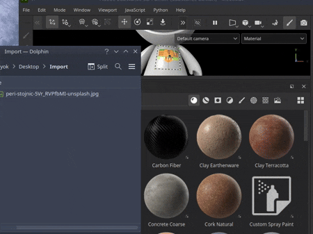
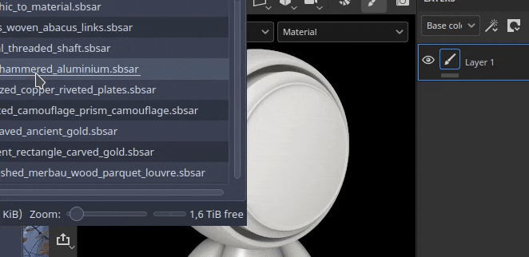

# Ajout de ressources par glisser-déposer

L’importation de ressources peut se faire simplement par glisser-déposer un fichier depuis l’extérieur de l’application dans différentes zones de l’interface.

## Importation dans la fenêtre Actifs

Pour importer une ressource dans Painter, faites-la glisser dans la fenêtre Actifs.

Cela ouvrira la fenêtre Importer la ressource qui permet de contrôler où placer la ressource (à l’intérieur du projet, sur le disque pour une réutilisation entre les projets ou dans la session pour une utilisation temporaire). Cette fenêtre permet également de configurer correctement l&#39;utilisation d&#39;une ressource, car parfois certains formats de fichiers peuvent être ambigus.

### Importation dans la clôture

Pour importer et appliquer directement un matériau dans votre projet, faites-le glisser dans la clôture. Tout en faisant glisser le fichier, il doit mettre en surbrillance le filet pour indiquer à quelle partie du projet il sera appliqué.

Il est également possible d’importer un fichier de SVG en le faisant glisser dans la clôture. Ainsi, vous créerez un nouveau calque avec le mode de projection de déformation et la ressource <b>Graphique vers matériau</b>, ce qui le rend pratique pour créer des décalcomanies.

### Importation dans la pile de calques

Glisser-déposer une ressource dans le calque créera des calques (ou effets) lors de la dépose. Un menu peut s’afficher pour demander dans quel canal placer la ressource s’il ne s’agit pas d’une Substance ou d’un filtre.

<table>
<tr style="border: 0;">
<td style="border: 0;" valign="top">

<b>Audio</b>

Ajustez ou ajoutez des données audio à votre projet.

* Réglez le volume vidéo source s’il contient de l’audio.
* Ajouter, supprimer ou remplacer un fichier audio externe.
* Réglez le volume du fichier audio externe.

</td>
<td style="border: 0;" valign="top">

</td>
</tr>
</table>

### Importation dans un emplacement de ressource

Glissez et déposez un fichier dans l&#39;un des emplacements de ressources de l&#39;interface, comme par exemple dans un canal à l&#39;intérieur d&#39;un calque de remplissage, importera la ressource et l&#39;appliquera automatiquement.

