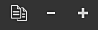
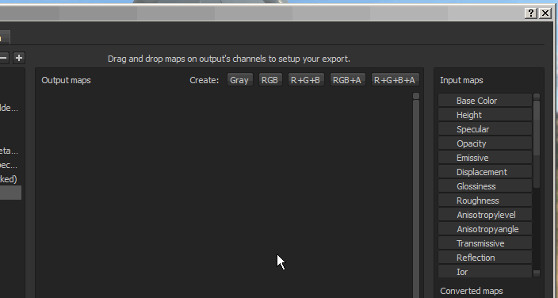
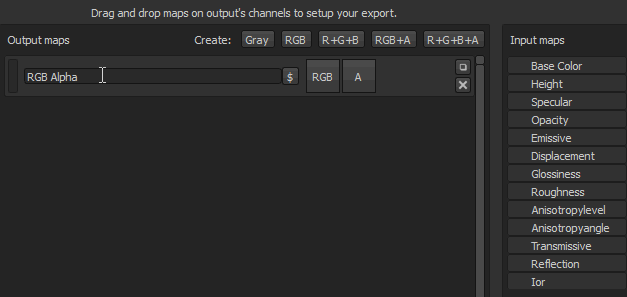

# Création de Modèles de sortie

Cette page explique comment créer et modifier des Modèles de sortie personnalisés. Les modèles de sortie contrôlent la dénomination et la configuration des textures exportées. La création d’un Modèle de sortie personnalisé vous permet de configurer vos exportations pour qu’elles correspondent parfaitement à votre workflow.

L’onglet Configuration de la fenêtre d’exportation est divisé en trois parties principales :

* <b>Liste des paramètres prédéfinis :</b> (à gauche) permet de choisir le modèle à modifier ou dupliquer et de renommer les modèles existants.
* <b>Liste des textures de sortie</b> : (au milieu) indiquez le contenu d&#39;un paramètre prédéfini sélectionné et affichez la convention de dénomination et les options de packing de couche.
* <b>Liste des couches</b> et <b>Textures converties</b> : (à droite) liste des couches et des textures à utiliser pour composer le contenu d’une texture exportée.

{width="800px"}

>[!NOTE]
>
> Les modèles de sortie sont enregistrés sur le disque en tant que <b>fichiers individuels</b> et peuvent être partagés avec tout autre utilisateur de Substance 3D Painter.\
> Les fichiers locaux des modèles personnalisés que vous avez créés se trouvent dans le dossier assets/export-presets de vos [fichiers Substance 3D Painter](../pipeline-and-integration/resource-management/shelf-and-assets-location.md).

>[!NOTE]
>
> Lorsqu’un modèle est utilisé pour exporter des textures, le fichier modèle est automatiquement inclus dans le fichier de projet lors des enregistrements suivants.\
> Cela permet le partage et/ou le déplacement d’un projet vers un autre ordinateur tout en conservant les modèles pour l’exportation des textures.\
> Seul le dernier paramètre prédéfini utilisé est enregistré dans le projet. Toutefois, si Substance 3D Painter détecte un paramètre prédéfini portant le même nom, le paramètre prédéfini dans le projet est marqué comme « Obsolète » dans la liste.

## Création d’un modèle

En haut de la liste des paramètres prédéfinis se trouvent trois boutons :

* <b> Dupliquer</b> : dupliquer un modèle existant.
* <b> Supprimer</b> : supprimez tout modèle sélectionné.
* <b> Créer</b> : créez un modèle vide.

Vous pouvez également double-cliquer sur un modèle ou <b>cliquer avec le bouton droit > renommer</b> pour modifier le nom d&#39;un modèle.

## Création de mappages de sortie

Une fois qu’un modèle est sélectionné, il est possible d’ajouter de nouveaux mappages de sortie à l’aide des boutons dédiés, disponibles en haut de la section centrale de la fenêtre.

Une fois un mappage créé, il est possible de le nommer, puis de faire glisser et déposer les mappages d&#39;entrée dans l&#39;un des slots de canal disponibles.\
Une fois qu’un mappage d’entrée a été déposé dans la section des mappages de sortie, un menu s’ouvre et vous demande quel type de contenu doit être chargé dans cet emplacement.

Les options vont des canaux <b>RGB</b> et <b>individuels</b> à la conversion <b>en Alpha</b> et en <b>niveaux de gris</b> de l&#39;entrée.

>[!NOTE]
>
> Chaque fois qu’un mappage d’entrée est déplacé, une couleur aléatoire est générée. Cela fournit un repère visuel pour les canaux et la carte d’entrée correspondante qui est chargée.\
> Le bouton indique également ce qui est chargé dans l&#39;emplacement :
> 
> * Couleur d&#39;arrière-plan : indique les mappages <b>d&#39;entrée</b> chargés.
> * Barre du RGB : indiquez que les canaux <b>R</b> , <b>G</b> et <b>B</b> du mappage d&#39;entrée sont chargés.
> * Barre rouge : indique que le canal <b>rouge</b> du mappage d&#39;entrée est chargé.
> * Barre verte : indique que le canal <b>vert</b> du mappage d&#39;entrée est chargé.
> * Barre bleue : indique que le canal <b>bleu</b> du mappage d&#39;entrée est chargé.
> * Barre de gris : indique que le mappage d&#39;entrée est chargé en <b>niveaux de gris</b> (d&#39;une conversion RGB en niveaux de gris ou parce que l&#39;entrée est déjà en niveaux de gris).
> * Ligne noire/blanche : indique que le canal <b>alpha</b> du mappage d&#39;entrée est chargé. Dans Substance 3D Painter, la valeur alpha d’une entrée correspond à la zone peinte totale.

## Dénomination des mappages de sortie

Certains indicateurs sont disponibles pour générer automatiquement le nom de la texture pendant le processus d’exportation.

* <b> $mesh</b> : nom du fichier de maillage chargé dans le projet
* <b> $textureSet</b> : nom du jeu de textures
* <b> /</b> (barre oblique inverse) : séparation des dossiers

<b> Exemple</b> : cymourai.fbx avec un ensemble de textures nommé « MaterialBase »

* <b>$mesh\_$textureSet\_BaseColor</b> générera <b>cymourai\_MaterialBase\_BaseColor.png.</b>
* <b>$mesh/$textureSet\_BaseColor</b> générera un dossier nommé <b>cymourai</b> avec une texture nommée <b>MaterialBase\_BaseColor.png</b> à l&#39;intérieur.

>[!NOTE]
>
> Les dossiers sont automatiquement convertis en groupes au cas où le format d&#39;exportation est défini comme format de fichier **PSD** (Photoshop).

## Affectation de canaux à des mappages de sortie

Il est possible de laisser certains canaux (de la carte de sortie) totalement vides. Dans ce cas, une couleur par défaut sera attribuée.

>[!NOTE]
>
> Si un emplacement fait référence à une couche absente du jeu de textures lors de l’exportation, une couleur par défaut est également générée.\
> Cette couleur change en fonction de la couche qui donne la meilleure valeur neutre.\
>  **Exemple** : s&#39;il est manquant, le canal height sera généré avec une valeur de gris par défaut.

Il existe différents types de mappages :

* <b>Cartes d&#39;entrée</b> : canaux directs pouvant être ajoutés dans un ensemble de textures. Via le panneau Paramètres de TextureSet.
* <b> mappages de maillage</b> : textures présentes dans les emplacements de mappage supplémentaires d&#39;un ensemble de textures (textures cuites).
* <b> Mappages convertis :</b> textures virtuelles, générées lors de l&#39;exportation en fonction des canaux présents dans le document.
  * <b>OpenGL normal/DirectX</b> : génère une normale dans l&#39;espace dédié en associant la normale à partir des cartes supplémentaires, de l&#39;height et du canal normal.
  * <b>AO mixte</b> : association de la carte supplémentaire Occlusion ambiante avec le canal Occlusion ambiante.
  * <b>Diffus</b> : couleur diffuse générée à partir des couches Couleur de base et Métallique (les parties métalliques seront remplacées par une couleur noire).
  * <b>Specular</b> : couleur Specular générée à partir des couches Couleur de base et Métallique.
  * <b>Éclat</b> : inverse de la couche de rugosité.
  * <b>Diffus Unity4</b> : couleur diffuse générée à partir de BaseColor pour correspondre aux nuanciers Unity4.
  * <b>Brillance Unity4</b> : brillance générée à partir de la rugosité et du canal métallique pour correspondre aux nuanciers Unity4.
  * <b>Réflexion</b> : exportez une carte où le blanc indique des matériaux diélectriques et d&#39;autres couleurs pour les matériaux métalliques
  * <b>1/ior</b> : 1 divisé par la valeur ior, ior est généré à partir de la carte métallique : 1,4 pour les diélectriques, 100 pour les métaux (couleur noire)
  * <b>Éclat2</b> : version carrée du canal d&#39;éclat (Éclat \* Éclat)
  * <b>f0</b> : valeur de réflectance à fresnel 0 (0,04 pour les diélectriques, 1,0 pour les métalliques)
