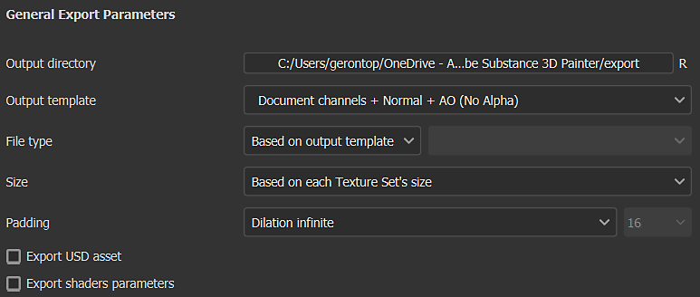

# Paramètres d’export

{width="500px"}

L&#39;<b>onglet Paramètres d&#39;exportation</b> de la <b>fenêtre Exporter les textures</b> vous permet de configurer la composition, la taille et l&#39;emplacement des textures exportées.

## Configuration générale et de Jeux de textures

Le premier élément de la fenêtre est la liste des Jeux de textures sur la gauche. La section Paramètres généraux permet d’accéder aux paramètres communs à tous les Jeux de textures. Cela facilite le réglage d’un seul ensemble de paramètres à appliquer à tous les jeux de textures du projet. Les modifications apportées aux paramètres de jeu de textures individuels remplaceront les paramètres globaux de ce jeu de textures. Par exemple, si vous définissez la résolution sur 2048 dans les paramètres généraux et 1024 comme valeur de remplacement pour un Jeu de textures spécifique, tous les jeux de textures seront exportés à la résolution 2048, sauf celui défini sur 1024.

La case à cocher en regard de chaque nom de Jeu de textures indique si les textures associées seront exportées ou non.

Le menu déroulant est utile pour les projets comportant un grand nombre de jeux de textures, car il vous permet de modifier rapidement la sélection avec les actions <b>Tout sélectionner</b>, <b>Tout désélectionner</b> et <b>Inverser </b>.

## Paramètres généraux d’exportation

Cette section contient les paramètres partagés pour chaque texture qui sera générée :

| Paramètre | Description |
| --- | --- |
| <b>Répertoire de sortie</b> | Emplacement d’enregistrement des textures exportées. |
| <b>Modèle de sortie</b> | Sélectionnez le modèle de sortie utilisé pour nommer et composer les canaux en fichiers de texture. Pour plus d&#39;informations sur les modèles, consultez la liste [Modèles de sortie](../export-presets/export-presets.md). |
| <b>Type de fichier </b> | Le format du fichier et son nombre de bits par pixel. Si l&#39;option <b>D&#39;après le modèle de sortie</b> est sélectionnée, le format de fichier est hérité du paramètre prédéfini d&#39;exportation (ce qui permet de déterminer le format et le nombre de bits par pixel par texture plutôt que globalement). Le nombre de bits par pixel disponible dépend du type de fichier ; pour plus d’informations, consultez le tableau ci-dessous. |
| <b>Taille </b> | Résolution du fichier de texture exporté. Valeurs possibles :<ul data-preserve-html="true"> <li data-preserve-html="true"><b>Selon la taille de chaque Jeu de textures</b></li> <li data-preserve-html="true"><b>128</b></li> <li data-preserve-html="true"><b>256</b></li> <li data-preserve-html="true"><b>512</b></li> <li data-preserve-html="true"><b>1024</b></li> <li data-preserve-html="true"><b>2048</b></li> <li data-preserve-html="true"><b>4096</b></li> <li data-preserve-html="true"><b>8192</b> (disponible uniquement avec les GPU qui ont plus de 1,5 Go de Vram)</li> </ul> |
| <b>Remplissage </b> | Comment la zone à l’extérieur des Îlots UV est remplie à l’intérieur de la texture. Les valeurs possibles sont :<ul data-preserve-html="true"> <li data-preserve-html="true"><b>Pas de remplissage (passthrough)</b> : utilisez l&#39;état actuel de la texture tel quel.</li> <li data-preserve-html="true"><b>Dilatation infinie</b> : étirez les bordures d&#39;Îlot UV jusqu&#39;à ce qu&#39;elles atteignent les bordures voisines ou la texture.</li> <li data-preserve-html="true"><b>Dilatation + transparent</b> : étirez les bordures Îlots UV à la distance donnée en pixels, le reste est transparent.</li> <li data-preserve-html="true"><b>Dilatation + couleur d&#39;arrière-plan par défaut</b> : étirez les bordures Îlots UV à la distance donnée en pixels, le reste est rempli avec la couleur par défaut de la couche du Jeu de textures.</li> <li data-preserve-html="true"><b>Dilatation + couleur d&#39;arrière-plan par défaut</b> : étirez les bordures Îlots UV à la distance donnée en pixels, le reste est rempli avec la couleur par défaut de la couche du Jeu de textures.</li> <li data-preserve-html="true"><b>Dilatation + diffusion</b> : étirez les bordures de l&#39;Îlot UV à la distance donnée en pixels. Le reste est rempli d&#39;une version floue de l&#39;Îlot UV (en fonction des cartes mip).</li> </ul> |

>[!NOTE]
>
> Le format de fichier **psd** est un conteneur, ce qui signifie que les mappages de sortie seront regroupés dans un seul fichier sur le disque.

### Dithering

L’exportation de textures 8 bits peut entraîner l’apparition de bandes dans les dégradés. Ceci est particulièrement visible avec Normal et Maps height. Il y a deux façons de résoudre ce problème : en utilisant une plus grande précision ou en compensant avec du dithering.

Une précision plus élevée (16 ou 32 bits) est idéale, mais cela peut ne pas être compatible avec toutes les applications. En particulier, les moteurs de jeu sont souvent compressés en 8 bits. Dithering introduit le bruit qui permet de réduire les problèmes de bande tout en utilisant 8 bits d&#39;information.

### Formats de fichier de texture

Vous trouverez ci-dessous une liste de tous les formats de fichiers d’exportation pris en charge par Painter :

| Nom du format | Extension de format | Profondeur binaire prise en charge |
| --- | --- | --- |
| **Bitmap** | bmp | 8, 8 + dithering |
| **OpenEXR** | exr | 16 (flottant), 32 (flottant) |
| **Graphics Interchange Format** | gif | 8, 8 + dithering |
| **Radiance HDR** | hdr | 32 (flottant) |
| **Icône** | ico | 8, 8 + dithering |
| **Jpeg 2000** | j2k | 8, 8 + dithering, 16 |
| **Jpeg Network Graphics** | jng | 8, 8 + dithering, 16 |
| **Jpeg 2000** | jp2 | 8, 8 + dithering, 16 |
| **Jpeg** | jpeg | 8, 8 + dithering |
| **Plage étendue JPEG** | jpeg-xr | 8, 8 + dithering, 16, 32 (flottant) |
| **Portable Bit Map** | pbm | 8, 8 + dithering, 16 |
| **Carte de Flottant portable** | pfm | 32 (flottant) |
| **Carte Grise Portable** | pgm | 8, 8 + dithering, 16 |
| **Portable Network Graphics** | png | 8, 8 + dithering, 16 |
| **Portable Pixel Map** | ppm | 8, 8 + dithering, 16 |
| **Document Photoshop** | psd | 8, 8 + dithering, 16 |
| **TGA de truvision** | targa | 8, 8 + dithering |
| **Format de fichier image de balise** | tiff | 8, 8 + dithering, 16, 32 (flottant) |
| **Format bitmap du protocole d&#39;application sans fil** | wbmp | 8, 8 + dithering |
| **WebP** | webp | 8, 8 + dithering |
| **X PixMap** | xpm | 8, 8 + dithering |

## Maps de sortie

Lorsqu’un jeu de textures spécifique est sélectionné, la section Mappages de sortie est visible pour ce jeu de textures.

Cette section répertorie toutes les textures qui seront générées en fonction du paramètre prédéfini d’exportation actif. Elle indique le modèle de nom de texture, le format de fichier, le nombre de bits par pixel et l&#39;espace colorimétrique, ainsi que si la [gestion des couleurs](../../features/color-management/color-management.md) est activée.

Cette section vous permet de désactiver l&#39;exportation de fichiers spécifiques ou de remplacer le <b>format de fichier</b> et le <b>nombre de bits par pixel</b>.

## Exporter une ressource USD

Cochez cette case pour exporter au format USD. Contrairement au paramètre prédéfini USDz (Apple AR) disponible dans <b>Modèle de sortie</b>, cette exportation prendra en compte tout modèle ou paramètre que vous avez configuré pour votre exportation. Les fichiers suivants sont exportés lorsque vous cochez la case Ressource USD -

* Un dossier avec des mappages de texture
* Un fichier *.usda* qui pointe vers le dossier des mappages de texture.
* .usd facultatif qui assemble des matériaux avec le fichier de maillage d’origine. Il peut être utilisé directement dans Omniverse pour montrer votre maillage avec les matériaux appliqués automatiquement.
* Un fichier .usd facultatif, qui inclut le maillage utilisé dans le projet. Il est exporté uniquement si le fichier de maillage d’origine n’est pas un USD ou si le déplie automatique Painter a été utilisé pour générer des UV.
