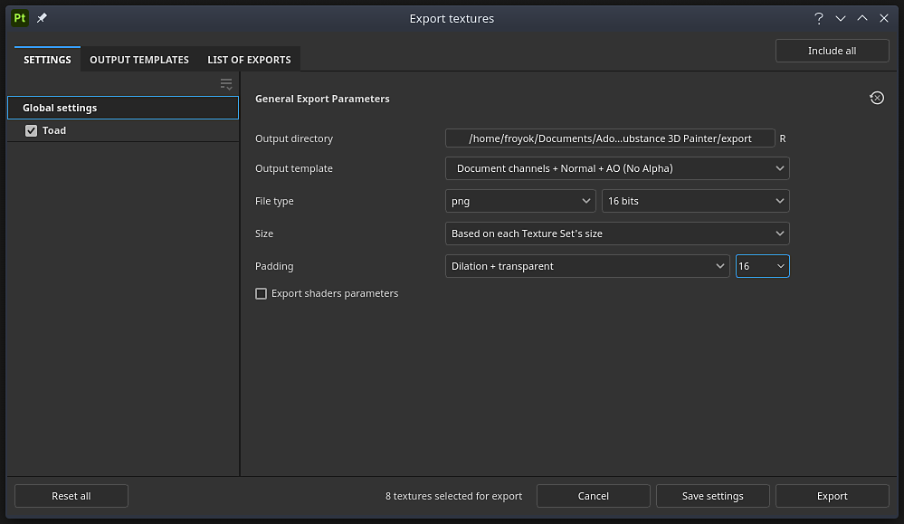

# Fenêtre d’exportation

{width="500px"}

Ouvrez la <b>fenêtre d’exportation </b> avec <b>Fichier > Exporter les textures </b> ou le raccourci clavier <b>Ctrl + Maj + E</b>.

La fenêtre <b>Exporter</b> est divisée en trois onglets :

* [Paramètres d’export](export-settings.md)
* [Modèles de sortie](output-templates.md)
* [Liste des exportations](list-of-exports.md)

Le bas de la fenêtre comporte plusieurs boutons :

* <b>Réinitialiser tout</b> (uniquement dans l&#39;<b>onglet Paramètres</b>) : réinitialisez la configuration d&#39;exportation du projet.
* <b>Annuler</b> : fermez la fenêtre sans enregistrer les modifications.
* <b>Enregistrer les paramètres</b> : enregistrez les paramètres d’exportation actuels dans le projet.
* <b>Exportation</b> : démarrez l&#39;exportation avec les paramètres d&#39;exportation actuels et passez automatiquement à la section <b>Liste des exportations</b> pour suivre la progression de l&#39;exportation.
