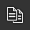
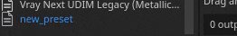
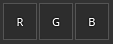

# Modèles de sortie

{width="500px"}

L’onglet Modèle de sortie vous permet de gérer et de créer de nouveaux Modèles de sortie. Vous pouvez utiliser des Modèles de sortie pour modifier les noms, les formats et la configuration des textures exportées.

## Liste des paramètres prédéfinis

La liste Paramètres prédéfinis affiche tous les Modèles de sortie disponibles. Cette liste comprend une collection de [Modèles de sortie par défaut](../export-presets/default-presets.md), ainsi que tous les modèles personnalisés que vous avez créés.

Dans cette liste, les modèles peuvent être <b>créés</b>, <b>renommés</b>, <b>dupliqués</b> ou <b>supprimés</b>.

| Action | Visuel | Description |
| --- | --- | --- |
| **Dupliquer** | 

 | Créer une copie du modèle de sortie actuellement sélectionné dans la liste. |
| **Supprimer** | 

 | Supprimer le modèle de sortie actuellement sélectionné dans la liste.  **Remarque :** la suppression d&#39;un modèle ne peut pas être annulée. |
| **Ajouter** | 

 | Ajoutez un nouveau modèle de sortie vide. |
| **Double-cliquer** | 

 | Renommez le modèle de sortie sélectionné. |
| **Clic droit** | 

 | Cliquez avec le bouton droit de la souris sur un modèle pour ouvrir le menu contextuel dans lequel vous pouvez supprimer, renommer ou dupliquer un modèle. |

## Liste des mappages de sortie

Cette section répertorie toutes les textures qui seront générées par le modèle et leur composition.

### Types de mappage et mots-clés

La ligne supérieure répertorie tous les types de texture pouvant être effectués :

| Bouton | Visuel | Description |
| --- | --- | --- |
| **Gris** | 

 | Ajoutez un nouveau mappage en niveaux de gris. |
| **RGB** | 

 | Ajoutez une nouvelle table des couleurs de RGB. |
| **R+G+B** | 

 | Ajoutez un nouveau mappage de RGB avec 3 emplacements individuels en niveaux de gris. |
| **RGB+A** | 

 | Ajoutez un nouveau mappage de RGB et un emplacement alpha (niveaux de gris). |
| **R+G+B+A** | 

 | Ajoutez une nouvelle carte RVBA avec 4 emplacements individuels en niveaux de gris. |

>[!NOTE]
>
> Certains types peuvent être fusionnés/réduits lorsqu’ils sont vides ou partagent la même map d&#39;entrée :
> 
> 

### Nom du mappage

Chaque texture peut être nommée à l’aide d’une convention de dénomination personnalisée. Quelques mots-clés peuvent être ajoutés (à l&#39;aide du bouton **$**) pour être automatiquement remplacés par l&#39;application lors de la génération du fichier final :

| Mot-clé | Description |
| --- | --- |
| **$project** | Remplacé par le nom du fichier de projet (.spp). |
| **$maillage** | Remplacé par le nom du fichier de maillage (fichier de maillage d’entrée, comme .fbx) |
| **$textureset** | Remplacé par le nom du matériau/Jeu de textures à partir duquel la texture est générée. |
| **$udim** | Remplacé par le numéro de l&#39;UDIM à partir duquel une texture est générée. |
| **$colorSpace** | Remplacé par le nom de l’espace colorimétrique utilisé pour la couche donnée (RGB ou V, ignore l’Alpha). |

### Format et nombre de bits par pixel du fichier de mappage

La première liste déroulante peut être utilisée pour spécifier le format de fichier du mappage de sortie actuel.

La deuxième liste déroulante est utilisée pour spécifier le nombre de bits par pixel du mappage de sortie. Le nombre de bits par pixel dépend du format de fichier sélectionné. Voir [Paramètres d&#39;exportation](export-settings.md) pour plus de détails.

>[!NOTE]
>
> Pour que les paramètres de format et de nombre de bits par pixel soient pris en compte lors de l&#39;exportation, assurez-vous que le type de fichier dans les paramètres généraux est défini sur **D&#39;après le modèle de sortie**.

## Liste des mappages source

### Maps d&#39;entrée

La liste de maps d&#39;entrée regroupe tous les canaux qui peuvent être ajoutés via les [paramètres de Jeu de textures](../../interface/texture-set/texture-set-settings.md).

>[!NOTE]
>
> Les canaux **utilisateur** sont basés sur leur nom d&#39;origine (**utilisateur\_x**). Les noms personnalisés sont ignorés.

### Maps de maillage

Les maps de maillage sont les textures bakées :

| Nom | Description |
| --- | --- |
| **Normal** | map normal bakée. |
| **Normale de l&#39;espace monde** | normale de l&#39;espace monde bakée. |
| **ID** | ID baké. |
| **Ambient occlusion** | ambient occlusion baké |
| **Courbure** | courbure bakée. |
| **Position** | position bakée. |
| **Thickness** | thickness baké. |
| **Height** | height baké. |
| **Bents normals** | bents normals bakés. |

### Maps converties

Les mappages convertis sont des mappages générés par l’application à partir d’une autre source :

| Nom | Description |
| --- | --- |
| **Normal OpenGL** | Map normal combinée au format OpenGL de la couche normale bakée et de la couche normale du Jeu de textures. |
| **Normal DirectX** | Map normal combinée au format DirectX de la couche normale bakée et de la couche normale du Jeu de textures. |
| **AO mixte** | Ambient occlusion combiné de l&#39;ambient occlusion baké et de la couche d&#39;ambient occlusion du Jeu de textures. |
| **Diffuse** | Diffuse générée à partir des canaux **Base color** et **Métallique** (les zones métalliques sont remplacées par une couleur noire). |
| **Specular** | texture de specular générée à partir du canal **Base color** et **Métallique**. |
| **Brillance** | texture de brillance générée à partir de l’inverse du canal de rugosité. |
| **Diffuse Unity4** | Obsolète. Diffuse générée à partir du canal **Base color** pour correspondre aux shaders Unity 4. |
| **Gloss Unity4** | Obsolète. texture de brillance générée à partir du canal **Rugosité** et **Métallique** pour correspondre aux shaders Unity 4. |
| **Réflexion** | Textures où le blanc indique un matériau diélectrique et d’autres couleurs comme matériaux métalliques. |
| **1/ior** | Texture contenant 1 divisé par la valeur **IOR**. L&#39;**IOR** est généré à partir de la carte métallique : 1,4 pour les diélectriques, 100 pour les métaux (couleur noire). |
| **Brillance2** | Version carrée du canal **Brillance** (**Brillance** \* **Brillance**) |
| **f0** | Texture contenant une valeur de réflectance de type fresnel 0 (0,04 pour la diélectrique, 1,0 pour la métallique). |
