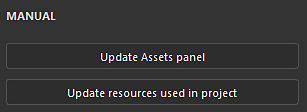

# Mise à jour automatique des ressources

La mise à jour automatique des ressources, ou <b>mise à jour automatique</b>, est une fonctionnalité de la [fenêtre Ressources](../interface/assets/assets.md) qui permet de recharger et de mettre à jour les ressources lorsque de nouvelles versions sont disponibles. Ce processus peut être déclenché automatiquement ou manuellement dans l&#39;interface, ou via un script Python.

## Tutoriel

Vous pouvez regarder un tutoriel rapide pour obtenir un aperçu de la fonctionnalité :

## Activation de la mise à jour automatique

Pour activer la <b>mise à jour automatique</b>, il vous suffit d&#39;aller au bas de la fenêtre Ressources et de cliquer sur l&#39;icône de double flèche. Le menu de mise à jour automatique avec tous ses paramètres s’ouvre. Activez ensuite l&#39;une des options disponibles dans la section <b>Mises à jour automatiques</b>.

### Mises à jour automatiques

Les paramètres de mise à jour automatique contrôlent la fréquence à laquelle l’application doit rechercher des mises à jour et où.

| Paramètre | Description |
| --- | --- |
| <b>Panneau Actifs</b> | Si cette option est activée, la mise à jour automatique recherche les actifs à mettre à jour dans toutes les bibliothèques actuellement chargées. Cela inclut le projet en cours. Cependant, il ne mettra pas à jour les ressources utilisées dans la pile de calques, les paramètres d’affichage, les paramètres de nuanceur, etc. |
| <b>Ressources utilisées dans le projet</b> | Si cette option est activée, la mise à jour automatique recherche les actifs à mettre à jour qui sont actuellement importés et utilisés par le projet en cours. Cela s’applique aux ressources utilisées dans la pile de calques, les paramètres d’affichage, les paramètres de nuanceur, etc. |
| <b>Mise à jour toutes les x minutes</b> | Contrôlez la fréquence à laquelle l’application recherche une mise à jour des ressources. Un délai de 0 minute déclenche une mise à jour toutes les quelques secondes. Notez qu’un délai aussi court peut entraîner des problèmes de performances. |

>[!NOTE]
>
> Si les mises à jour automatiques sont activées, l’application recherche automatiquement les modifications chaque fois qu’elle reprend le focus.

### Mises à jour manuels

Les actions de mise à jour manuelles sont un moyen pratique de déclencher le système de mise à jour lorsque vous le souhaitez. Ils peuvent être utilisés avec ou sans les paramètres de mise à jour automatique activés.

| Paramètre | Description |
| --- | --- |
| <b>Panneau Mettre à jour les actifs</b> | Démarrez le processus de mise à jour automatique. Comportez-vous de la même manière que pour le paramètre <b>panneau Actifs</b> (voir ci-dessus). |
| <b>Mettre à jour les ressources utilisées dans le projet</b> | Démarrez le processus de mise à jour automatique. Comportez-vous de la même manière que les <b>ressources utilisées dans le projet</b> (voir ci-dessus). |

## Paramètres avancés

Les paramètres avancés permettent de contrôler le comportement du processus de mise à jour.

| Paramètre | Description |
| --- | --- |
| <b>Ignorer les ressources lorsque leurs paramètres ne correspondent pas</b> | Si cette option est activée, le processus de mise à jour automatique évite de mettre à jour les ressources si la nouvelle version ne correspond pas à l’ancienne. Par exemple, si un matériau de Substance a des paramètres qui n&#39;existent plus dans la nouvelle version (parce qu&#39;ils ont été supprimés ou renommés) le processus de mise à jour ignorera la ressource et gardera l&#39;ancienne version à la place. |

>[!NOTE]
>
> Pour forcer la mise à jour des actifs qui ont une incompatibilité, vous pouvez désactiver le paramètre <b>Ignorer les actifs lorsque leur paramètre ne correspond pas</b>.

## Mettre à jour le statut et le journal

Après une mise à jour des ressources (automatique ou manuelle), le résultat du processus s&#39;affiche dans l&#39;onglet <b>Actifs</b> de la fenêtre <b>Journal</b>, signalant à la fois les mises à jour réussies et les problèmes. En cas d’incompatibilité de ressources (voir ci-dessus), les détails du problème doivent nous être fournis par ressource.

Le journal peut être rapidement ouvert en cliquant sur l’icône dédiée en haut à droite du menu de mise à jour automatique :

>[!NOTE]
>
> Lorsqu’un ou plusieurs problèmes apparaissent après une mise à jour, l’icône du journal affiche une petite icône d’avertissement.

En fonction du processus de mise à jour, plusieurs types de problèmes peuvent apparaître :

| Problème | Description |
| --- | --- |
| <b>Impossible de mettre à jour dans le panneau Actifs</b> | Ce message signifie qu’un problème a empêché le système de mise à jour de continuer. Développez le nom de la ressource pour obtenir plus d’informations. |
| <b>(nom de fichier).(format) n&#39;existe pas. Impossible de recharger (nom de la ressource)</b> | Ce message signifie que le fichier source d&#39;une ressource est introuvable (soit parce qu&#39;il a été déplacé, soit parce qu&#39;il a été supprimé). Une solution simple consiste à réimporter la ressource ou à la relocaliser dans la fenêtre Actifs (via le menu contextuel). |

## Ancien message de projet

Lors de l’ouverture d’un ancien projet, une option est disponible dans l’avertissement du message contextuel pour vous informer du processus de mise à jour automatique. Il s’agit d’un moyen pratique de désactiver rapidement le processus de mise à jour automatique au cas où il resterait activé avant l’ouverture de l’ancien projet.
