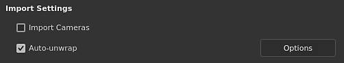

# Déballage UV automatique

\
Le déballage UV automatique permet de générer automatiquement des Îlots UV lors de l’importation d’un mannequin 3D. Il peut être utilisé pour peindre sur un modèle 3D qui n’a pas d’UV existants.

## Activation du déballage UV automatique

Lors de la création d’un nouveau projet ou de la réimportation d’un filet dans un projet existant, assurez-vous que le paramètre « Déplier automatiquement » est coché. Si cette option est désactivée, le processus est ignoré et les UV du maillage restent tels quels.

## Paramètres de déballage UV

Lors de l’importation d’un filet et de l’utilisation du processus de déballage, les paramètres suivants sont disponibles. Certains paramètres sont disponibles via le bouton Options de l’interface.

| Section | ***Paramètre*** | ***Description*** |
| --- | --- | --- |
| **Supprimer l&#39;enchaînement de la séquence** | **Coutures** | Contrôle si les coutures (bordures d&#39;Îlot UV) doivent être générées uniquement pour les maillages qui n&#39;en ont pas ou qui sont toujours régénérés.Valeurs possibles :<ul data-preserve-html="true"><li data-preserve-html="true"><strong> Générer les données manquantes </strong> (par défaut) : des coutures seront générées pour les maillages qui les manquent.</li><li data-preserve-html="true"><strong> Recalculer tous les </strong> : les coutures seront générées pour tous les maillages.</li></ul> |
| **Îlots UV** | Contrôle si le déballage UV doit être généré à partir de filets sans UV ou pour des filets. Valeurs possibles :<ul data-preserve-html="true"><li data-preserve-html="true"><strong> Générer les données manquantes </strong> (par défaut) : le déballage UV sera généré pour les maillages comportant des UV manquants.</li><li data-preserve-html="true"><strong> Recalculer tous les </strong> : le déballage UV sera généré pour tous les maillages.</li></ul> |  |
| **Packing** | Contrôle le packing/la disposition des Îlots UV des filets.Valeurs possibles :<ul data-preserve-html="true"><li data-preserve-html="true"><strong> Générer des données manquantes </strong> (par défaut) : Îlots UV de pack pour les maillages qui ne contenaient pas d&#39;UV.</li><li data-preserve-html="true"><strong> Recalculer tous les </strong> : emballer tous les Îlots UV.</li></ul> |  |
|  |  |  |
| **Personnalisation de la mise en page** | **Taille de la marge** | Définit l’espacement entre les Îlots UV. Ce paramètre applique un pourcentage général indépendant de la résolution.Valeurs possibles :<ul data-preserve-html="true"><li data-preserve-html="true"><strong> Pas de marge </strong> : 0 %</li><li data-preserve-html="true"><strong> Petit </strong> (par défaut) : 0,2 %</li><li data-preserve-html="true"><strong> Moyen </strong> : 0,5 %</li><li data-preserve-html="true"><strong> Grand(s) </strong> : 1 %</li></ul> |
|  | **Orientation de l&#39;Îlot UV** | Contrôlez l’orientation des Îlots UV pendant le processus de packing.Valeurs possibles :<ul data-preserve-html="true"><li data-preserve-html="true"><strong>Non contraint</strong> (par défaut) : aucune contrainte n&#39;est appliquée pour calculer l&#39;orientation.</li><li data-preserve-html="true"><strong>Aligner avec le filet 3D</strong> : contraindre l&#39;Îlot UV à être orienté vers la direction du filet</li></ul> |
|  |  |  |
| **Tuiles UV** | **Nombre maximal de tuiles UV** | Si le flux de travail Tuiles UV est activé, ces paramètres déterminent le nombre maximal de tuiles à produire à distribuer sur les Îlots UV. |
|  |  |  |
| **Optimisation** | **Éviter les Îlots UV allongés** | Si cette option est activée, ce processus fractionnera les Îlots UV considérés comme trop longs pour améliorer l’utilisation de l’espace de la texture.Exemple de avant (en haut) et après (en bas) : 

 |

## Limitations connues

Vous trouverez ci-dessous une liste des limitations liées au processus de déballage :

* Le traitement des maillages en poly peut prendre beaucoup de temps.
* Les sommets situés exactement aux mêmes coordonnées sont fusionnés
* La génération UV peut échouer sur certaines parties du maillage dans de rares cas
* Rapport texel non uniforme ou fortement déformé dans un seul Îlot UV dans certains cas
* Rapport des textures non uniforme entre les ensembles de textures
* Les Îlots UV générés peuvent être très allongés et ne s&#39;insèrent pas dans l&#39;espace UV dans certains cas
* Les faces dégénérées ou les faces maillées non triangulaires avec des arêtes petites ou superposées peuvent ne pas être dépliées par UV
