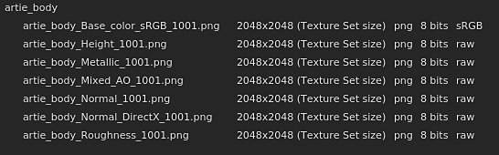

# Gestion des couleurs

La gestion des couleurs consiste à manipuler et à convertir les couleurs. De l’importation des ressources à l’affichage des couleurs à l’écran, en passant par l’exportation des textures. L’étalonnage des couleurs est important pour garantir le même aspect dans toutes les applications.

Dans l&#39;application, la gestion des couleurs est gérée via l&#39;intégration de [OpenColorIO](https://opencolorio.org/) (OCIO pour faire court) version 2. OCIO est la norme en matière de films et d’animations pour convertir et afficher les couleurs. Pour activer la gestion des couleurs, il vous suffit de créer un projet ou d’ouvrir un projet existant et d’activer les paramètres dédiés.

>[!NOTE]
>
> La gestion des couleurs est disponible depuis la version 7.4.0.

## Paramètres du projet

Paramètres de gestion des couleurs :

* [Gestion des couleurs avec Adobe ACE - ICC](color-management-with-adobe-ace-icc.md)
* [Gestion des couleurs avec OpenColorIO](color-management-with-opencolorio.md)

## Vocabulaire

Il peut être utile de connaître quelques termes techniques liés à la gestion des couleurs afin de mieux comprendre le workflow associé :

| Mot-clé | Description |
| --- | --- |
| **Espace colorimétrique** | Repère dans lequel les couleurs sont définies. |
| **Espace de travail** | Espace colorimétrique utilisé à l’intérieur de l’application pour mélanger la texture, la peinture, etc. |
| **Afficher la transformation** | La transformation Affichage convertit les couleurs linéaires de l’espace de travail vers l’espace colorimétrique du moniteur pour afficher les couleurs de manière perceptive (afin qu’elles soient visibles par l’œil humain). Les transformations d’affichage incluent souvent une passe de mappage des tonalités pour compresser les couleurs et les ajuster à la plage de valeurs limitée autorisée par un écran. |
| **Configuration** | Un fichier de configuration OCIO. Elle définit ce qu’est l’espace de travail, une liste d’espaces colorimétriques et une liste de transformations d’affichage. |
| **ACES** | ACES signifie Academy Color Encoding System et est la norme dans de nombreuses applications pour l’exchange de fichiers d’images numériques. Deux versions de cette norme sont incluses par défaut dans l’application. |
| **Mappage Tonal** | Il s’agit du processus de mappage des valeurs de couleur de HDR (plage dynamique élevée) à LDR (plage dynamique basse). Ce processus permet d’afficher approximativement une large gamme de couleurs. |

## Liste des couches avec gestion des couleurs

Dans l’application, les canaux qui sont gérés en couleur ou non (données/passthrough) sont prédéfinis.

| Canal | Gestion des couleurs |
| --- | --- |
| **occlusion ambiante** | Non |
| **Angle d&#39;anistotropie** | Non |
| **Niveau d&#39;Anisotropie** | Non |
| **Couleur de base** | **Oui** |
| **Masque de fusion** | Non |
| **Couleur du pelage** | **Oui** |
| **Couche normale** | Non |
| **Opacité de la couche** | Non |
| **Rugosité du pelage** | Non |
| **specular level de manteau** | Non |
| **Diffus** | **Oui** |
| **Displacement** | Non |
| **Lustre** | Non |
| **Height** | Non |
| **Ior** | Non |
| **Métallique** | Non |
| **Normal** | Non |
| **Opacité** | Non |
| **Réflexion** | Non |
| **Rugosité** | Non |
| **Diffusion** | Non |
| **Couleur diffuse** | **Oui** |
| **Couleur de l&#39;éclat** | **Oui** |
| **Opacité du reflet** | Non |
| **Rugosité du reflet** | Non |
| **Specular** | **Oui** |
| **Specular edge color** | **Oui** |
| **Specular level** | Non |
| **Translucidité** | Non |
| **Transmissif** | **Oui** |
| **UserX (0-15)** | Dépend des [paramètres du jeu de textures](../../interface/texture-set/texture-set-settings.md). Par défaut, les couches utilisateur ne sont pas gérées par couleur. 

 |

## Sélecteur de couleurs

Lorsque la gestion des couleurs est activée, le comportement du [sélecteur de couleurs](../../interface/color-picker.md) change légèrement :

* Les couleurs sont modifiées en fonction de l’affichage actuellement sélectionné.
* Quelques informations supplémentaires sont ajoutées à l’interface.

Pour plus d&#39;informations, voir le sélecteur de couleurs [page de documentation](../../interface/color-picker.md).

## Commandes de la fenêtre d’affichage

Les vues 2D et 3D prennent en charge la gestion des couleurs et disposent de paramètres dédiés disponibles en haut de la fenêtre pour contrôler la transformation d’affichage à utiliser :

* **Bouton gauche** : activez/désactivez la transformation d&#39;affichage de la fenêtre d&#39;affichage. Si cette option est désactivée, les couleurs s’affichent en mode brut/transparent. Ce bouton est activé par défaut.
* **Liste déroulante de droite** : spécifiez la transformation d&#39;affichage à utiliser pour convertir les couleurs à afficher à l&#39;écran. La valeur par défaut est basée sur la configuration OCIO. Ce paramètre n’est pas enregistré avec le projet, car il peut dépendre de l’écran.

>[!NOTE]
>
> En mode solo (affichage individuel des couches), la gestion des couleurs est automatiquement désactivée lors de l’affichage des couches de données (voir la liste ci-dessus).

## Paramètres d’export

Les principaux paramètres d’exportation dépendent de la configuration du projet (voir ci-dessus).

Dans la fenêtre [Exporter des textures](../../export/export.md), un mot-clé peut être utilisé pour ajouter aux noms de fichier l&#39;espace colorimétrique utilisé par texture : **$colorSpace**.

<table>
<tr style="border: 0;">
<td style="border: 0;" valign="top">

{width="320px"}

</td>
<td style="border: 0;" valign="top">

{width="500px"}

</td>
</tr>
</table>

## Remplacement des espaces colorimétriques

Il peut être nécessaire de spécifier un autre espace colorimétrique pour qu’une ressource diffère des valeurs par défaut. Pour ce faire, utilisez le menu Espace colorimétrique.

### Modification de l’espace colorimétrique d’une ressource

Dans la fenêtre [propriétés](../../interface/properties.md), il est possible de remplacer l&#39;espace colorimétrique d&#39;une ressource spécifique (où elle est actuellement utilisée).

Pour ce faire, développez la section Espace colorimétrique et utilisez la liste déroulante pour spécifier le nouvel espace colorimétrique :

### Modification de l’espace colorimétrique de la carte d’environnement

Dans les [paramètres d&#39;affichage](../../interface/display-settings/display-settings.md), activez l&#39;**espace colorimétrique de la carte d&#39;environnement personnalisée**, puis choisissez un espace colorimétrique dans la liste qui correspond à votre ressource.

