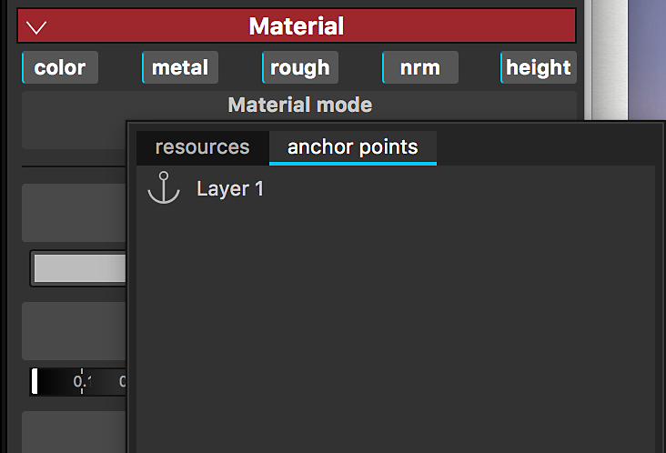

# Point d’ancrage

Un point d’ancrage permet d’exposer à n’importe quelle ressource ou élément de la pile de calques et de la référencer dans différentes zones de la pile de calques à des fins différentes et avec un jeu de réglages différent. Ils offrent un tout nouvel ensemble de possibilités, vous permettant de lier efficacement des calques ou des masques entre eux et d’avoir un seul point d’ancrage qui affecte plusieurs aspects de votre projet, transformant ainsi Substance 3D Painter en une expérience véritablement non linéaire.

>[!NOTE]
>
> Un point d’ancrage ne peut être référencé qu’à l’intérieur de la même texture qui a été créée. La création de liens entre une ancre et sa ou ses références n’est pas possible entre les Jeux de textures.

## Ajout d’un point d’ancrage

Les options Point d’ancrage sont disponibles dans le menu Effets. Ils peuvent être ajoutés sur les calques et les masques.

## Utilisation d’un point d’ancrage comme référence

Un point d’ancrage peut être référencé par un autre calque : cela instancie le contenu du point d’ancrage dans le calque qui le référence.

Les points d’ancrage peuvent être utilisés comme référence dans les ressources suivantes :

* Calque de remplissage
* Effet Fond
* Entrée d’un filtre Substance (Effet, Procédural, Générateur)

Seuls les points d&#39;ancrage situés **en dessous** du calque qui y fait référence peuvent être utilisés comme références.\
Si vous déplacez un point d’ancrage au-dessus d’un calque qui y fait référence, la référence est rompue. Vous pouvez annuler si vous souhaitez annuler cette action.

## Recherche de références pour un point d’ancrage

Lorsque vous cliquez sur un point d’ancrage, la liste des calques dans lesquels ce point d’ancrage est utilisé comme référence s’affiche dans les propriétés.

## Trouver un point d’ancrage

Lorsque vous êtes un Calque de remplissage/effet et que vous utilisez un point d’ancrage comme référence, vous pouvez accéder directement au point d’ancrage.

