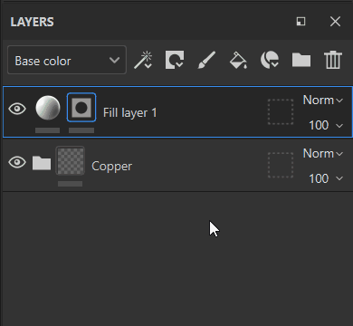

# Filtres

Les effets de filtre sont des substances qui transforment le contenu d’un calque ou d’un masque. Avec le mode de fusion Passthrough, un calque peut modifier les résultats de la pile de calques. L’utilisation d’un filtre sur un calque avec le mode de fusion Passthrough vous permet donc d’utiliser des filtres pour modifier la pile de calques dans son ensemble.

## Comment puis-je appliquer un filtre ?

Selon le type de filtre, un effet de filtre doit être créé sur le contenu ou le masque d’un calque. Il existe deux façons d’appliquer un filtre :

* L’approche manuelle nécessite plusieurs étapes pour configurer le filtre, mais offre un contrôle direct sur chaque étape du processus.
* L’approche glisser-déposer vous permet d’ajouter un filtre rapidement et définit automatiquement le mode de fusion sur passthrough sur tous les canaux.

### Ajout manuel d’un filtre

Dans l’exemple suivant, un filtre de flou est appliqué au contenu d’un calque, mais il est plus couramment utilisé pour appliquer des filtres aux masques :

**1. Ajouter un effet de filtre**

Commencez par sélectionner le contenu d&#39;un calque ou le masque de calque, puis cliquez sur le **bouton Effet** (ou cliquez avec le bouton droit pour ouvrir le menu contextuel). Sélectionnez l&#39;option **Ajouter un filtre** dans la liste.

**2. Sélectionnez le filtre dans la fenêtre des propriétés**

Dans le panneau **Propriétés**, aucun filtre n&#39;a encore été sélectionné. Cliquez sur le bouton de sélection du filtre pour ouvrir la mini-étagère et sélectionner le filtre souhaité. Ici, nous sélectionnons le **filtre Flou**.

>[!NOTE]
>
> Lors de l’application manuelle d’un filtre, n’oubliez pas que vous devrez peut-être utiliser le mode de fusion transparent si vous souhaitez que le filtre affecte le contenu des calques situés en dessous.

## Glisser-déposer un filtre depuis l’Étagère

Cette méthode est uniquement destinée aux filtres qui doivent s’appliquer à toute la pile de calques. Tous les [modes de fusion](../../interface/layer-stack/blending-modes.md) du canal seront automatiquement définis. Cela ne fonctionne pas pour appliquer des filtres à un masque.

**1. Ouvrez la zone Filtres de l&#39;Étagère**

Dans l’Étagère, cliquez sur la section « Filtres » à gauche.

**2. Glissez-déposez le filtre**

Sélectionnez le filtre à utiliser dans l’étagère. Glissez-déposez-le dans votre pile de calques, en vous assurant qu’il est placé au bon emplacement (évitez de le déposer dans des groupes indésirables, par exemple).

Notez, dans l’exemple ci-dessus, que le filtre déposé dispose déjà d’un mode de fusion Passthrough. Cela est vrai pour tous les canaux du document.

## Ajout de nouveaux filtres à Painter

Si vous avez de nouveaux filtres à importer dans Painter, vous pouvez les ajouter comme vous le feriez pour des ressources standard : il vous suffit de glisser-déposer le Fichier sbsar dans le **panneau Actifs** pour pouvoir gérer l’importation de vos nouveaux filtres.

## Création de vos propres filtres

Tous les filtres sont des Substances qui peuvent être créées avec Substance 3D Designer. Substance 3D Designer fournit des modèles pour Substance 3D Painter afin de vous aider à démarrer rapidement.

Pour plus d&#39;informations, consultez cette page : [Création d&#39;effets personnalisés](../../content/creating-custom-effects/creating-custom-effects.md)

## Filtres par défaut dans Painter

### Standard

* [Flou](filters/standard/blur.md)
* [Flou directionnel](filters/standard/blur-directional.md)
* [Pente du flou](filters/standard/blur-slope.md)
* [Verrouiller](filters/standard/clamp.md)
* [Balance des couleurs](filters/standard/color-balance.md)
* [Correct couleur](filters/standard/color-correct.md)
* [Luminosité du contraste](filters/standard/contrast-luminosity.md)
* [Ombre portée](filters/standard/drop-shadow.md)
* [Couleur de la zone de remplissage](filters/standard/fill-area-color.md)
* [Masque de zone de remplissage](filters/standard/fill-area-mask.md)
* [FXAA (anticrénelage)](filters/standard/fxaa-anti-aliasing.md)
* [Lueur](filters/standard/glow.md)
* [Dégradé](filters/standard/gradient.md)
* [Dégradé dynamique](filters/standard/gradient-dynamic.md)
* [Conversion en niveaux de gris](filters/standard/grayscale-conversion.md)
* [Passe-haut](filters/standard/highpass.md)
* [Numérisation de l’histogramme](filters/standard/histogram-scan.md)
* [Décalage de l’histogramme](filters/standard/histogram-shift.md)
* [TSL Perceptive](filters/standard/hsl-perceptive.md)
* [Inverser](filters/standard/invert.md)
* [Miroir](filters/standard/mirror.md)
* [Pixellisation](filters/standard/pixelate.md)
* [Isohélie](filters/standard/posterize.md)
* [Accentuer](filters/standard/sharpen.md)
* [Smoothstep](filters/standard/smoothstep.md)
* [Seuil](filters/standard/threshold.md)
* [Transformation](filters/standard/transform.md)
* [Chaîne](filters/standard/warp.md)

### Finitions

* [MatFinish Brushed Linear](filters/finishes/matfinish-brushed-linear.md)
* [MatFinish Galvanisé](filters/finishes/matfinish-galvanized.md)
* [Finition mate granuleuse](filters/finishes/matfinish-grainy.md)
* [MatFinish Grinded](filters/finishes/matfinish-grinded.md)
* [MatFinish Hammered](filters/finishes/matfinish-hammered.md)
* [Cercles perforés MatFinish](filters/finishes/matfinish-perforated-circles.md)
* [MatFinish Poudre Enrobé](filters/finishes/matfinish-powder-coated.md)
* [MatFinish Raw](filters/finishes/matfinish-raw.md)
* [MatFinish Rough](filters/finishes/matfinish-rough.md)

### MatFX

* [Bande dessinée MatFX](filters/matfx/matfx-comic-book.md)
* [Edge Wear de détails MatFX](filters/matfx/matfx-detail-edge-wear.md)
* [Dommages aux contours de MatFX](filters/matfx/matfx-edge-damages.md)
* [MatFX HBAO](filters/matfx/matfx-hbao.md)
* [Peinture à huile MatFX](filters/matfx/matfx-oil-paint.md)
* [Peinture de décollement MatFX](filters/matfx/matfx-peeling-paint.md)
* [Altération de Rouille MatFX](filters/matfx/matfx-rust-weathering.md)
* [Ligne de fermeture MatFX](filters/matfx/matfx-shut-line.md)
* [Aquarelle MatFX](filters/matfx/matfx-watercolor.md)
* [Gouttes d’eau MatFX](filters/matfx/matfx-water-drops.md)

### Éclairage

* [Environnement d&#39;éclairage baké](filters/lighting/baked-lighting-environment.md)
* [Éclairage baké stylisé](filters/lighting/baked-lighting-stylized.md)

### Advanced

* [Kuwahara anisotrope](filters/advanced/anisotropic-kuwahara.md)
* [Biseau](filters/advanced/bevel.md)
* [Bevel smooth](filters/advanced/bevel-smooth.md)
* [Correspondance des couleurs](filters/advanced/color-match.md)
* [Directional distance](filters/advanced/directional-distance.md)
* [Courbe de dégradé](filters/advanced/gradient-curve.md)
* [Réglage de l’Height](filters/advanced/height-adjustments.md)
* [Height à la normale](filters/advanced/height-to-normal.md)
* [Contour du masque](filters/advanced/mask-outline.md)
* [Validation PBR](filters/advanced/pbr-validate.md)
* [Quantifier](filters/advanced/quantize.md)
* [Stylisation](filters/advanced/stylization.md)
* [Tri-Planaire avancé](filters/advanced/tri-planar-advanced-filter.md)
