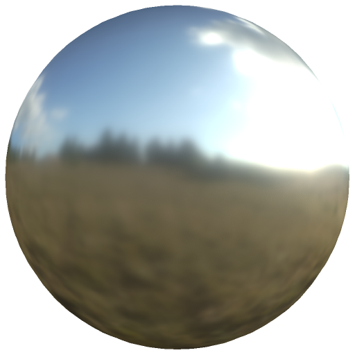

# Environnement d&#39;éclairage baké

<table>
<tr style="border: 0;">
<td width="33.33%" style="border: 0;" valign="top">

Icône 

<b>Entrée :</b> Effets/éclairage, baking, environnement, PBR

</td>
<td width="100.00%" style="border: 0;" valign="top">

## Description

Le filtre Environnement d&#39;éclairage baké bake les informations d’éclairage du matériau et de l’environnement dans la couche de couleur.

Il est utilisé sur un calque de peinture défini sur le mode passthrough et appliqué à tous les canaux. Elle est utile pour les workflows stylisés où un éclairage simulé précis n’est pas nécessaire, ou lorsque les ressources sont limitées, comme dans le cas de projets mobiles ou de ressources qui s’appuient uniquement sur une carte colorimétrique.

</td>
</tr>
</table>

## Entrées

| Saisir un nom | Description |
| --- | --- |
| <b>Ambient occlusion :</b> niveaux de gris | Utilisez le mappage d’Ambient occlusion baké. |
| <b>Map d&#39;environnement :</b> niveaux de gris | Utilisez la map d&#39;environnement. |
| <b>Normal :</b> Couleur | Utilisez la Map normal bakée. |

## Paramètres

| Nom du paramètre | Description |
| --- | --- |
| <b>Rotation horizontale :</b> | Réglez la rotation horizontale de l’éclairage de l’environnement. |
| <b>Rotation verticale :</b> | Réglez la rotation verticale de l’éclairage de l’environnement. |
| <b>Exposition :</b> | Réglez l’exposition du résultat baké. |
| <b>Intensité de l&#39;Height :</b> | Ajustez la force des informations sur l’height sur le résultat. |
| <b>Intensité de l&#39;Ambient occlusion :</b> | Réglez l’intensité des ambients occlusion dans le baking. |
| <b>Intensité Occlusion du Specular :</b> | Réglez l’intensité de l’occlusion du specular dans le baking. |
