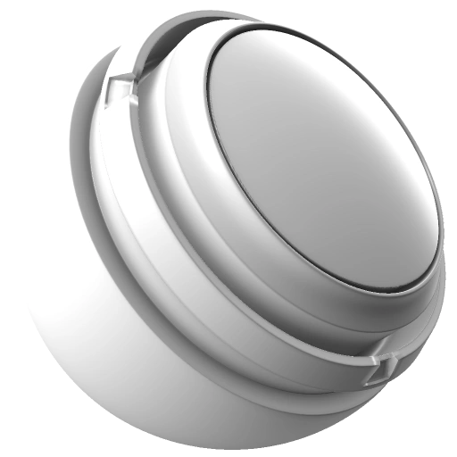

# Occlusion ambiante

<table>
  <tr style="border: 0;">
    <td style="border: 0;" valign="top"> <strong>Entrée :</strong> masque, générateur, niveaux de gris, fusion</td>
    <td style="border: 0;" valign="top"><strong>Description</strong> Le générateur d’Ambients occlusion crée un masque d’après la carte d’Ambients occlusion bakée avec la possibilité de fusionner une texture ou des détails microscopiques dans le masque.  Si vous utilisez le générateur d’Ambients occlusion pour créer un masque de fusion, vous devrez peut-être inverser la sortie Ambient occlusion. Par défaut, le générateur génère les zones occultées comme les zones sombres et les zones non occultées comme les zones claires. S’il est utilisé comme masque, le calque masqué n’est visible que dans les zones non occultées. L’inversion de la sortie garantit que le calque masqué n’apparaît que dans les zones occultées.  Les cartes de position, d'ambient occlusion et de normale de l'espace monde Bakées sont requises en tant qu'entrées d'image. <a href="../../../baking/baking.md">En savoir plus sur le baking ici</a>.</td>
  </tr>
</table>

## Entrées

| Saisir un nom | Description |
| --- | --- |
| Couleur de la texture | Utilisez une texture personnalisée ou un point d’ancrage. |
| Couleur micro normale | Utilisez une texture normale personnalisée ou un point d’ancrage. |
| Couleur Height | Utilisez une texture personnalisée ou un point d’ancrage. |
| Ambient occlusion en niveaux de gris | Utilisez le mappage d’Ambient occlusion baké. |
| Couleur des normales des espaces monde | Utilisez le mappage de Normales des espaces monde baké. |
| Couleur du dégradé de position | Utilisez le mappage de position baké. |

## Paramètres

| Nom du paramètre | Description |
| --- | --- |
| **Inversion globale** | Inversez le résultat final une fois tous les effets combinés. |
| **Flou global** | Lissez le masque final uniformément une fois tous les effets combinés. |
| **Balance globale** | Déplacez la balance du masque final une fois que tous les effets sont combinés entre le noir et le blanc, comme dans un réglage de la luminosité. |
| **Contraste global** | Réglez le contraste du masque final une fois tous les effets combinés. |
| **Utiliser la Texture** | Activer/désactiver l’utilisation d’un mappage de texture personnalisé. |
| **Utiliser les micro-détails** | Activez ou désactivez l’utilisation des micro-détails personnalisés. |

### Occlusion ambiante

| Nom du paramètre | Description |
| --- | --- |
| **Inverser** | Inversez uniquement les Ambients occlusion et les micro-détails. |
| **Flou** | Lissez juste l’Ambient occlusion et les détails micro. |
| **Balance** | Réglez l&#39;équilibre des détails Ambients occlusion et micro, en déplaçant le milieu vers le noir ou le blanc comme un contrôle de luminosité. |
| **Contraste** | Réglez le contraste/la baisse de l’Ambient occlusion et des détails micro uniquement. |

### Texture

<table>
  <tr>
    <th>Nom du paramètre</th>
    <th>Description</th>
  </tr>
  <tr>
    <td><strong>Opacité de texture</strong></td>
    <td>Ajustez la visibilité de la texture personnalisée.</td>
  </tr>
  <tr>
    <td><strong>Inverser</strong></td>
    <td>Inversez uniquement la texture personnalisée.</td>
  </tr>
  <tr>
    <td><strong>Conversion en niveaux de gris</strong></td>
    <td>Définissez la méthode utilisée pour convertir la couleur en niveaux de gris. Le <a href="grayscale-conversion.md">générateur de Conversions en niveaux de gris dispose d'informations supplémentaires sur le fonctionnement de chaque méthode</a>.</td>
  </tr>
  <tr>
    <td><strong>Mode de fusion</strong></td>
    <td>Sélectionnez le <a href="../../../interface/layer-stack/blending-modes.md">mode de fusion</a> à utiliser pour le calque actuel.</td>
  </tr>
  <tr>
    <td><strong>Échelle</strong></td>
    <td>Ajustez la taille de la texture personnalisée.</td>
  </tr>
  <tr>
    <td><strong>Contraste</strong></td>
    <td>Réglez le contraste/l’atténuation de la texture personnalisée.</td>
  </tr>
  <tr>
    <td><strong>Luminosité</strong></td>
    <td>Réglez la luminosité de la texture personnalisée.</td>
  </tr>
  <tr>
    <td><strong>Triplanaire</strong></td>
    <td>Lorsque l’option Triplanaire est activée, la texture est projetée à partir de trois directions (axes X, Y et Z) au lieu de dépendre uniquement des UV. <ul><li>Sans triplan, la texture suit la disposition de l’UV.</li><li>Avec le mode triplanaire, la texture est projetée sous plusieurs angles et fusionnée.</li></ul></td>
  </tr>
  <tr>
    <td><strong>Contraste triplanaire</strong></td>
    <td>Contrôlez la fluidité de fusion d’une texture lors de la projection à l’aide de la cartographie triplanaire. Ce paramètre ajuste la douceur de la fusion entre les projections de chaque direction.</td>
  </tr>
</table>

### Micro-détails

| Nom du paramètre | Description |
| --- | --- |
| **Micro-Height** | Activez ou désactivez l’utilisation d’une Map height Micro personnalisée. |
| **Micro Normal** | Activez ou désactivez l’utilisation d’une Map normal Micro personnalisée. |
| **Rayon AO** | Ajustez le rayon (plage) de l&#39;Ambient occlusion dans les détails. |
| **Profondeur AO** | Réglez la profondeur (intensité) de l&#39;Ambient occlusion dans les détails. |
