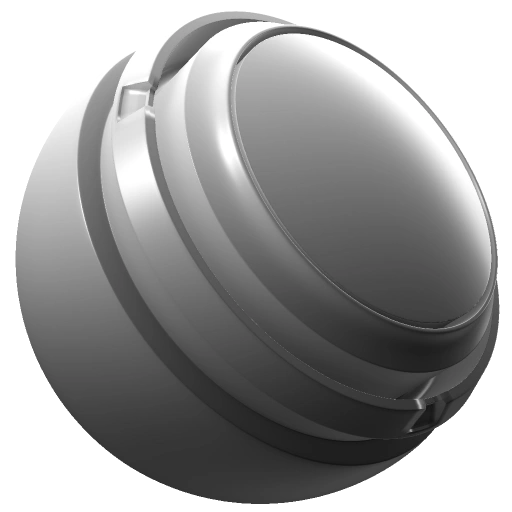

# Position

<table>
  <tr style="border: 0;">
    <td style="border: 0;" valign="top"> <strong>Entrée :</strong> filet, uv, distance</td>
    <td style="border: 0;" valign="top"><strong>Description</strong> Le générateur de position utilise les cartes de position et de normales d’espace universel pour créer un masque de dégradé basé sur la position du matériau dans l’espace 3D (comme de haut en bas ou de côté en côté).  Le générateur de position génère une texture monochrome (noir et blanc). Par conséquent, il est utile pour générer des masques de dégradé en fonction de la position dans l’espace univers.  Les cartes de position ancrée et de normales d'espace universel sont requises en tant qu'entrées d'image. <a href="../../../baking/baking.md">En savoir plus sur la cuisson ici</a>.</td>
  </tr>
</table>

## Entrées

| Saisir un nom | Description |
| --- | --- |
| Couleur de la **texture** | Utilisez une texture personnalisée ou un point d’ancrage. |
| **Couleur du dégradé de position** | Utilisez le mappage de position ancré. |
| Couleur des **normales de l&#39;espace universel** | Utilisez la carte des normales de l&#39;espace universel. |

## Paramètres

| Nom du paramètre | Description |
| --- | --- |
| **Inversion globale** | Inversez le résultat final une fois tous les effets combinés. |
| **Flou global** | Appliquez un flou uniforme au masque final une fois tous les dégradés combinés. |
| **Balance globale** | Réglez la balance du masque final après avoir combiné tous les dégradés entre le noir et le blanc, comme pour un réglage de la luminosité. |
| **Contraste global** | Ajustez le contraste du masque final une fois tous les dégradés combinés. |
| **Utiliser la texture** | Activez ou désactivez l’utilisation d’une texture plaquée personnalisée. |

### Dégradé de position

| Nom du paramètre | Description |
| --- | --- |
| **Inverser** | Inversez uniquement le dégradé de position. |
| **Balance** | Réglez la balance du dégradé de position uniquement, en déplaçant le point médian vers le noir ou le blanc comme un contrôle de luminosité. |
| **Contraste** | Réglez le contraste/l’atténuation du dégradé de position uniquement. |
| **Luminosité** | Réglez la luminosité du dégradé de position uniquement. |
| **De droite à gauche** | Réglez la façon dont l’effet est appliqué de gauche à droite sur le filet. |
| **De Haut En Bas** | Réglez la façon dont l’effet est appliqué de haut en bas sur le filet. |
| **De l&#39;avant vers l&#39;arrière** | Réglez la façon dont l’effet est appliqué d’avant en arrière sur le filet. |

#### Dégradé de position/De droite à gauche

| Nom du paramètre | Description |
| --- | --- |
| **Inverser** | Inversez le sens du dégradé de droite à gauche. |
| **Mode de fusion** | Sélectionnez le [mode de fusion](../../../interface/layer-stack/blending-modes.md) à utiliser pour le dégradé de droite à gauche. |

#### Dégradé de position/De haut en bas

| Nom du paramètre | Description |
| --- | --- |
| **Inverser** | Inversez la direction du dégradé de haut en bas. |
| **Mode de fusion** | Sélectionnez le [mode de fusion](../../../interface/layer-stack/blending-modes.md) à utiliser pour le dégradé de haut en bas. |

#### Dégradé de position/De l&#39;avant vers l&#39;arrière

| Nom du paramètre | Description |
| --- | --- |
| **Inverser** | Inversez la direction du dégradé de l’avant vers l’arrière. |
| **Mode de fusion** | Sélectionnez le [mode de fusion](../../../interface/layer-stack/blending-modes.md) à utiliser pour le dégradé avant/arrière. |

### Texture

<table>
  <tr>
    <th>Nom du paramètre</th>
    <th>Description</th>
  </tr>
  <tr>
    <td><strong>Opacité de texture</strong></td>
    <td>Ajustez la visibilité de la texture personnalisée.</td>
  </tr>
  <tr>
    <td><strong>Inverser</strong></td>
    <td>Inversez la texture plaquée personnalisée.</td>
  </tr>
  <tr>
    <td><strong>Conversion en niveaux de gris</strong></td>
    <td>Définissez la méthode utilisée pour convertir la couleur en niveaux de gris. Le <a href="grayscale-conversion.md">générateur de conversion en niveaux de gris dispose d'informations supplémentaires sur le fonctionnement de chaque méthode</a>.</td>
  </tr>
  <tr>
    <td><strong>Mode de fusion</strong></td>
    <td>Sélectionnez le <a href="../../../interface/layer-stack/blending-modes.md">mode de fusion</a> à utiliser.</td>
  </tr>
  <tr>
    <td><strong>Échelle</strong></td>
    <td>Ajustez la taille de la texture personnalisée.</td>
  </tr>
  <tr>
    <td><strong>Contraste</strong></td>
    <td>Réglez le contraste/l’atténuation de la texture personnalisée.</td>
  </tr>
  <tr>
    <td><strong>Luminosité</strong></td>
    <td>Réglez la luminosité de la texture personnalisée.</td>
  </tr>
  <tr>
    <td><strong>Triplanaire</strong></td>
    <td>Lorsque l'option <strong>Utiliser le mode triplanaire </strong> est activée, la texture est projetée à partir de trois directions (axes X, Y, Z) au lieu de dépendre uniquement des UV.  <ul><li>Sans option triplanaire, la texture suit la disposition UV.</li><li>Lorsque l’option triplanaire est activée, la texture est projetée sous plusieurs angles et fusionnée.</li></ul></td>
  </tr>
  <tr>
    <td><strong>Contraste triplanaire</strong></td>
    <td>Ajustez la fluidité de fusion d’une texture lors de sa projection à l’aide du placage triplanaire. Cela ajuste la douceur de la fusion entre les projections de chaque direction.</td>
  </tr>
</table>
