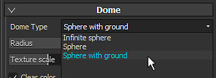
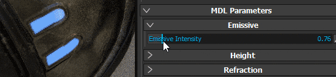

# Paramètres de la visionneuse et de MDL

{width="400px"}

## Environnement

Identique à la fenêtre d&#39;affichage normale, la carte d&#39;environnement utilisée en Irlande contrôle l&#39;éclairage.\
La carte d’environnement peut être modifiée en cliquant sur le bouton ou en faisant glisser une texture HDR vers celui-ci.

* **Exposition à l’environnement** : contrôle du niveau d’exposition de la carte d’environnement HDR.
* **Rotation de l&#39;environnement** : pour modifier la texture de l&#39;environnement et faire pivoter l&#39;éclairage autour de la scène.

>[!NOTE]
>
> Iray étant un moteur de rendu physique, la texture de l’environnement définit considérablement l’éclairage et l’aspect de votre scène.

## Dôme

Le dôme est la forme sur laquelle sera projetée la carte de l&#39;environnement en arrière-plan.\
3 types de dômes sont disponibles, à utiliser selon la scène :

* **Sphère infinie** : l&#39;environnement est projeté en arrière-plan sur une sphère pour simuler l&#39;horizon, toujours loin de la scène
* **Sphère** : l&#39;environnement est projeté sur une sphère normale, qui peut être mise à l&#39;échelle
* **Sphère avec le sol** : similaire à la forme précédente, celle-ci possède également une commande permettant d&#39;aplatir le bas de la sphère pour simuler un sol.

>[!NOTE]
>
> La sphère avec le sol a un contrôle pour définir la taille/le rayon du sol, mais un grand rayon créera des distorsions sur l&#39;environnement.\
>  Selon le type choisi, l’éclairage peut être affecté.

Des paramètres supplémentaires sont disponibles :

| *Paramètre* | *Description* |
| --- | --- |
| **Rayon** | La taille de la sphère (si elle n&#39;est pas infinie) |
| **Échelle de texture** | Étendue de la texture pour le type **Sphère avec sol**. |
| **Effacer la couleur** | Si cette option est activée, remplacez l’image d’arrière-plan de la carte d’environnement par une couleur uniforme. Cela affectera l’éclairage. |

### Paramètres au sol

Les paramètres du sol permettent de spécifier l&#39;emplacement d&#39;un étage.\
Par défaut, la valeur est définie pour fixer le bas du cadre de sélection de la scène.

| ***Paramètre*** | ***Description*** |
| --- | --- |
| **Valeur X, Y, Z** | Définissez l&#39;emplacement du sol sur les trois axes.   La valeur 0,0,0 correspond au milieu du cadre de sélection de la scène. |
| **Réflectivité** | Définit l’intensité et la couleur du reflet du sol.   Une valeur de luminosité du blanc signifie que le sol est réfléchissant à 100 %, tandis que le noir signifie qu’il n’est pas réfléchissant du tout. 

 |
| **Lustre** | Définit le niveau de brillance (ou de rugosité) du reflet. 

 |
| **Intensité des ombres** | Ce paramètre définit l’opacité finale de l’ombre après le calcul de l’éclairage. |
| **Visible d&#39;en dessous** | Définit si le sol est visible par le bas ou non. Si cette case est cochée, cela signifie que le sol occultera tout élément au-dessus de lui. |

## Paramètres MDL et Shader

Vous pouvez utiliser le langage MDL pour définir les matériaux utilisés pour le rendu d’un objet. Pour plus d&#39;informations, consultez la page [Nvidia officielle du format](http://www.nvidia.com/object/material-definition-language.html) .

Par défaut, dans Substance 3D Painter, un MDL est associé à un shader GLSL, ce qui permet de basculer entre la fenêtre d’affichage normale et Iray sans avoir à configurer quoi que ce soit.\
Les paramètres du MDL s’affichent alors en bas des paramètres du visualiseur. Vous trouverez ci-dessous les paramètres du MDL par défaut (compatible avec le nuanceur PBR Métallique/Rugosité).

>[!NOTE]
>
> Pour charger des fichiers MDL personnalisés, un nuanceur glsl personnalisé est requis.\
>  Dans le shader, certaines métadonnées peuvent être ajoutées pour spécifier le chemin mdl :
> 
> //- Déclarez le matériau iray mdl à utiliser avec cet ombrage. // : metadata { // : « mdl » :« mdl::alg::materials::physico\_métallique\_roughness::physico\_métallique\_roughness » // : }
> 
> * **mdl** : définissez la matière Iray mdl à utiliser avec le shader. La syntaxe du chemin d&#39;accès est la suivante : *mdl::folder1::folder2::mdl\_filename::material\_name* où *folder1::folder2::mdl\_filename* est le chemin d&#39;accès à un fichier mdl à l&#39;intérieur de l&#39;un de vos dossiers *mdl* et *::material\_name* est le nom d&#39;un matériau déclaré à l&#39;intérieur de ce fichier mdl. (ex : « mdl » : « mdl::alg::materials::physico\_métallique\_roughness::physico\_métallique\_roughness »)

>[!NOTE]
>
> Pour chaque instance de matériau d&#39;un projet, un MDL est défini. Par conséquent, pour séparer les propriétés des matériaux entre les ensembles de textures, définissez une nouvelle instance Matériaux pour configurer séparément les LDM.

Le MDL par défaut de Substance 3D Painter prend en charge les propriétés suivantes :

| *Paramètre* | *Description* |
| --- | --- |
| **Intensité émissive** | Multiplicateur du canal émissif. Une valeur élevée commence à émettre de la lumière. 

 |
| **Réfraction** | Définit le degré de réfraction. |
| **IOR** | Définit l&#39;indice de réfraction de la matière.   Note : Air = 1,0, Eau = 1,2, Verre = 1,5. |
| **Diffusion** | Contrôle la quantité de lumière diffusée sur la surface. |
| **Absorption** | Contrôle la quantité de lumière absorbée à travers la surface. |
| **Couleur d&#39;absorption** | Simule les changements de couleur lorsque la lumière traverse la surface. |
