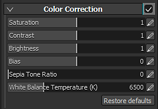

# Correction colorimétrique

Paramètres de correction des couleurs :

| *Paramètre* | *Description* |
| --- | --- |
| **Saturation** | Contrôle l’intensité/saturation de la couleur dans la clôture. Utilisez une saturation à 0 pour obtenir un rendu en niveaux de gris. |
| **Contraste** | Contrôle la différence entre les couleurs claires et foncées. |
| **Luminosité** | Contrôle la luminosité des couleurs. |
| **Biais** | Décale globalement la luminosité de la clôture. |
| **Rapport des tons sépia** | Paramètre avancé pour donner un effet sépia à la clôture. |
| **Température De Balance Des Blancs (K)** | Température des couleurs, en Kelvins. La valeur par défaut est 6500K, ce qui correspond à la lumière du jour. [Voir Wikipédia pour plus d&#39;informations](https://en.wikipedia.org/wiki/Color_temperature). |
