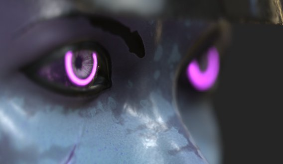
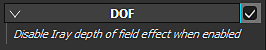

# Profondeur de champ

La **Profondeur de champ** (DOF) ne comporte aucun paramètre direct. Si cette option est activée, elle **remplacera** le DOF de **Iray**.

Pour contrôler l’aspect du DDL dans la clôture, deux paramètres sont disponibles via la caméra :

| *Paramètre* | *Description* |
| --- | --- |
| **Distance de mise au point** | Définit la distance à laquelle se trouve le point focal.  Ce point est utilisé par la Profondeur de l’effet Champ. 

 **Remarque :** la distance de mise au point peut être définie automatiquement en cliquant sur un point du filet à l&#39;aide du raccourci **CTRL + bouton central de la souris.** |
| **Ouverture** | Définit la largeur de la Profondeur de champ. 

 **Remarque :** si Iray contrôle ce paramètre, sa modification déclenchera à nouveau un calcul. |
