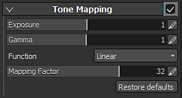

# Mappage de tons

Les paramètres de mappage de tonalité permettent de contrôler la mise à l’échelle des couleurs à afficher à l’écran. Ces paramètres peuvent être utiles pour redistribuer les couleurs en raison de leur large plage de valeurs (qui peuvent dépasser ce que l’écran actuel peut afficher).

>[!NOTE]
>
> Substance 3D Painter produit des couleurs **HDR** (Plage dynamique élevée) (dans l’espace gamma linéaire), mais la plupart des écrans ne permettent que de visualiser les couleurs **LDR** (plage dynamique faible). Afin de mapper la plage HDR à la plage LDR, une conversion doit être effectuée. C’est le principe de la correspondance des tonalités.

| *Paramètre* | *Description* |
| --- | --- |
| **Exposition** | Met à l’échelle les résultats du rendu de l’espace HDR avant l’application des effets de reflet ou le mappage de tonalité. |
| **Gamma** | Il s’agit de la valeur gamma de correction. |
| **Fonction** | Fonction à utiliser pour mapper la plage HDR à la plage LDR.  Les fonctions disponibles sont les suivantes :<ul data-preserve-html="true"><li data-preserve-html="true"><strong> Auto </strong> : la fonction de mappage de tonalité est sélectionnée automatiquement. La valeur par défaut est <strong> Sensitométrique </strong>. </li><li data-preserve-html="true"><strong> Linéaire </strong> : la couleur de sortie n&#39;est pas définie sur 0 à 1 pour ce type uniquement. Cette option est optimale lors de l’implémentation d’un effet dans l’espace HDR côté application après l’application des effets.  Nous vous déconseillons cette option, sauf si vous avez une raison particulière de l’utiliser, car les composants haute luminance seront complètement perdus et les hautes lumières surexposées se produiront si le mappage linéaire est utilisé comme sortie d’écran finale telle quelle.</li><li data-preserve-html="true"><strong> LinearSat </strong> : il s&#39;agit presque de <strong> Linear </strong> , à l&#39;exception du fait que la couleur de sortie est rétreinte. En outre, la synthèse du reflet est un peu plus lisse que la <strong> linéaire </strong>.</li><li data-preserve-html="true"><strong> Sensitométrique </strong> : fonction par défaut lorsque le rendu des scènes est effectué dans l&#39;espace HDR.</li><li data-preserve-html="true"><strong> Reinhard </strong> : le mappage est plus progressif que le mappage <strong> Sensitométrique </strong> et le contraste est légèrement faible. Par conséquent, il provoque une résolution élevée des composants à haute luminance et une reproduction plus forte des variations de luminance dans les parties lumineuses.</li><li data-preserve-html="true"><strong> ReinhardLum </strong> : type pour l&#39;implémentation de la carte tonale <strong> Reinhard </strong> avec la luminance comme référence et en conservant la saturation d&#39;origine (vivacité : rapport RGB). Mappe uniquement les informations de luminance à l’espace LDR, puis reproduit la saturation d’origine. La saturation dans l’espace HDR est également conservée après le mappage des tonalités.</li><li data-preserve-html="true"><strong> Journal </strong> : le mappage est alors encore plus progressif que celui de <strong> Reinhard </strong> et le contraste est faible. Elle provoque une forte résolution des composantes de forte luminance, et une forte reproduction des variations de luminance dans les parties brillantes.</li><li data-preserve-html="true"><strong> LogLum </strong> : type pour la mise en œuvre de la carte des tonalités de l&#39;espace logarithmique avec la luminance comme référence et le maintien de la saturation d&#39;origine (vivacité : rapport RGB). Cette opération mappe uniquement les informations de luminance à l&#39;espace logarithmique, puis reproduit la saturation d&#39;origine. La saturation dans l’espace HDR est également conservée après le mappage des tonalités.</li></ul> |
| **Facteur de mappage** | Cela contrôle le niveau maximal de la luminance (luminosité) dans l’espace HDR qui est mappé à l’espace LDR final dans le processus de mappage de tonalité. Les couleurs plus lumineuses que la luminance d’espace HDR spécifiée ne peuvent pas être représentées dans l’espace LDR, ce qui entraîne des tons clairs surexposés. Concrètement, cette valeur est la luminance (après mise à l’échelle de l’exposition) dans l’espace HDR qui correspond à la valeur de luminance maximale (1,0) dans l’espace LDR. En mode de rendu HDR, plus cette valeur est faible, plus le contraste est élevé et plus la probabilité de tons clairs surexposés est grande. À l’inverse, des valeurs plus élevées réduisent le contraste et la probabilité de tons clairs surexposés. En mode de rendu LDR, lorsqu&#39;un remappage vers l&#39;espace HDR est effectué afin d&#39;appliquer un effet, la plage de luminances est étendue jusqu&#39;à la valeur spécifiée dans **Facteur de mappage**. À l&#39;inverse, la luminance **Facteur de mappage** est mappée à la luminance LDR maximale lors du mappage des tonalités.En d’autres termes, cette option spécifie le facteur d’échelle de plage dynamique appliqué aux résultats du rendu LDR pour l’application des effets. Une valeur élevée accentue les zones claires dans les effets.  **Remarque :** ce paramètre n&#39;aura aucun effet (il sera ignoré) si la **fonction** est définie sur l&#39;une des valeurs suivantes en mode de rendu HDR : **Linéaire** , **LinéaireSat** ou **Sensitométrique** . |
