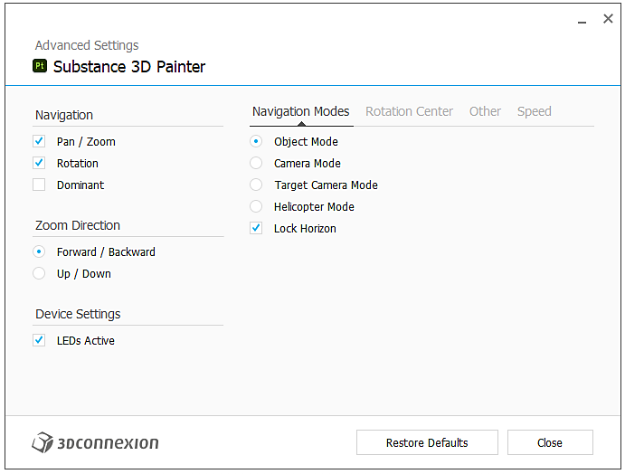

# SpaceMouse® par 3Dconnection

SpaceMouse® by 3Dconnection est un appareil qui permet de naviguer facilement en 3D. Il peut être utilisé pour manipuler le modèle de caméra/3D dans la fenêtre d’application.

* SpaceMouse® est pris en charge depuis la version 7.4.2.
* Pour utiliser correctement cet appareil, assurez-vous d&#39;installer le dernier pilote de [3Dconnection](https://3dconnexion.com/uk/drivers/).

>[!NOTE]
>
> Les utilisateurs qui utilisent le modèle compact et doivent fréquemment faire pivoter la carte d&#39;environnement peuvent choisir d&#39;affecter la touche MAJ au bouton gauche.

## Tutoriel

## Vue d’ensemble

Le bouton de commande principal ou SpaceMouse® vous permet de faire pivoter, de panoramiser et de zoomer dans la clôture d’une manière qui n’est pas possible avec les commandes normales de la souris/du stylet et du clavier. Le dispositif peut être utilisé en combinaison avec la souris et les tablettes avec le stylet.

Tous les modèles et toutes les versions doivent être compatibles avec l’application :

| Modèle | Description | Visuel |
| --- | --- | --- |
| **Modèle compact** | Modèle de base avec la commande Bouton. | 

 |
| **Modèle Pro** | Contrôle des boutons et boutons supplémentaires pour les raccourcis clavier. | 

 |
| **Modèle d&#39;entreprise** | Commande de bouton, boutons supplémentaires et affichage contextuel. | 

 |

>[!NOTE]
>
> Les modèles Compact, Pro et Enterprise ont été testés et validés pour fonctionner correctement avec l&#39;application.

## Menu radial

Le menu est accessible directement à partir de l’appareil :

* Sur le modèle Compact en cliquant sur le bouton de gauche et en choisissant les propriétés dans le menu radial :

  {width="250px"}
* Sur les modèles Pro et Enterprise, le menu des propriétés est accessible en appuyant sur le bouton Menu.

Vous pouvez également cliquer avec le bouton droit de la souris sur l&#39;icône 3Dconnection dans la barre d&#39;état système (en regard de l&#39;horloge système) et choisir **Ouvrir les paramètres 3Dconnection**. Ce menu est contextuel en fonction de la dernière fenêtre active. Sa barre de titre indique à quel programme il correspond. S’il ne s’agit pas de Adobe Substance 3D Painter, passez à la fenêtre Painter, puis revenez à la fenêtre des paramètres :

## Paramètres par défaut

{width="400px"}

Dans le panneau des paramètres de SpaceMouse®, les paramètres par défaut de Painter sont disponibles dans la dernière version des pilotes. Aucune configuration supplémentaire n&#39;est nécessaire, connectez simplement l&#39;appareil et il sera prêt à l&#39;emploi.

Assurez-vous de sélectionner le périphérique approprié dans le menu déroulant supérieur. Par défaut, il doit sélectionner le périphérique approprié.

Le curseur « vitesse » modifie la sensibilité dans tous les axes et toutes les directions.

### Paramètres avancés

En cliquant sur le bouton « Paramètres avancés », il vous permet de modifier le comportement détaillé des commandes principales.

Tout paramètre par défaut peut être modifié. Les onglets **Modes de navigation** et **Centre de rotation** comportent deux sections importantes.

#### Modes de navigation

{width="400px"}

Définissez le comportement du bouton en 3D :

| Paramètre | Description |
| --- | --- |
| Mode objet | Le bouton est l’objet 3D lui-même, il est utilisé par défaut. |
| Mode appareil photo | Contrôlez librement la caméra en 3D. |
| Mode de la caméra cible | Contrôlez la caméra en ciblant toujours un point dans l’espace 3D. |
| Mode hélicoptère | Contrôlez un hélicoptère dans l’espace 3D. |
| Verrouiller l’horizon | Pour verrouiller la caméra afin que l&#39;horizon soit toujours horizontal. Painter propose déjà une option similaire dans ses paramètres, mais elle peut être contrôlée séparément ici. Il est verrouillé par défaut. |

#### Centre de rotation

{width="400px"}

Définissez le comportement de la petite icône de pivot :

| Paramètre | Description |
| --- | --- |
| Auto | Déplacez automatiquement la cible de pivot ou de caméra. Si cette option est désactivée, elle reste toujours collée au pivot d&#39;origine du maillage. |
| Toujours afficher | Le point pivot est toujours affiché dans la clôture 3D, même lorsqu’il n’interagit pas avec le périphérique. |
| Afficher sur le mouvement | Le point pivot s’affiche dans la clôture 3D uniquement lors de l’interaction avec le périphérique. Il s’agit de l’option par défaut. |
| Masquer | Supprimez complètement le point pivot dans la fenêtre 3D. |

>[!NOTE]
>
> Le point pivot a été spécialement conçu pour Painter, mais il peut être masqué si nécessaire.

### Boutons

{width="400px"}

En cliquant sur **Boutons**, il est possible d&#39;attribuer des commandes, des macros ou des menus radiaux. Pour plus d&#39;informations, consultez la [documentation 3Dconnection](https://3dconnexion.com/uk/support/faq/).
