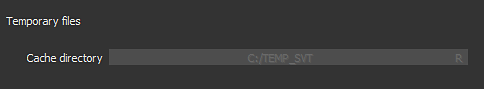

# Textures virtuelles fragmentées

À partir de la version **2018.3**, Substance 3D Painter utilise **des textures virtuelles fragmentées** (**SVT** ) dans sa fenêtre d&#39;affichage en temps réel pour gérer une grande quantité de textures. Cette technologie permet de diffuser des textures d’entrée et de sortie uniquement nécessaires d’un point de vue donné afin de conserver une empreinte spécifique sur la mémoire du GPU. Il améliore les performances des projets comportant un grand nombre d’ensembles de textures (ou UDIM).

## Plates-formes prises en charge

Les textures fragmentées reposent sur une configuration matérielle spécifique afin d’être pleinement performantes. Si la configuration actuelle ne la prend pas correctement en charge, Substance 3D Painter **recourra** à une implémentation logicielle à la place (qui sera moins précise et moins performante).

Il est possible de forcer Substance 3D Painter à utiliser le logiciel de secours au lieu de l&#39;accélération matérielle en accédant aux [Paramètres](../interface/settings/settings.md).

Voici la configuration qui prend en charge les textures virtuelles dispersées à accélération matérielle :

| Plateforme | Pris en charge (accélération matérielle) | Non pris en charge (logiciel de secours) |
| --- | --- | --- |
| **Windows** | <ul data-preserve-html="true"><li data-preserve-html="true">Nvidia GeForce (pilotes 411.63 ou version ultérieure)</li><li data-preserve-html="true">Nvidia Quadro (pilotes 411.63 ou version ultérieure)</li><li data-preserve-html="true">AMD FirePro et Radeon Pro (pilotes 18.9.3 ou version ultérieure) <strong> &#42; </strong></li><li data-preserve-html="true">AMD Radeon (pilotes 18.9.3 ou version ultérieure)&#42;</li></ul> | <ul data-preserve-html="true"><li data-preserve-html="true"> Nvidia Quadro M2000 </li><li data-preserve-html="true">  Nvidia Geforce GTX 970 </li><li data-preserve-html="true"> GPU Intel </li></ul> |
| **Système d&#39;exploitation Mac** | <ul data-preserve-html="true"><li data-preserve-html="true"> Fonctionnalité matérielle non prise en charge par le système d’exploitation </li></ul> | <ul data-preserve-html="true"><li data-preserve-html="true">N’importe quel modèle GPU</li></ul> |
| **Linux** | <ul data-preserve-html="true"><li data-preserve-html="true">Nvidia GeForce (pilotes 410.73 ou supérieurs)</li><li data-preserve-html="true">Nvidia Quadro (pilotes 410.73 ou supérieurs)</li><li data-preserve-html="true">AMD FirePro et Radeon Pro (pilotes 18.9.3 ou version ultérieure) <strong> &#42; </strong></li><li data-preserve-html="true">AMD Radeon (pilotes 18.9.3 ou version ultérieure)&#42;</li></ul> | <ul data-preserve-html="true"><li data-preserve-html="true">GPU Intel</li></ul> |

* **\*** : l’accélération matérielle est désactivée par défaut. Elle peut être activée manuellement dans les [Paramètres](../interface/settings/settings.md).

## Pourquoi Substance 3D Painter utilise-t-il des textures virtuelles éparses ?

Substance 3D Painter utilise son moteur principal pour calculer les textures qui sont ensuite affichées dans les fenêtres. Cela signifie que le moteur et la clôture doivent partager la mémoire GPU (VRam) pour le calcul et l’affichage de ces textures. Plus un projet contient de **ensembles de textures** (ou mosaïques UV), plus la mémoire nécessaire à la clôture sera importante. Si la fenêtre d’affichage prend trop de mémoire sur le GPU, le moteur principal ne dispose pas de suffisamment d’espace pour calculer les textures et devra les éjecter de la mémoire système (Ram). Cela entraînera de mauvaises performances et des calculs lents.

L’objectif du SVT est d’établir le budget de la capacité de la fenêtre d’affichage à utiliser sur la mémoire du GPU, en laissant autant de place que possible au moteur principal pour effectuer les calculs. L’avantage du système est qu’il permet également de charger des projets beaucoup plus volumineux dans Substance 3D Painter tout en continuant à fonctionner normalement.

## Comment fonctionnent les textures dispersées ?

Les textures virtuelles clairsemées sont un type de textures qui ne sont pas complètes. Cela signifie que l’application charge uniquement des parties de textures en mémoire. Seul le nécessaire est chargé et le reste est placé dans la mémoire système ou sur le disque (cache). Si nécessaire, les textures sont à nouveau récupérées de la mémoire cache et replacées dans la clôture. Pour effectuer des transferts suffisamment rapides, le système repose sur **mipmaps** et passe rapidement d&#39;une résolution de texture à l&#39;autre. C&#39;est pourquoi un passage rapide dans l&#39;aire d&#39;affichage peut afficher des textures floues au début, qui augmentent ensuite en qualité au bout de quelques secondes.

Pour plus de connaissances techniques, voir : [Textures virtuelles fragmentées](https://silverspaceship.com/src/svt/) .

## Emplacement du cache

Lorsque la mémoire système (Ram) disponible est insuffisante pour stocker le cache SVT, Substance 3D Painter bascule vers le disque dur de l’ordinateur à la place pour stocker le cache.\
L&#39;emplacement de ce cache est par défaut dans le dossier Fichiers temporaires du système d&#39;exploitation. Cet emplacement peut être modifié en accédant aux paramètres principaux de l&#39;application, voir les [Préférences générales](https://helpx.adobe.com/fr/substance-3d/unlisted/documentation/spdoc/general-71008262.html) .

## Compatibilité du nuanceur

Pour tirer pleinement parti du SVT, les shaders doivent demander et lire des textures à partir du système Sparse. Par conséquent, les fonctions précédentes basées sur les **coordonnées de texture vec2** et les **échantillonneurs** ont été déconseillées. Des fonctions d’aide sont désormais disponibles pour utiliser les textures dispersées.

Pour mettre à jour vos shaders :

* Pour le **shader Substance 3D Painter par défaut** : suivez la procédure étape par étape de la page [Mise à jour d&#39;un shader](../interface/shader-settings/updating-a-shader.md).
* Pour **Ombrage personnalisé** : examinez le ou les messages d&#39;erreur dans le journal ainsi que la page [API de shader](https://helpx.adobe.com/fr/substance-3d/unlisted/documentation/spdoc/custom-shader-api-89686018.html).

>[!WARNING]
>
> Les projets plus anciens peuvent afficher des flashes blancs si leurs nuanciers ne sont pas à jour. Pour plus d&#39;informations, consultez cette page : [Filet clignotant vers le blanc lors du déplacement de l&#39;appareil photo](../technical-support/technical-issues/rendering-issues/mesh-flash-to-white-when-moving-camera.md).
