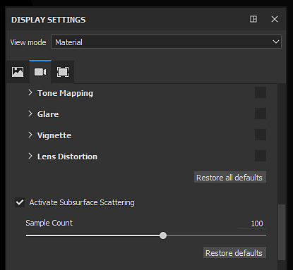

# Activation de la sous-surface dans un projet

Pour activer correctement la Subsurface scattering dans Substance 3D Painter, quelques paramètres doivent d’abord être définis.\
Cette page fournit un guide sur les paramètres à activer.

## 1 - Paramètres de Jeu de textures

Dans le [Jeu de textures](../../interface/texture-set/texture-set.md), ajoutez un canal de **diffusion** s&#39;il n&#39;est pas déjà présent :

>[!NOTE]
>
> Le canal de diffusion fonctionne comme un **masque** sur la **sous-surface** : si le canal est noir, il n&#39;y a pas de sous-surface du tout, tandis que s&#39;il est blanc, l&#39;intensité de la sous-surface sera maximale. Cette couche est une valeur de niveaux de gris qui est **noire par défaut**. Ajoutez un calque de remplissage dans la pile de calques pour contrôler la couleur par défaut ou utilisez un calque de peinture pour contrôler manuellement l’intensité.

## 2 - Réglage global du sous-sol

Activez le paramètre de Subsurface scattering principal dans les [paramètres d&#39;affichage](../../interface/display-settings/display-settings.md) (sous les paramètres Post-Effects) :

>[!NOTE]
>
> L’activation/la désactivation de l’effet Sous-surface affecte l’ensemble du projet. Il peut être utile d&#39;utiliser ce paramètre global s&#39;il est trop lourd en termes de performances.

## 3 - Paramètres de Shader

Dans la fenêtre [Paramètres Shader](../../interface/shader-settings/shader-settings.md) avec les nuanceurs par défaut, un groupe « **Paramètres SSS** » avec deux paramètres est trouvé.\
Modifiez l’échelle et la couleur pour les adapter au matériau cible. Pour plus de détails sur ces paramètres, voir : [Paramètres de sous-surface](subsurface-parameters.md)

## Bonus : Activation des tons foncés

L’effet Subsurface scattering fonctionne bien, mais peut paraître étrange s’il est utilisé seul.\
L’activation de l’ombre peut améliorer l’aspect final du viewport et le réalisme du matériau final.

Dans la fenêtre [Paramètres d&#39;environnement](../../interface/display-settings/environment-settings.md), activez le paramètre « **Tons foncés** » :

