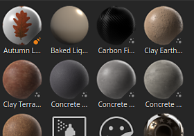

# Ressources

La fenêtre Ressource vous permet d’accéder aux ressources par défaut fournies avec l’application (appelées **Ressources de démarrage**), ainsi qu’aux [ressources importées](https://helpx.adobe.com/fr/substance-3d/unlisted/documentation/spdoc/adding-content-to-the-shelf-142213317.html) (qui se trouvent ensuite sous **Vos ressources**).

* Sur le disque, la bibliothèque **Ressources de démarrage** est stockée dans le dossier d&#39;installation de l&#39;application, tandis que les ressources importées dans **Votre bibliothèque de ressources** par défaut se trouvent dans le dossier Documents.
* Pour plus d&#39;informations sur l&#39;emplacement de stockage de vos ressources sur le disque, consultez [Ajout de contenu sur le disque dur](../../content/importing-assets/adding-content-on-the-hard-drive.md).
* Il est également possible d’ajouter un autre emplacement de bibliothèque. Pour cela, consultez [Ajout d&#39;une nouvelle bibliothèque](adding-a-new-library.md).

## Vue d’ensemble

La fenêtre Actifs est divisée en trois sections principales par défaut :

1. Zone de filtre
1. La liste des actifs
1. La barre du bas

### Zone de filtre

Pour plus d&#39;informations, consultez la [page de navigation](navigation.md).

#### Liste des actifs

#### Barre inférieure

