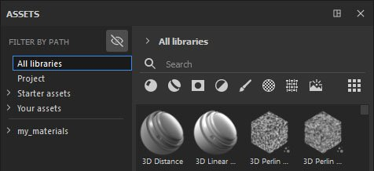

# Filtrer par chemin

**Filtrer par chemin** est une section supplémentaire qui peut être utilisée pour parcourir vos ressources. Il a la même structure que le chemin de navigation, ce qui signifie qu’il vous permet de voir le chemin/l’emplacement de vos ressources.

Par défaut, **Masquer les dossiers non applicables** est activé, ce qui vous permet de masquer les dossiers vides de l&#39;interface utilisateur. Cela peut être utile si, par exemple, vous combinez Filtrer par chemin avec un mot de recherche spécifique ou si vous sélectionnez un type de fichier. Cela vous permettra de voir uniquement les emplacements pertinents qui contiennent votre recherche.

