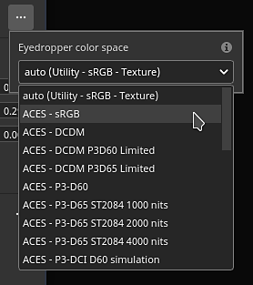

# Sélecteur de couleurs

Le sélecteur de couleurs permet de définir une couleur à peindre ou à projeter sur le filet. Il peut être utilisé pour sélectionner des couleurs à partir d’images externes ou pour ajuster une image existante dans l’application.

La fenêtre du sélecteur de couleurs s’affiche lorsque vous cliquez sur un champ de couleur dans Painter, qui se trouve dans Propriétés ou dans des paramètres ou menus supplémentaires, tels que les paramètres d’affichage ou de nuanceur.

## Présentation du sélecteur de couleurs

Une fois ouvert, le sélecteur de couleurs est semi-persistant, ce qui signifie qu’il reste ouvert jusqu’à un changement de contexte, par exemple, lors du passage d’un calque de peinture à un calque de remplissage. Il est possible de déplacer la fenêtre et de la placer n&#39;importe où sur l&#39;un des écrans disponibles. Cependant, contrairement à d’autres fenêtres, le sélecteur de couleurs ne peut pas être ancré.

La fenêtre a une disposition verticale et se compose de trois sections :

* Sélecteur de dégradé (ou spectre)
* Curseurs (RGB/HSV)
* Nuancier

{width="200px"}

### Sélecteur de dégradé (spectre)

| Nom et visuel | Description |
| --- | --- |
| **Sélecteur d&#39;affichage** 

 | Autoriser à choisir l’affichage à utiliser pour modifier les couleurs (spectre et curseurs). La valeur par défaut correspond à l&#39;affichage utilisé par la fenêtre principale.  **Remarque :** ce paramètre est uniquement disponible lorsque la [gestion des couleurs](../features/color-management/color-management.md) est activée. |
| **Spectre** 

 | Le curseur vertical correspond à la teinte générale. Cela permet de sélectionner la nuance de couleur à afficher dans le champ de dégradé.Une fois la nuance générale sélectionnée, il est possible de maintenir et de faire glisser le curseur en croix dans le champ de dégradé pour sélectionner la couleur souhaitée.  **Remarque :** lorsque la [gestion des couleurs](../features/color-management/color-management.md) est activée, les couleurs HDR de l’affichage actuel sont bridées (dans l’espace colorimétrique de travail). Cela permet d’éviter la valeur HDR de sortie dans les canaux avec gestion des couleurs. |
| **Couleur actuelle et précédente** 

 | Le rectangle de gauche indique la couleur finale qui sortira du sélecteur de couleurs.Le rectangle droit affiche la couleur précédente (à l’ouverture du sélecteur de couleurs). Il est possible de cliquer dessus pour restaurer la couleur précédente et en faire la couleur actuelle. |
| **Champ hexadécimal** 

 | Les champs hexadécimaux représentent la couleur actuelle sous forme de valeurs hexadécimales. Les composantes RGB sont représentées par une paire de lettres.Par exemple, #FF0000 représente la couleur rouge.  **Remarque :** lorsque la [gestion des couleurs](../features/color-management/color-management.md) est activée, le champ hexadécimal fonctionne toujours dans l’espace colorimétrique sRVB standard pour faciliter le copier/coller de valeurs entre les logiciels, quel que soit l’espace d’affichage ou de travail actuellement utilisé par le projet. |
| **Pipette** 

 | La pipette peut être utilisée pour sélectionner une couleur à partir d’une source externe. Pour l&#39;utiliser, **cliquez** sur l&#39;icône, puis déplacez à nouveau la souris pour copier la couleur souhaitée.  **Remarque :** lors de la sélection d&#39;une couleur dans la fenêtre d&#39;affichage, il est possible d&#39;utiliser le modificateur **Maj** pour choisir la couche actuelle modifiée directement. Cela permet d’éviter la conversion avec perte de couleur entre la texture d’origine et la couleur affichée à l’écran. Cela est également utile pour choisir des couleurs sans avoir à passer du mode d&#39;affichage **Matière**. 

  **Remarque :** les champs de couleur sont également dotés d&#39;une pipette et peuvent être utilisés pour sélectionner rapidement des couleurs sans avoir à ouvrir le sélecteur de couleurs. 

  **Remarque :** sur le système d&#39;exploitation Mac, il est possible que la pipette ne puisse pas sélectionner de couleurs en dehors de l&#39;interface de l&#39;application en raison des paramètres de confidentialité. Pour résoudre ce problème, attribuez les droits appropriés à l&#39;application dans : `System Preferences > Security & Privacy > Privacy > Screen Recording` |

### Paramètres de couleurs

| Paramètre | Description |
| --- | --- |
| **Espace colorimétrique de la pipette** | Spécifiez l’espace colorimétrique pour la couleur sélectionnée en dehors de la fenêtre d’affichage.Le paramètre **auto** utilise l&#39;espace colorimétrique sRVB standard des paramètres du projet. 

 **Remarque :** ce paramètre s&#39;applique également aux pipettes situées à côté des boutons de couleur.  **Remarque :** les couleurs sélectionnées dans la clôture utilisent également ce profil lorsqu&#39;elles n&#39;utilisent pas le modificateur Maj. |

### Curseurs

Les curseurs de couleur permettent un réglage manuel des valeurs individuelles.

Les curseurs peuvent être définis dans deux modes différents : **HSV** ou **RGB**. Pour changer de mode, utilisez le menu déroulant dédié.

#### HSV

**HSV** signifie **H** ue, **S** saturation et **V** valeur.

La **teinte** permet de parcourir les familles de couleurs globales, tout comme le curseur de dégradé vertical.

La **saturation** contrôle la richesse de la couleur sélectionnée et passe des niveaux de gris à une saturation maximale.

La **valeur** détermine le degré de noirceur ou de clarté d&#39;une couleur, qui varie du noir total au blanc total.

#### RGB

**RGB** signifie **R**&#x200B;éd, **G** vert et **B** bleu.

Il s’agit des principaux composants utilisés numériquement pour stocker les couleurs dans les images informatiques. Chaque curseur représente la proportion de la composante présente dans la couleur finale.

Exemple : l’image ci-dessous a une couleur qui contient 100 % de rouge, mais 50 % de bleu et de vert.

Il est plus courant de mesurer les curseurs RGB par le biais de valeurs comprises entre 0 et 255. Pour ce faire, désactivez l&#39;option **Valeurs à virgule flottante**.

### Paramètres des curseurs

Le menu Paramètres permet de configurer quelques comportements supplémentaires :

| Paramètre | Description |
| --- | --- |
| **Curseurs dynamiques** | Si cette option est activée, la couleur d’arrière-plan des curseurs s’ajuste en fonction de la couleur actuelle. |
| **Valeurs à virgule flottante** | Si cette option est activée, les valeurs des curseurs sont représentées en allant de 0,0 à 1,0. Si elle est désactivée :<ul data-preserve-html="true"> <li data-preserve-html="true"><strong>HSV</strong> : le curseur de teinte est mesuré en degrés (comme une roue chromatique). Saturation et Valeur utilisent des pourcentages. </li> <li data-preserve-html="true"><strong>RGB</strong> : les composants sont représentés sous forme de valeur allant de 0 à 255.</li> </ul> |

## Espace colorimétrique de travail

Cette section affiche la valeur chromatique finale en fonction de l’espace colorimétrique de travail actuel.

Survoler le titre de l&#39;**espace colorimétrique de travail** avec la souris permet d&#39;afficher le nom de l&#39;espace colorimétrique actuel.

>[!NOTE]
>
> Cette section est uniquement disponible lorsque la [gestion des couleurs](../features/color-management/color-management.md) est activée.

## Nuancier

Les nuanciers permettent d’enregistrer les couleurs afin de pouvoir les réutiliser ultérieurement. Des nuanciers sont disponibles pour toutes les projections et sessions.

### Ajouter une nuance

En cliquant sur ce bouton, vous créez une nouvelle couleur de nuance dans l’ensemble actuel.

La nuance n’est créée que si la dernière couleur (celle en regard du bouton) est différente de la couleur actuellement modifiée.

>[!NOTE]
>
> Les couleurs d&#39;échantillon sont gérées et enregistrées en tant que couleurs sRVB, quelle que soit la configuration actuelle de la [gestion des couleurs](../features/color-management/color-management.md).

### Couleur de nuance

Cliquez sur une nuance pour la charger.

Le survol de la nuance affiche sa valeur hexadécimale.

>[!NOTE]
>
> Lorsque la [gestion des couleurs](../features/color-management/color-management.md) est activée, l&#39;affichage des couleurs est ajusté en fonction de l&#39;affichage actuellement sélectionné.

### Paramètres d’échantillon

Cliquez avec le bouton droit de la souris sur une nuance pour ouvrir le menu et la supprimer.

### Menu Paramètres

Utilisez le menu Paramètres pour supprimer toutes les nuances.

>[!NOTE]
>
> Les nuances sont enregistrées dans un fichier de configuration disponible dans le dossier Documents de l’utilisateur. Pour plus d&#39;informations, consultez la page [Emplacement du rayon et des actifs](../pipeline-and-integration/resource-management/shelf-and-assets-location.md).
