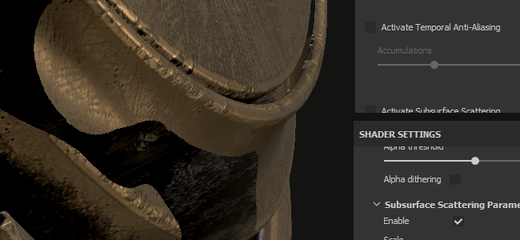

# Paramètres de caméra

Cette section des **Paramètres d&#39;affichage** contrôle le comportement de l&#39;appareil photo ainsi que l&#39;aspect final de la fenêtre d&#39;affichage.

## Caméra

| *Paramètre* | *Description* |
| --- | --- |
| **Champ de vision** | Permet de contrôler le champ de vision de la caméra (en degrés) |
| **Distance de mise au point** | Définit la distance à laquelle se trouve le point focal.  Ce point est utilisé par la Profondeur de l’effet Champ. 

 **Remarque :** la distance de mise au point peut être définie automatiquement en cliquant sur un point du filet à l&#39;aide du raccourci **CTRL + bouton central de la souris** |
| **Ouverture** | Définit la largeur de la Profondeur de champ. 

 **Remarque :** si Iray contrôle ce paramètre, sa modification déclenchera à nouveau un calcul. |

## Effets de post-traitement

Voir la [page post-effet](../../features/post-processing/post-processing.md) pour plus d&#39;informations.

## Antialiasing temporel

Lorsque cette option est activée, l&#39;**Antialiasing temporel** (**TAA**) supprimera les crénelures dans la clôture.\
**Le TAA** fonctionne en accumulant des informations sur plusieurs images de rendu. Cela signifie que l&#39;effet est désactivé jusqu&#39;à ce que la caméra arrête de se déplacer ou que d&#39;autres opérations soient effectuées.

| *Paramètre* | *Description* |
| --- | --- |
| **Accumulations** | Définit le nombre d’images qui seront cumulées pour réduire le crénelage.<ul data-preserve-html="true"> <li data-preserve-html="true">16 : Valeur recommandée pour la plupart des cas</li> <li data-preserve-html="true">64 : Utile pour nettoyer les valeurs de contraste élevées (telles que l&#39;ombrage de test d&#39;Alpha et l&#39;interpolation combinés)</li> </ul>  **Remarque :** ce paramètre n&#39;a aucun impact sur les performances. Toutefois, l&#39;obtention d&#39;une valeur élevée peut prendre plus de temps. |

{width="500px"}

Le lissage peut également être utilisé pour filtrer le shader **Alpha-Test** si le paramètre « **Alpha dithering** » est activé :

{width="500px"}

## Subsurface scattering

Voir la page [Dispersion de sous-surface](../../features/subsurface-scattering/subsurface-scattering.md) pour plus d&#39;informations.

## Profil colorimétrique

Consultez la [page Profil colorimétrique](../../features/post-processing/color-profile.md) pour plus d&#39;informations.

## Mappage de tons

| Paramètre | Description |
| --- | --- |
| **Fonction** | Spécifiez la fonction utilisée pour ajuster les valeurs de couleur dépassant les capacités d’affichage du moniteur (remappage des valeurs HDR vers une plage LDR). Les valeurs possibles sont les suivantes :<ul data-preserve-html="true"><li data-preserve-html="true"><strong>Linéaire</strong> (par défaut) : aucune transformation, les valeurs supérieures à 1,0 sont interceptées.</li><li data-preserve-html="true"><strong>ACES</strong> : utilisez la courbe de mappage des tonalités du film ACES.</li></ul> 

 **Remarque :** certains moteurs de jeu et logiciels de rendu utilisent le mappeur de tonalité ACES. L’activation de cette fonction permet de faire correspondre les couleurs entre les applications et d’éviter les différences. |
