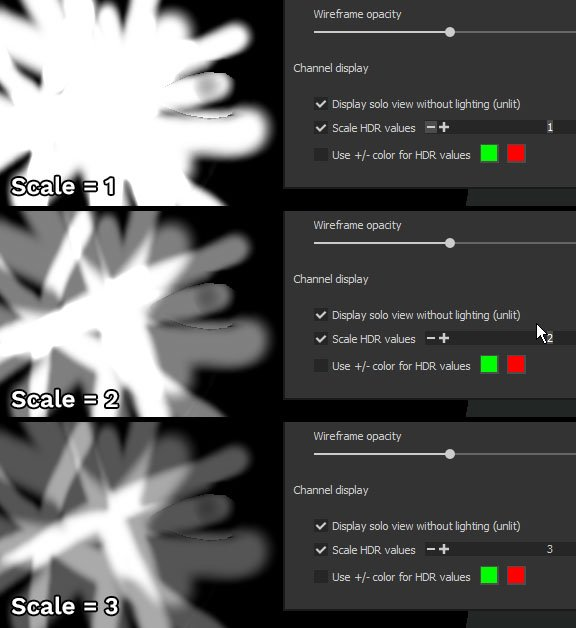

# Paramètres du viewport

Cette section des **Paramètres d&#39;affichage** contrôle divers paramètres liés à l&#39;affichage de la fenêtre, tels que le filtrage de texture et la structure filaire du filet.

## Filtrage de texture

Le filtrage anisotrope et le biais MipMap permettent de contrôler l&#39;affichage des textures dans la fenêtre d&#39;affichage. Ces paramètres n’affectent pas directement les textures et ne seront pas appliqués lors de l’exportation. Ils affinent simplement le processus de rendu dans la clôture. Le paramètre Biais MipMap permet de forcer l’utilisation de textures très nettes pour les pixels éloignés ou formant des angles obliques. Toutefois, dans certains cas, ces textures peuvent créer des motifs Moiré ou des tressautements.

Les paramètres par défaut compromettent la qualité et les performances. Ils ne doivent être modifiés qu’en cas de réel besoin.

| *Paramètre* | *Description* |
| --- | --- |
| **Filtrage Anisotrope** | Le filtrage anisotrope améliore la qualité de la texture lorsque vous la visualisez sous des angles obliques. Des valeurs de qualité élevées permettent un meilleur filtrage, mais peuvent entraîner une perte de performances. Ce paramètre contrôle la quantité d’échantillons par pixel (spp) utilisée pour le filtrage :<ul data-preserve-html="true"><li data-preserve-html="true"><strong>Désactivé</strong> : aucun filtrage</li><li data-preserve-html="true"><strong>Faible</strong> (2spp)</li><li data-preserve-html="true"><strong>Medium</strong> (4spp) : valeur par défaut</li><li data-preserve-html="true"><strong>Élevé</strong> (8spp)</li><li data-preserve-html="true"><strong>Très élevé</strong> (16spp)</li></ul> 

 |
| **Biais MipMap** | Décalez le Niveau du mipmap des détails pour améliorer la qualité de la texture. Des valeurs élevées peuvent entraîner une perte de performances et des irrégularités dans les textures.<ul data-preserve-html="true"><li data-preserve-html="true"><strong>0 - Souple</strong> (Performances légères) : valeur par défaut</li><li data-preserve-html="true"><strong>1 - Moyennement doux</strong></li><li data-preserve-html="true"><strong>2 - Net</strong></li><li data-preserve-html="true"><strong>3 - Très Net</strong> (Performances Intensives)</li></ul>(De 0 à -3) |

## Cadre de la caméra

Pour plus d&#39;informations sur la gestion de l&#39;appareil photo, voir : [Gestion de l&#39;appareil photo](../viewport/camera-management.md)

## Affichage de l&#39;outil

| *Paramètre* | *Description* |
| --- | --- |
| **Masquer le gabarit lors de la peinture** | Lorsque vous utilisez un gabarit (voir les propriétés de l’outil Peinture ), ce paramètre permet de le masquer temporairement lorsque vous peignez sur le filet. |
| **Opacité de l&#39;affichage au pochoir** | Contrôle la visibilité du gabarit sur le rendu de la fenêtre lorsque vous ne peignez pas. |
| **Canal d&#39;aperçu de projection** | Détermine la couche du matériau à afficher lors de l’utilisation de l’outil de projection. |

## Structure filaire du maillage

| *Paramètre* | *Description* |
| --- | --- |
| **Afficher la structure filaire du filet** | Activez ou désactivez l&#39;affichage de la structure filaire du filet dans la clôture. |
| **Couleur Structure filaire** | Définit la couleur utilisée pour dessiner la structure filaire du filet. |
| **Opacité Structure filaire** | Détermine la visibilité de la structure filaire lorsqu’elle est dessinée sur le filet. |

## Affichage du canal

>[!NOTE]
>
> Les paramètres d&#39;affichage des canaux sont uniquement disponibles lors de l&#39;utilisation du mode d&#39;affichage **canal unique**.

| *Paramètre* | *Description* |
| --- | --- |
| **Afficher la vue en solo sans éclairage (non éclairé)** | Lors de l’affichage en mode couche unique, l’activation de ce paramètre supprime l’éclairage et affiche la couche comme des couleurs plates. Si cette option est désactivée, une ombre est appliquée à la bordure du filet. |
| **Valeurs HDR à l’échelle** | Lors de l&#39;affichage en mode Monocanal d&#39;une texture **HDR** (telle que l&#39;height), ce paramètre met à l&#39;échelle les valeurs totales. Cette option est utile pour afficher les valeurs supérieures à 1 ou inférieures à -1. Le résultat est égal à **Canal divisé par échelle**.Dans l’exemple ci-dessous, la couche height a des valeurs allant jusqu’à 3. Cependant, par défaut, elles ne peuvent pas être affichées à moins que la valeur d’échelle ne soit modifiée : 

 |
| **Utiliser +/- couleur pour les valeurs HDR** | Ce paramètre permet d’afficher plus facilement une texture HDR en remplaçant les valeurs positives par la première couleur et les valeurs négatives par la deuxième couleur. Les valeurs neutres (0) sont noires.Exemple : 

 |
| **Couches de couleur** | Modifiez le mode d&#39;affichage de la fenêtre d&#39;affichage pour n&#39;afficher qu&#39;individuellement le composant R, V, B ou Alpha de la couche courante. Ce paramètre n&#39;est pas disponible en mode d&#39;affichage Matière. Lorsque cette option est activée, le nom de la couche de couleur sélectionnée s’affiche dans la clôture :  

  Valeurs possibles :<ul data-preserve-html="true"><li data-preserve-html="true"><strong>RGBA</strong> (par défaut) : dans Couches de couleur, affichez tous les composants avec la transparence.</li><li data-preserve-html="true"><strong>Niveaux de gris+Alpha</strong> (par défaut) : sur la couche Niveaux de gris, affichez les valeurs de niveaux de gris avec la transparence.</li><li data-preserve-html="true"><strong>R</strong> : sur Couches de couleur, affichez uniquement la composante Rouge.</li><li data-preserve-html="true"><strong>G</strong> : sur les couches de couleur, affichez uniquement le composant Vert.</li><li data-preserve-html="true"><strong>B</strong> : sur Couches de couleur, affichez uniquement la composante Bleu.</li><li data-preserve-html="true"><strong>Alpha</strong> : sur toutes les couches, affichez uniquement la transparence de la texture.</li></ul> |

## Grille

Les paramètres de grille permettent d’afficher et de contrôler le dessin d’une grille 3D dans la fenêtre 3D.

Les divisions de grille sont automatiques en fonction du niveau de zoom et d’angle actuel de la caméra. L&#39;unité de grille courante est affichée en bas à gauche de la clôture.

| Paramètre | Description |
| --- | --- |
| **Afficher la grille** | Si cette option est activée, la grille devient visible dans la clôture 3D. |
| **Axe** | Définissez l’axe le long duquel la grille est visible dans la clôture. La valeur par défaut est Y, car il s’agit de l’axe supérieur de l’application. |
| **Couleur de la grille** | Couleur de la grille lorsqu’elle est dessinée dans la clôture. |
| **Opacité de la grille** | Opacité de la grille dans la clôture. |
