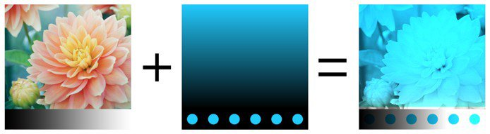
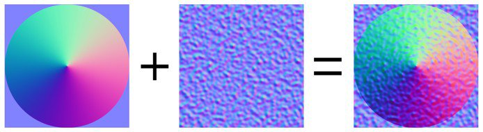

# Modes de fusion

Les calques et les effets ont accès à de nombreux **modes de fusion**. Ils permettent de mélanger le résultat d’un calque avec les autres calques en dessous de différentes manières.

Tous les modes de fusion ne conviennent pas à tous les cas d’utilisation. Par exemple, les modes de fusion de **texture normale** ne sont utiles que pour la couche **normale** dans un ensemble de textures.

## Ordre des modes de fusion

Pour comprendre comment et quand un mode de fusion est appliqué, il est important de comprendre l&#39;ordre dans lequel les opérations sont effectuées dans la **pile de calques** :

1. Calque en bas calculé.
1. Le calque du haut est calculé et mélangé au calque du dessous en fonction du mode de fusion (exemple : Produit).
1. Le masque est appliqué pour donner l’aspect final au calque supérieur.

## Modification Du Mode De Fusion

Le mode de fusion peut être modifié pour **chaque canal** dans un calque. Pour basculer entre les couches, utilisez la liste déroulante en haut à gauche disponible dans la fenêtre de pile de calques.

Pour modifier le mode de fusion, cliquez simplement sur la liste déroulante Mode de fusion sur un calque spécifique :

>[!NOTE]
>
> Il est possible de basculer rapidement entre les modes de fusion à l’aide des raccourcis suivants si la liste déroulante est active :
> 
> * Raccourcis clavier fléchés vers le haut ou le bas
> * Molette de la souris vers le haut ou le bas

## Liste des modes de fusion

Vous trouverez ci-dessous la liste de tous les modes de fusion disponibles dans les calques et effets Substance 3D Painter. La plupart des modes de fusion fonctionnent via des opérations en RGB (ou en niveaux de gris), mais certaines opérations sont également effectuées via un mode différent qui est [HSV (Teinte, Saturation, Valeur)](https://en.wikipedia.org/wiki/HSL_and_HSV). Tous les modes de fusion sont effectués en interne dans **l&#39;espace gamma linéaire**.

| *Nom* | *Description* |
| --- | --- |
| Normale | Affiche le calque supérieur sur le calque inférieur sans transformation (mode de copie). Si le calque supérieur comporte une transparence (alpha), le calque inférieur s’affiche à travers les pixels transparents. 

 |
| Passthrough | Permet d’aplatir le calque inférieur dans le calque supérieur. Principalement utile dans les cas suivants :<ul data-preserve-html="true"> <li data-preserve-html="true">Pour appliquer un effet à tous les calques situés sous le calque supérieur</li> <li data-preserve-html="true">Pour étaler ou dupliquer les calques situés sous le calque supérieur</li> </ul> 

 **Remarque :** **Les effets** peuvent être **glissés et déposés** directement dans la pile de calques, ce qui permet de créer un calque avec le mode de fusion défini sur PassThrough pour tous ses canaux. |
| Désactiver | Ignore la fusion du calque et n’affiche que les calques précédents. Il peut être utilisé pour optimiser le calcul d’un canal en l’ignorant dans la couche supérieure. 

 |
| Remplacer | Remplace le calque inférieur. Cela permet, par exemple, d’éviter de fusionner des informations avec les calques sous-jacents. La commande Remplacer fonctionne différemment de la fusion normale, car elle ignore également la couche alpha présente dans le calque supérieur, ce qui peut se traduire par des pixels transparents. 

 |
|  |  |
| Multiply | Multiplie le calque supérieur par-dessus le calque inférieur. Il en résulte toujours une couleur plus foncée. 

 |
| Divide | Divise les calques inférieurs par les informations de couleur du calque actif. L’image finale est la plupart du temps plus claire et peut parfois sembler creuse. 

 |
| Division inverse | Identique au mode de fusion Division, mais les calques Supérieur et Inférieur sont échangés lors de l’opération de fusion. 

 |
| Darken (Min) | Conserve la valeur chromatique minimale entre le calque supérieur et le calque inférieur. 

 |
| Lighten (Max) | Conserve la valeur chromatique maximale entre les calques supérieur et inférieur. 

 |
|  |  |
| Densité linéaire - (Ajout) | Ajoute la valeur de couleur du calque supérieur au calque inférieur. Le résultat peut donner des couleurs inférieures à 0 ou supérieures à 1, auquel cas le résultat sera bridé/écrêté si la couche n’est pas HDR. Ce mode de fusion est utile pour accumuler des informations sur l’height, par exemple. 

 |
| Subtract | Soustrait la couleur du calque supérieur du calque inférieur. Le résultat peut donner des couleurs inférieures à 0, auquel cas le résultat sera bridé/écrêté si la couche n’est pas HDR. 

 |
| Inverse Subtract | Identique au mode de fusion Soustraction, mais les calques Supérieur et Inférieur sont échangés lors de l’opération de fusion. 

 |
| Difference | Soustrait la couleur du calque supérieur du calque inférieur, mais prend la valeur absolue du résultat (les valeurs négatives deviennent positives). 

 |
| Exclusion | Similaire au mode de fusion Différence, mais il produira un résultat avec un contraste inférieur. 

 |
| Ajout signé (AddSub) | Ajoute et soustrait des informations de couleur du calque inférieur en fonction des couleurs du calque supérieur. Les valeurs de niveaux de gris n’ont aucun effet, tandis que les couleurs sombres soustraient des informations et que les couleurs claires en ajoutent. 

 |
|  |  |
| Overlay | Combinez les deux modes de fusion Superposition et Produit. Les valeurs de niveaux de gris du calque supérieur n’auront aucun effet, mais les couleurs sombres multiplieront les couleurs, tandis que les couleurs claires éclairciront les couleurs. 

 |
| Screen | Les informations de couleur des calques Haut et Bas sont inversées puis multipliées l’une par rapport à l’autre, ce résultat est ensuite à nouveau inversé. Vous obtenez ainsi un résultat visuel qui est l’opposé du mode de fusion Produit et qui donne une image plus lumineuse. 

 |
| Densité linéaire + | Ajoute les informations de couleur du calque supérieur et inférieur ensemble, puis soustrait 1 du résultat. 

 |
| Densité couleur + | Divise le calque inférieur par le calque supérieur. Le calque inférieur est inversé avant l’exécution de l’opération. Cette opération de fusion assombrit le calque supérieur et augmente son contraste pour révéler les couleurs du calque inférieur. Plus le calque du bas est sombre, plus sa couleur est utilisée. 

 |
| Densité couleur - | Divise le calque inférieur par le calque supérieur inversé. Cette opération éclaircit le calque inférieur en fonction de la valeur du calque supérieur. Plus le calque supérieur est lumineux, plus ses couleurs affectent le calque inférieur. 

 |
|  |  |
| Lumière tamisée | Similaire au mode de fusion Incrustation, mais appliqué avec une courbe différente pour fusionner les informations de couleur, ce qui donne une image moins contrastée. 

 |
| Lumière crue | Similaire au mode de fusion Incrustation (combinez les opérations Produit et Superposition). La différence est que l’ordre de fonctionnement est inversé, ce qui donne une image avec des couleurs plus sombres ou plus claires, mais avec moins de contraste. 

 |
| Lumière vive | Associe les modes de fusion Densité couleur et Densité couleur +. La densité est appliquée aux couleurs plus claires que le gris et la densité est appliquée aux couleurs plus foncées que le gris. Les valeurs de gris ne sont pas affectées. Le résultat est une image plus contrastée. 

 |
| Lumière linéaire | Combine Densité linéaire - et Densité linéaire +. La densité est appliquée aux couleurs plus claires que le gris et la densité est appliquée aux couleurs plus foncées que le gris. Les valeurs de gris ne sont pas affectées. Le résultat est similaire à celui de la lumière vive, mais avec moins de contraste. 

 |
| Lumière ponctuelle | Éclaircit et assombrit les informations de couleur en fonction des couleurs du calque supérieur. Si les couleurs sombres du calque supérieur sont plus sombres que celles du calque inférieur, elles seront visibles, sinon elles disparaîtront. Le même principe s’applique aux couleurs vives. Ce mode de fusion peut produire des taches ou des taches (bruit important) et il supprime complètement toutes les demi-teintes. 

 |
|  |  |
| Tint | Effectue l’opération avec le modèle CSV. Conserve uniquement la teinte du calque supérieur et utilise la saturation et la valeur du calque inférieur. Les couleurs noires et très sombres n’ont aucune teinte. Par conséquent, les couleurs du calque inférieur restent inchangées. 

 |
| Saturation | Effectue l’opération avec le modèle CSV. Conserve uniquement la saturation du calque supérieur et utilise la teinte et la valeur du calque inférieur. Les couleurs noires et très sombres sont désaturées, par conséquent les couleurs du calque inférieur deviennent des valeurs de niveaux de gris. 

 |
| Couleur | Effectue l’opération avec le modèle CSV. Conserve uniquement la teinte et la saturation du calque supérieur et utilise la valeur du calque inférieur. Les couleurs noires et très sombres n’ont pas de teinte et sont désaturées, par conséquent les couleurs du calque inférieur deviennent des valeurs de niveaux de gris. 

 |
| Value | Effectue l’opération avec le modèle CSV. Conserve uniquement la valeur du calque supérieur et utilise la teinte et la saturation du calque inférieur. 

 |
|  |  |
| Combinaison de mappage normal | Opération de fusion du voile blanc. Conservez les détails tout en vous assurant que les normales plates fonctionnent toujours correctement. Voir [Peinture de cartes standard](../../painting/advanced-channel-painting/normal-map-painting.md) pour plus d&#39;informations. 

 |
| Détails de la carte des normales | Opération Fusion orientée détail (mappage normal réorienté), plus précise que la combinaison de cartes normale. Conservez les cartes de normales plates et l’intensité des deux sources. Pour obtenir ce résultat, la normale du calque supérieur est réorientée pour suivre la surface du calque inférieur. Voir [Peinture de cartes standard](../../painting/advanced-channel-painting/normal-map-painting.md) pour plus d&#39;informations. 

 |
| Détail inverse de la carte de normales | Même comportement que pour l’opération de fusion Détail de la carte de normales, mais c’est le calque Inférieur qui est transformé pour s’adapter à la surface du calque Supérieur. Voir [Peinture de cartes standard](../../painting/advanced-channel-painting/normal-map-painting.md) pour plus d&#39;informations. 

 |

>>
