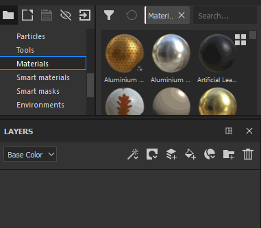

# Création de calques

Il existe plusieurs façons d’ajouter/de créer des calques dans la pile de calques :

| *Action* | *Démonstration* |
| --- | --- |
| Créez un **calque de peinture** en cliquant sur le bouton dédié. 

 | 

 |
| Créez un **calque de remplissage** en cliquant sur le bouton dédié. 

 | 

 |
| Créez un **dossier** en cliquant sur le bouton dédié. 

 | 

 |
| **Dupliquez** un calque à l’aide de l’une des méthodes suivantes :<ul data-preserve-html="true"><li data-preserve-html="true">Cliquez avec le bouton droit > Dupliquer</li><li data-preserve-html="true">Raccourci CTRL+D ou COMMANDE+D</li><li data-preserve-html="true">Maintenez la touche CTRL ou CMD enfoncée et faites glisser le ou les calques</li></ul> | 

 |
| Supprimer un calque en cliquant sur le bouton dédié 

 | 

 |

>[!NOTE]
>
> Certaines de ces actions ont un raccourci clavier associé qui peut être consulté sur la [page dédiée](../settings/shortcuts.md).

Glisser-déposer des ressources de l’étagère peut également être un moyen de créer des calques :

| *Action* | *Démonstration* |
| --- | --- |
| Glissez-déposez un **matériau** à partir des [actifs](../assets/assets.md) dans la pile de calques | 

 |
| Glissez-déposez un **matériau dynamique** à partir des [actifs](../assets/assets.md) dans la pile de calques | 

 |
| Glissez-déposez un **effet** à partir des [actifs](../assets/assets.md) dans la pile de calques | 

 |
