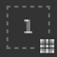

# Masque de géométrie

\
Le masque Géométrie est un masque secondaire sur les calques qui permet de masquer un calque en fonction de la géométrie du modèle 3D du jeu de textures associé. Il peut être masqué par des noms de filet ou par des carreaux UV.

## Vue d’ensemble

Le masque Géométrie spécifie sur quelle partie du modèle 3D le calque doit s’appliquer via une liste d’inclusion/exclusion.

Le masque Géométrie est un outil utile pour éliminer rapidement une grande partie de la géométrie du modèle 3D. Il offre plusieurs avantages au masque de peinture :

* Il est généralement plus rapide à configurer et à utiliser avec les modes de sélection des fenêtres.
* Il offre de meilleures performances car la géométrie peut être complètement supprimée lors de la génération des textures.
* Il est non destructif et sera mis à jour lorsque le modèle 3D sera modifié après une réimportation.
* Il permet de peindre la géométrie qui se trouve sous la géométrie masquée, ce qui permet de peindre les pièces masquées.
* Comme le masque de peinture, le masque de géométrie peut être appliqué à un groupe pour affecter plusieurs calques à la fois.

### États des icônes

L&#39;icône du masque de géométrie peut indiquer dans quel état il se trouve :

| Icône | Description |
| --- | --- |
| 

 | Aucune géométrie n&#39;a été exclue, le calque est appliqué à l&#39;ensemble du maillage du jeu de textures associé. Il s&#39;agit de l&#39;état par défaut de tout nouveau calque ou dossier. |
| 

 | Un ou plusieurs noms de filet ont été exclus. La numérotation indique le nombre d’éléments restants qui sont toujours affectés par le calque. |
| 

 | Un ou plusieurs carreaux UV ont été exclus. La numérotation indique le nombre d’éléments restants qui sont toujours affectés par le calque. |
| 

 | Aucun nom de filet n’est inclus, le calque n’aura aucun effet réel. |

## Modification du masque de géométrie

Pour modifier le masque Géométrie d&#39;un calque donné, cliquez simplement sur l&#39;icône dédiée. Pour quitter le mode de modification, cliquez simplement sur une autre partie du calque, telle que le contenu ou le masque de peinture :

### Types de masquage

Le masque de géométrie prend en charge deux types de masquage :

| Type | Description |
| --- | --- |
| **Tuiles UV** | Le masquage est effectué en spécifiant le numéro UDIM (UV Tile) qui doit être inclus. Il s&#39;agit de la méthode la plus performante qui permet d&#39;éliminer complètement une texture en cours de calcul. |
| **Noms de maillage** | Le masquage est effectué en spécifiant quel sous-maillage doit être inclus dans le modèle 3D. La géométrie est regroupée par nom de maillage. |

### Actions de pile de calques

L’état du masque Géométrie peut être rapidement modifié à partir de la pile de calques directement en cliquant avec le bouton droit de la souris sur l’icône.

Il propose les actions suivantes :

| Action | Description |
| --- | --- |
| **Copier le masque de géométrie** | Copiez le type et la sélection du masque Géométrie du calque donné. |
| **Coller dans le masque de géométrie.** | Collez les propriétés du masque de géométrie copiées précédemment. |
| **Tout inclure** | Marquer tous les éléments du masque donné comme sélectionnés. |
| **Exclure tout** | Marquer tous les éléments du masque donné comme désélectionnés. |

## Peinture à travers une géométrie masquée

Lorsque des parties de la géométrie ont été exclues, elles peuvent être masquées dans la clôture. Cela permet de peindre sur la géométrie qui était précédemment sous-jacente et inaccessible.

Pour masquer la géométrie exclue, utilisez le bouton situé en haut de la fenêtre d&#39;affichage dans la barre d&#39;outils contextuelle :

Dans l’exemple ci-dessous, le modèle 3D a été divisé en deux objets : une partie supérieure et une partie inférieure. Par défaut, les contours entrent en collision avec tous les objets. en excluant la partie supérieure, il est désormais possible de ne peindre que sur la partie inférieure exclusivement.

>[!NOTE]
>
> La liste d&#39;inclusion/exclusion du masque de géométrie est dynamique. La modification de son état déclenchera un nouveau calcul des traits de pinceau dans le calque. Cela permet d’ajuster le masquage sans perdre les traits de pinceau lors de la réimportation d’un filet avec de nouveaux carreaux UV ou si les noms des filets ont été modifiés. Cependant, cela signifie également que les coups de pinceau ne sont pas cuits, de sorte que toute modification du masque de géométrie peut entraîner une projection incorrecte du pinceau par la suite.

| Visuel | Description |
| --- | --- |
| 

 | Aucune géométrie n&#39;a été exclue dans le masque de géométrie. Le calque de peinture sur lequel le coup de pinceau blanc a été effectué entre en collision va toute la géométrie.Le bouton **Masquer la géométrie exclue** est désactivé. |
| 

 | La partie supérieure a été exclue du masque de géométrie et le contour blanc entre uniquement en collision avec la partie inférieure de la géométrie.Le bouton **Masquer la géométrie exclue** est activé. |
| 

 | La partie supérieure a été exclue du masque de géométrie et le contour blanc entre uniquement en collision avec la partie inférieure de la géométrie.Le bouton **Masquer la géométrie exclue** est désactivé. |
