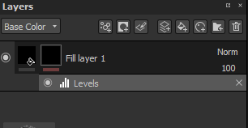

# Masquage et effets

## Masquage

Les calques peuvent être masqués pour afficher/appliquer leur contenu uniquement sur des parties spécifiques de la texture. Le masque fonctionne comme un paramètre d’intensité sur le contenu du calque. Un masque sur un calque est toujours en niveaux de gris, quel que soit le contenu utilisé pour le peindre (par conséquent, toute couleur sera convertie en une valeur de niveaux de gris avant d’être peinte).

Vous pouvez ajouter un masque en utilisant le menu contextuel ou en utilisant le bouton dédié :

Opérations possibles sur les masques :

* Vous pouvez visualiser le masque lui-même en **Alt + clic gauche** sur sa vignette. Cela fera basculer la fenêtre d’affichage vers une vue isolée du masque de ce calque. Cette opération est également disponible via les paramètres de la visionneuse.
* Vous pouvez désactiver temporairement un masque en **MAJ + clic gauche** sur sa vignette. Répétez la même opération pour l’activer à nouveau. Cette opération est également disponible par menu contextuel (Activer/Désactiver le masque).
* Vous pouvez copier le contenu d&#39;un masque sur un autre masque en effectuant un **clic droit > Copier le contenu du masque** sur la vignette, puis en effectuant un **clic droit > Coller dans le masque** sur la vignette du deuxième masque.
* Vous pouvez inverser l&#39;arrière-plan du masque en **faisant un clic droit > Inverser l&#39;arrière-plan du masque**. Cette option est utile si vous souhaitez éviter de détruire les effets liés à un masque.

>[!WARNING]
>
> L’ajout ou le retrait d’un masque détruira le masque et tous les effets qui y sont liés.

Il est possible de créer immédiatement un masque lors de la création d&#39;un calque de remplissage (par glisser-déposer) si vous appuyez sur la touche **CTRL** :

## Effets

Les effets sont une opération spéciale qui peut être modifiée à tout moment. Les effets peuvent être placés sur un masque ou sur le contenu d’un calque.\
Cependant, les effets sont plus appropriés pour l&#39;un pour l&#39;autre. Par exemple, les générateurs conviennent aux masques.

La ligne sous chaque vignette d’un calque indique s’il existe des effets. Le gris n’entraîne aucun effet, le rouge au moins un effet. Il existe une pile d’effets par masque et par contenu.

Pour plus d&#39;informations, [consultez la page dédiée](../../features/effects/effects.md).

## Masques adaptables

Les masques dynamiques permettent d’enregistrer un masque et son effet afin de les réutiliser facilement sur d’autres calques ou projets. Pour créer un masque dynamique, faites un clic droit sur un masque et choisissez « **Créer un masque dynamique** ».\
Lorsque vous faites glisser et déposez un masque dynamique sur un calque, un masque noir est créé s’il n’existe pas déjà, sinon la liste d’effets est fusionnée avec la liste existante. Il est possible d&#39;écraser complètement la liste d&#39;effets en maintenant la touche « **CTRL** » enfoncée lors de la suppression du masque dynamique.

<table>
<tr style="border: 0;">
<td style="border: 0;" valign="top">

</td>
<td style="border: 0;" valign="top">

</td>
</tr>
</table>
