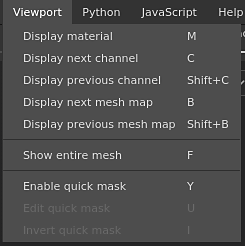

# Menu Fenêtre d’affichage

Le menu Fenêtre d&#39;affichage peut être utilisé pour modifier le mode d&#39;affichage des [Fenêtres d&#39;affichage](https://substance3d.adobe.com/).

| Action | Description |
| --- | --- |
| **Matière d&#39;affichage** | Basculez les fenêtres vers le mode **Matériau** qui affiche le modèle 3D avec éclairage et ombrage. |
| **Afficher le canal suivant** | Basculez les fenêtres en mode Solo pour afficher le canal du prochain ensemble de textures. |
| **Afficher le canal précédent** | Basculez les fenêtres en mode Solo pour afficher le canal du jeu de textures précédent. |
| **Afficher la carte de maillage suivante** | Basculez les fenêtres en mode Solo pour afficher le type de texture Filet cuit suivant. |
| **Afficher la carte de maillage précédente** | Basculez les fenêtres en mode Solo pour afficher le type de texture Filet précédemment défini. |
| **Afficher le maillage entier** | Réglez la caméra de la clôture pour la centrer sur le modèle 3D. |
| **Masque rapide activé** | Voir la page [Masque rapide](../../painting/tool-list/quick-mask.md) pour plus d&#39;informations. |
| **Modifier le masque rapide** | Voir la page [Masque rapide](../../painting/tool-list/quick-mask.md) pour plus d&#39;informations. |
| **Inverser le masque rapide** | Voir la page [Masque rapide](../../painting/tool-list/quick-mask.md) pour plus d&#39;informations. |

Pour plus d&#39;informations sur les modes d&#39;affichage, consultez les [paramètres d&#39;affichage](../display-settings/display-settings.md).

Pour plus d&#39;informations sur le Masque rapide, consultez la [page dédiée](../../painting/tool-list/quick-mask.md).
