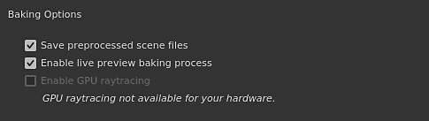
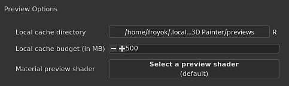

# Préférences générales

Cette page explique les principaux paramètres de l’application.

## Options de l&#39;interface

| Paramètre | Description |
| --- | --- |
| **Langue** | Définissez la langue utilisée par l’interface dans l’application. Ce paramètre nécessite un redémarrage de l’application pour prendre effet.Valeurs possibles :<ul data-preserve-html="true"><li data-preserve-html="true"><strong>Par défaut (langue du système)</strong> : récupérer la langue compatible à partir du système d&#39;exploitation</li><li data-preserve-html="true"><strong>Anglais</strong></li><li data-preserve-html="true"><strong>Allemand</strong></li><li data-preserve-html="true"><strong>Français</strong></li><li data-preserve-html="true"><strong>Japonais</strong></li><li data-preserve-html="true"><strong>Chinois</strong> (simplifié)</li></ul> |
| **Afficher l&#39;assistant du clavier** | Si cette option est activée, les raccourcis clavier s’affichent en bas à gauche des viewports lorsque vous appuyez sur une touche (comme CTRL ou MAJ). |
| **Afficher les axes du monde** | Si cette option est activée, l’axe du monde est affiché en bas à droite de la vue 3D. |
| **Couleur d&#39;arrière-plan** | Choisit les couleurs utilisées comme arrière-plan pour les viewports. Deux couleurs sont disponibles pour créer un dégradé. |
| **Afficher le matériau sélectionné uniquement lors de la peinture** | Si cette option est activée, seul le Jeu de textures actuellement sélectionné s’affiche dans la vue 3D lors de la peinture (en masquant temporairement les autres Jeux de textures).  **Remarque :** il est recommandé de conserver ce paramètre, car la modification rapide de la visibilité dans le viewport peut affecter les performances des [Sparse Virtual Texture](../../features/sparse-virtual-textures.md). |
| **Mise à l&#39;échelle des Viewports** | Permet de réduire la résolution du viewport pour les écrans HDPI/Retina pour améliorer les performances.Valeur possible :<ul data-preserve-html="true"><li data-preserve-html="true"><strong>Aucun</strong> : aucune mise à l’échelle, le viewport est rendu à la résolution d’écran native.</li><li data-preserve-html="true"><strong>Auto</strong> : divisez la résolution d&#39;écran par deux (sur les écrans HDPI uniquement).</li></ul> |

## options de pile de calques

| Paramètre | Description |
| --- | --- |
| **Échelle UV par défaut pour les matériaux** | Définit la valeur de répétition/répétition par défaut pour les calques de remplissage et l’effet de remplissage dans la pile de calques lors de l’application des matériaux. |
| **Utiliser des vignettes simplifiées** | Si cette option est activée, la pile de calques affiche uniquement des icônes au lieu de calculer des vignettes. L’utilisation d’icônes améliore les performances. Ce paramètre ne s’applique pas aux projets utilisant le workflow de Tuile UV de données, car ils affichent toujours des icônes. |

## Options de l&#39;appareil photo

| Paramètre | Description |
| --- | --- |
| **Vitesse de rotation** | Multiplicateur de la vitesse de caméra par défaut dans les viewports. |
| **Vitesse de zoom** | Multiplicateur de la vitesse de zoom par défaut de la caméra dans les viewports.La direction inverse permet d’inverser la direction du zoom en fonction du mouvement de la souris. |
| **Vitesse des molettes** | Multiplicateur de la vitesse de zoom de la molette de la souris.La direction inverse permet d’inverser la direction du zoom en fonction du mouvement de la roue. |

## Options de baking

| Paramètre | Description |
| --- | --- |
| **Enregistrer les fichiers de scène prétraités** | Si cette option est activée, les maillages prétraités en haute technologie utilisés par les bakers seront enregistrés sur le disque pour une réutilisation ultérieure. Ce paramètre permet de baker à nouveau plus rapidement. |
| **Activer le processus de baking de l&#39;aperçu en direct** | Si cette option est activée, les viewports 3D et 2D affichent la texture de baker en cours de calcul sur le maillage. |
| **Activer le GPU raytracing** | Si cette option est activée, les Bakers tenteront d’utiliser le GPU pour effectuer du raytracing au lieu du CPU. La fonction permet aux bakers de fonctionner plus rapidement en général.Cette option ne peut être activée que sur du matériel compatible. Voir [Configuration requise](../../getting-started/system-requirements.md) pour plus de détails. |

## Options d&#39;aperçu

| Paramètre | Description |
| --- | --- |
| **Répertoire de cache local** | Définissez l’emplacement secondaire où se trouvent les vignettes de ressource lors de la génération.Ce paramètre est utile pour calculer et stocker les miniatures de ressource lorsqu’un chemin de ressource est en lecture seule (comme sur un chemin réseau avec un accès en lecture seule). Cela évite de recalculer les vignettes à chaque démarrage, car elles ne seraient sinon pas enregistrées sur le disque. |
| **Budget du cache local (en Mo)** | Définissez la taille maximale du cache pour le cache local. |
| **Shader d&#39;aperçu de matériau** | Définissez un shader à utiliser pour générer des miniatures de matériaux dans les étagères. Ceci est utile si les ressources utilisent un workflow différent du shader par défaut. Ce paramètre nécessite le redémarrage de l’application pour prendre effet. |

## Fichiers temporaires

| Paramètre | Description |
| --- | --- |
| **Répertoire du cache** | Définit l’emplacement d’écriture des fichiers temporaires. Cela inclut le cache [Sparse Virtual Texture](../../features/sparse-virtual-textures.md). Ce paramètre peut être remplacé par une [variable d&#39;environnement](../../pipeline-and-integration/configuration/environment-variables.md). |

## Textures virtuelles éparses

| Paramètre | Description |
| --- | --- |
| **Accélération de la prise en charge matérielle** | Si cette option est activée, l’application tente d’utiliser les textures fragmentées avec le GPU. Pour plus d&#39;informations, consultez la page [Sparse Virtual Texture](../../features/sparse-virtual-textures.md). Ce paramètre peut être remplacé par une [variable d&#39;environnement](../../pipeline-and-integration/configuration/environment-variables.md). |

## Matériel Iray

Cette section répertorie tout le matériel compatible disponible qui peut être utilisé lors du rendu avec Iray.

Le paramètre CPU est disponible sur tous les ordinateurs. Si l&#39;ordinateur dispose d&#39;un **GPU Nvidia** avec une version compatible CUDA, il sera également répertorié ici.

>[!NOTE]
>
> Il est recommandé de désactiver le processeur et de conserver uniquement le matériel GPU activé pour assurer les meilleures performances de rendu. L’activation conjointe du processeur et du GPU peut augmenter le temps de rendu.

## Confidentialité

| Paramètre | Description |
| --- | --- |
| **Envoyer automatiquement les statistiques d&#39;utilisation** | Si cette option est activée, envoyez des informations anonymes sur la configuration matérielle de l’ordinateur avec d’autres données d’utilisation. Ces données nous aident à développer et à améliorer le logiciel. |
