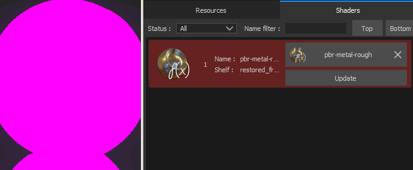

# Mise à jour d’un shader

Il peut être nécessaire de mettre à jour le shader utilisé par un projet afin de résoudre des problèmes ou de tirer parti des dernières fonctionnalités. Cette page explique comment procéder.

Vous trouverez ci-dessous deux méthodes étape par étape pour mettre à jour le shader d’un projet :

* **Mise à jour d&#39;un Shader via la fenêtre Shader**
* **Mettre à jour un Shader via le plug-in Resource Updater**

Si un projet utilise un **shader personnalisé** (non fourni par défaut avec Substance 3D Painter), consultez la page [Shader personnalisé](https://substance3d.adobe.com/display/DRAFTPAINTER/Shader+API) pour obtenir un guide sur la façon de le mettre à jour.

## Mise à jour d’un Shader via la fenêtre Shader

### 1 - Ouverture de la fenêtre Paramètres de Shader

La fenêtre **Paramètres de Shader** est disponible par défaut à droite dans la barre d&#39;outils Ancrer.

### 2 - Cliquez sur le bouton shader et sélectionnez le shader mis à jour

Cliquez sur le bouton shader (sous le bouton Annuler/Rétablir) et recherchez le shader correspondant à celui qui a déjà été utilisé.

### 3 - Shader est mis à jour

Une fois le nouveau shader chargé, la mention **obsolète** doit être supprimée et le modèle 3D doit apparaître normalement dans le viewport.

## Mise à jour d’un Shader via le module Resource Updater

### 1 - Ouvrir le programme de mise à jour des ressources

Allez vers la gauche de l&#39;interface pour trouver la **barre d&#39;outils des plug-ins** et cliquez sur l&#39;icône **Resource Updater**.

### 2 - Basculer vers l’onglet Shader

Dans la nouvelle fenêtre qui s&#39;est affichée, cliquez sur l&#39;onglet « Shader » pour afficher le shader présent dans le projet en cours.

### 3 - Rechercher le Shader et le mettre à jour

L’onglet Shader doit contenir une liste de toutes les ressources Shader utilisées par le projet actif. Le Shader **obsolète** est visible avec un **arrière-plan rouge**. Cliquez sur le bouton « mettre à jour » à côté d&#39;une ressource pour la mettre à jour.

