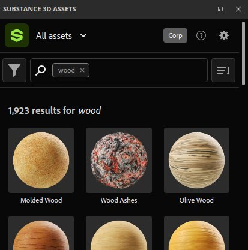

# Substance 3D Assets

Le dock <b>Substance 3D Assets</b> permet de parcourir la bibliothèque en ligne du même nom directement dans l&#39;application. La bibliothèque d&#39;origine est disponible à l&#39;adresse suivante : <https://substance3d.adobe.com/assets>

>[!NOTE]
>
> La fenêtre Substance 3D Assets n’est pas disponible avec la version Steam de l’application.

## Emplacement

Par défaut, la fenêtre est ancrée en tant qu’onglet en regard de la fenêtre générale Actifs. Si la fenêtre est fermée, elle peut être ouverte à nouveau à partir de la barre d’outils d’ancrage à l’extrême droite de l’interface.

### Navigation dans les ressources

Pour parcourir les actifs, vous pouvez utiliser l’interface disponible dans la fenêtre. La partie supérieure affiche un champ de recherche pour affiner votre recherche et un filtre est également disponible.

### Téléchargement des ressources

Une fois que vous avez cliqué sur le bouton de téléchargement d’une ressource, celle-ci commence à être téléchargée et apparaît dans le gestionnaire de téléchargement de la fenêtre. Pour l&#39;afficher, il suffit de cliquer sur le bouton inférieur gauche de la fenêtre.

Cette liste affiche uniquement les ressources téléchargées pendant la session en cours de l’application.

Une fois qu&#39;une ressource a été téléchargée avec succès, elle s&#39;affiche dans la fenêtre <b>Ressources</b> standard.

>[!NOTE]
>
> L’emplacement de téléchargement des ressources dépend de la bibliothèque par défaut. Cet emplacement peut être modifié dans les préférences, voir la [page de documentation](assets/adding-a-new-library.md) dédiée.

### Menu Contrôle

Le bouton en bas à droite de la fenêtre propose quelques actions :

* <b>Ouvrir l&#39;emplacement du dossier</b> : ouvrez l&#39;explorateur de fichiers à l&#39;emplacement de la bibliothèque actuelle. Cela permet de parcourir sur le disque les ressources téléchargées (y compris les sessions précédentes).
* <b>Recharger la page</b> : rechargez l&#39;interface dans la fenêtre.
* <b>Page précédente</b> : accédez à l’interface précédente dans la fenêtre.
* <b>Page suivante</b> : accédez à l’interface suivante dans la fenêtre.

