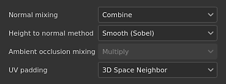

# paramètres de jeu de textures

{width="300px"}

Les **paramètres de Jeu de textures** contrôlent les paramètres du Jeu de textures actuellement sélectionné. C&#39;est là que la résolution, les canaux et les maps de maillage associées peuvent être gérés.

## Propriétés générales

| Paramètre | Description |
| --- | --- |
| **Nom** | Nom du Jeu de textures. Hérité pour le nom de matériau attribué au modèle 3D. |
| **Description** | Champ de texte qui permet d’ajouter des informations sur un Jeu de textures. Ce texte s&#39;affiche dans les fenêtres [Liste de Jeux de textures](texture-set-list.md) et [Baking](../../baking/baking.md). |
| **Taille** | Contrôle la résolution des couches en pixels à l’intérieur d’un Jeu de textures. Pour utiliser des résolutions **non carrées** (par exemple 2048x1024), désactivez le **bouton de verrouillage** entre les deux listes déroulantes.Les résolutions de jeu de textures sont **dynamiques** en raison du **workflow non destructif**. Cela signifie qu’il est possible de travailler à basse résolution pour obtenir de bonnes performances, puis d’utiliser une résolution plus élevée ultérieurement pour obtenir une meilleure qualité. Dans l’application, la résolution maximale d’un canal est de 4 096 x 4 096 pixels, tandis que lors de l’exportation, la résolution maximale est de 8 192 x 8 192 (si le GPU le prend en charge). La modification de la résolution peut déclencher un long calcul du moteur. |
| **Instance de shader** | Définissez le [Shader](../shader-settings/shader-settings.md) à utiliser pour effectuer le rendu du Jeu de textures donné dans le [viewport](../viewport/viewport.md). |

## Canaux

### Liste des canaux

La liste peut être modifiée à tout moment en ajoutant ou en supprimant des canaux (sauf si elle est remplacée par le workflow [Calque de Matériau](../../features/dynamic-material-layering.md)).

| Bouton/icône | Description |
| --- | --- |
| <b>Ajouter un canal</b>  

 | Cliquez sur ce bouton pour ajouter un nouveau canal à la liste.Le menu contextuel qui s’ouvre est divisé en trois catégories :<ul data-preserve-html="true"><li data-preserve-html="true"><strong>Canaux pris en charge</strong> : ces canaux peuvent être utilisés par le shader actuel dans le viewport.</li><li data-preserve-html="true"><strong>Canaux non pris en charge</strong> : ces canaux sont ignorés par le shader actuel dans le viewport.</li><li data-preserve-html="true"><strong>Couches utilisateur</strong> : couches supplémentaires pour peindre plus d’informations, généralement non prises en charge par les nuanceurs.</li></ul>  **Remarque :** il n&#39;y a pas de limite au nombre de canaux pouvant être ajoutés. Cependant, un trop grand nombre de canaux peut avoir un impact important sur les performances et nécessitera davantage de mémoire. |
| <b>Supprimer le canal</b>  

 | Supprimer un canal de la liste.  **Remarque :** les informations de peinture à l&#39;intérieur du projet ne sont pas supprimées avec le canal, de sorte que le canal peut être rajouté ultérieurement si nécessaire pour récupérer la texturation (après un recalcul). |
| <b>Nom du canal</b>  

 | Nom d’un canal donné.Les canaux utilisateur peuvent être renommés en double-cliquant sur le nom actuel : 

 |
| <b>Paramètres de canal</b>  

 | Ce bouton ouvre le menu des paramètres du canal avec plusieurs actions.La première liste d’actions contrôle le type de stockage et la précision du canal :<ul data-preserve-html="true"><li data-preserve-html="true"><strong>sRGB8</strong> : couleurs RGB, valeurs corrigées en gamma, stockées sur 8 bits.</li><li data-preserve-html="true"><strong>L8</strong> : valeurs de niveaux de gris, stockées sur 8 bits.</li><li data-preserve-html="true"><strong>RGB8</strong> : couleurs RGB, stockées sur 8 bits.</li><li data-preserve-html="true"><strong>L16</strong> : valeurs de niveaux de gris, stockées sur 16 bits.</li><li data-preserve-html="true"><strong>RGB16</strong> : couleurs RGB, stockées sur 16 bits.</li><li data-preserve-html="true"><strong>L16F</strong> : valeurs de niveaux de gris - positives et négatives, stockées sur un support flottant 16 bits.</li><li data-preserve-html="true"><strong>RGB 16F</strong> : couleurs RGB - positives et négatives, stockées sur un écran flottant 16 bits.</li><li data-preserve-html="true"><strong>L32F</strong> : valeurs de niveaux de gris - positives et négatives, stockées sur un support flottant 32 bits.</li><li data-preserve-html="true"><strong>RGB 32F</strong> : couleurs RGB - positives et négatives, stockées sur un écran flottant 32 bits.</li></ul>  **Remarque :** le type de stockage **n&#39;est pas** un contrôle d&#39;espace colorimétrique/gamma. Les données utilisées pour stocker les informations d&#39;un canal (par example sRGB8 ou L32F) n&#39;ont aucun effet sur la façon dont l&#39;application les lira. Par exemple, la couche de Rugosité sera toujours considérée comme données/brutes et la Base color sera toujours considérée comme gamma corrigé.  La dernière action du menu peut être utilisée pour activer ou désactiver la [gestion des couleurs](../../features/color-management/color-management.md) sur le canal :<ul data-preserve-html="true"><li data-preserve-html="true"><strong>Couche de couleur</strong> : si cette option est activée, la couleur de la couche est gérée. Cette option ne peut être modifiée manuellement que pour les canaux utilisateur.</li></ul> |
| <b>Gestion des couleurs</b>  

 | Le cas échéant, indique que la couche est gérée en couleur. Seules les couches utilisateur peuvent être marquées comme gérées par couleurs ou non. Le comportement des autres couches est fixe.Pour obtenir une liste détaillée des couches qui bénéficient ou non de la gestion des couleurs, voir : [Gestion des couleurs](../../features/color-management/color-management.md). |

### Paramètres de mélange

Ces paramètres contrôlent différents comportements sur la façon dont les canaux sont générés, notamment la façon dont les canaux sont combinés avec les textures bakées (maps de maillage).

| Paramètre | Description |
| --- | --- |
| **Mélange normal** | Contrôle la façon dont la « map normal bakée » doit être associée au canal « Normal ». Les valeurs possibles sont :<ul data-preserve-html="true"><li data-preserve-html="true"><strong> Remplacer </strong> : ignorez la « map normal bakée » et n&#39;utilisera que le canal « Normal » pour ce Jeu de textures. Peut être utilisé pour effectuer une peinture sur une map normal bakée. Pour plus d&#39;informations, consultez la documentation sur la [peinture sur couches avancée](../../painting/advanced-channel-painting/normal-map-painting.md). Si le canal Normal n’est pas présent ou si la sortie du canal Normal est vide, la map normal bakée sera toujours utilisée.</li><li data-preserve-html="true"><strong> Combiner </strong> (par défaut) : utilisez une fonction orientée détail pour combiner le canal « Normal » et la « map normal bakée ».</li></ul>  **Remarque :** ce paramètre peut être désactivé si le canal est manquant dans la liste des canaux. Si la couche est manquante, la valeur de mixage par défaut est utilisée. |
| **Height à la méthode normale** | Détermine la méthode à utiliser pour convertir la couche d’height en map normal. Les valeurs possibles sont :<ul data-preserve-html="true"><li data-preserve-html="true"><strong>Netteté</strong> : produisez une map normal plus définie au risque d&#39;introduire un bruit et un crénelage. Adapté pour répéter des motifs comme des tissus.</li><li data-preserve-html="true"><strong>Lisser (Sobel)</strong> (par défaut) : produisez une map normal plus lisse avec un filtre Sobel au risque de perdre des détails. Adapté à la plupart des cas.</li></ul> |
| **Mélange d&#39;Ambients occlusion** | Contrôle la manière dont l’« ambient occlusion baké » doit être associé au canal « Ambient occlusion ». Les valeurs possibles sont :<ul data-preserve-html="true"><li data-preserve-html="true"><strong> Remplacer </strong> : ignorez l&#39;ambient occlusion baké et n&#39;utilisera que le canal Ambient occlusion pour ce Jeu de textures. Peut être utilisé pour effectuer une peinture sur un ambient occlusion baké. Pour plus d&#39;informations, consultez la documentation [peinture sur couches avancée](../../painting/advanced-channel-painting/ambient-occlusion-painting.md).  </li><li data-preserve-html="true"><strong> Multiplier </strong> (par défaut) : utilisez une opération de multiplication pour combiner le canal « Ambient occlusion » et « ambient occlusion baké ».  </li></ul>  **Remarque :** ce paramètre peut être désactivé si le canal est manquant dans la liste des canaux. Si la couche est manquante, la valeur de mixage par défaut est utilisée. |
| **UV padding** | Contrôle la génération du remplissage en dehors de l’Îlot UV. Les valeurs possibles sont :  <ul class="steps" data-preserve-html="true"> <li class="step" data-preserve-html="true">    <strong>Voisin de l’espace 3D</strong> (par défaut) : regardez de l’autre côté de l’UV pour rechercher la couleur de pixel voisine et utilisez-la au niveau de la bordure de l’UV. Ce paramètre est recommandé lorsque vous peignez sur des UV avec des motifs continus. Exemple avec un remplissage normal à gauche et le voisin 3D à droite :           </li> <li class="step" data-preserve-html="true">    <strong>Voisin d&#39;espace 2D</strong> : copiez le pixel à l&#39;intérieur d&#39;un Îlot UV sur la bordure à l&#39;extérieur de l&#39;Îlot UV avant de générer le remplissage. Ce paramètre est recommandé lorsque les Îlots UV ont des informations très opposées et ne se chevauchent pas. Exemple avec une sphère où les bandes ont chacune une couleur unique par Îlot UV, à gauche avec le paramètre de voisin 2D et le voisin 3D à droite (remarquez le saignement) :           </li> </ul>  **Remarque :** ce paramètre de remplissage est enregistré par Jeu de textures et pris en compte lors de l&#39;exportation de la texture et de la visualisation dans le viewport.En raison du fonctionnement de l’espace voisin 3D, il ne peut pas être utilisé avec le canal normal et utilisera plutôt la version 2D. |

## Maps de maillage

Les Maps de maillage sont des textures bakées spécifiques au maillage et au Jeu de textures utilisées pour augmenter la qualité de la texture à l&#39;aide de filtres, de Matériaux adaptables et de Masques adaptables. Pour plus de détails, consultez la documentation sur le [baking](../../baking/baking.md).
