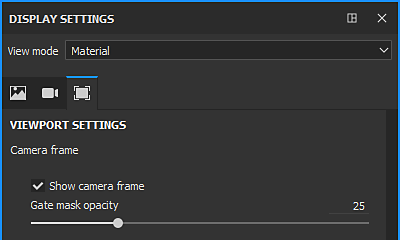

# gestion des caméras

Les caméras créées dans Maya, Max, Blender, Modo et DAE peuvent être importées dans Substance 3D Painter.

>[!NOTE]
>
> Les caméras Orthographiques et les rapports d’affichage ne sont pas correctement pris en charge au format ABC (Alembic).

## Importation de caméras dans Substance 3D Painter

Les caméras doivent être incluses dans le fichier de maillage, au format FBX ou ABC (Alembic).

Le nom, les paramètres de transforme, le FOV et le rapport L/H (s’il existe) sont importés.

Dans la fenêtre Nouveau projet, sélectionnez le fichier de maillage qui inclut les caméras et vérifiez que la case **Importer des Caméras** est cochée. Si vous activez **Réimporter le maillage** dans la fenêtre **Modifier > Configuration du projet**, vous pouvez également activer **Importer des caméras** si vous les avez manquées lors de la création initiale du projet.

Cliquez ensuite sur **OK** :

<table>
  <tr style="border: 0;">
    <td style="border: 0;" valign="top"></td>
    <td style="border: 0;" valign="top"></td>
  </tr>
</table>

## Sélectionner des Caméras

Une fois les caméras importées dans votre projet, vous pouvez sélectionner la caméra active dans la **liste déroulante** du **Viewport 3D**.

Par défaut, la caméra Painter nommée « caméra par défaut » est sélectionnée et est en mode perspective.

Dans l’exemple donné ci-dessus, 3 caméras sont importées, ce qui donne un total de 4 caméras dans la liste déroulante lorsque la caméra Par défaut est incluse.

## Contrôle des caméras

Lorsqu’une caméra importée est sélectionnée, le déplacement de la caméra par panoramique, zoom ou rotation dans le Viewport passe à la Caméra par défaut. Cela empêche le déplacement des caméras importées dans la scène.

>[!NOTE]
>
> Si vous devez modifier la position de la caméra importée, vous pouvez la mettre à jour dans l&#39;application d&#39;édition de scènes de votre choix et réimporter la scène avec **Modifier > Configuration du projet**.

Vous pouvez contrôler les paramètres des caméras importées dans la **fenêtre Paramètres d&#39;affichage**.

Utilisez la liste déroulante **Paramètre prédéfini** pour sélectionner la caméra à modifier.

Si l&#39;un des attributs est modifié, il est possible de revenir à ses valeurs d&#39;origine avec le **bouton Restaurer**.

Si un paramètre a été modifié pour une caméra importée, le nom de la caméra est mis en italique et un &#39;\*&#39; est ajouté au nom de la caméra.

### Attributs de caméra

Le Champ de vision ou FOV est exprimé en degrés.

La Distance focale est exprimée en mm.

En mode Viewport (OpenGL), les options Distance de mise au point et Ouverture sont désactivées. Pour les activer, vous devez activer les Effets de post-traitement et le DOF.

### Rapport d’affichage

Si le rapport d’affichage est présent dans le fichier de maillage, il sera affiché dans la section Caméra. Si une caméra n&#39;a pas de rapport d&#39;affichage défini, elle sera répertoriée comme **Non spécifiée** (comme la caméra par défaut).

### Verrouiller

Une caméra peut être verrouillée en cliquant sur l’icône de verrouillage. Le verrouillage d’une caméra empêche toute modification des paramètres de la caméra.

## Cadre de la caméra

Le cadre de caméra peut être basculé dans **Paramètres d&#39;affichage > Paramètres de Viewport** :

Vous pouvez également ajuster l&#39;opacité de la zone en dehors du cadre avec l&#39;**opacité du masque de grille**.

<table>
  <tr style="border: 0;">
    <td style="border: 0;" valign="top"></td>
    <td style="border: 0;" valign="top"></td>
  </tr>
</table>
