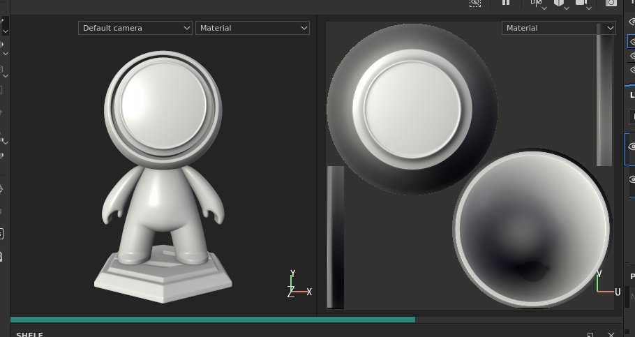

# Viewport

{width="600px"}

C’est dans la fenêtre d’affichage que s’affichent le maillage 3D et ses textures. C’est également là qu’il est possible de peindre sur la surface du filet 3D.

## Vue d’ensemble

La clôture est divisée en quatre parties :

* **Barre d&#39;outils contextuelle** : cette barre d&#39;outils se trouve en haut de la fenêtre et offre un raccourci vers diverses propriétés en fonction du contexte actuel (paramètres du pinceau lors de la peinture, par exemple).
* **Vue 3D** : cette vue montre le filet 3D sous un angle spécifique, défini par une caméra.
* **Vue 2D** : cette vue montre le déballage UV du filet 3D pour le [ensemble de textures](../texture-set/texture-set-list.md) actuellement sélectionné.
* **Barre de progression** : cette barre grise/verte au bas de la clôture apparaît lorsqu&#39;un calcul est en cours (par exemple, lorsque le moteur génère des textures).

Pour plus de détails, consultez les pages dédiées :

* [Vue 2D](2d-view.md)
* [Vue 3D](3d-view.md)
* [Gestion de la caméra](camera-management.md)

Les vues 3D et 2D peuvent être ajustées pour afficher des informations supplémentaires ou différentes via les [paramètres d&#39;affichage](../../interface/display-settings/display-settings.md).

## Commandes de navigation dans la fenêtre d’affichage

Les commandes de déplacement dans la clôture sont similaires dans les vues 2D et 3D.

<table>
  <tr>
    <th>Type de mouvement</th>
    <th>Raccourci</th>
    <th>Description</th>
  </tr>
  <tr>
    <td>Orbite/Rotation </td>
    <td><strong>Alt + clic gauche</strong></td>
    <td><ul><li>Vue 3D : placez la caméra en orbite autour de la position du curseur.</li><li>Vue 2D : faites pivoter l’espace UV autour de la position du curseur.</li></ul></td>
  </tr>
  <tr>
    <td>Panoramique</td>
    <td><strong>Alt + clic au milieu</strong></td>
    <td>Déplacez l'appareil photo vers le haut, le bas, la gauche ou la droite.</td>
  </tr>
  <tr>
    <td>Zoom/dolly</td>
    <td><strong>Alt + clic droit</strong></td>
    <td>Effectuez un zoom plus près ou plus loin du filet/des UV.</td>
  </tr>
</table>

>[!NOTE]
> Dans les vues 2D et 3D, vous pouvez effectuer un accrochage à l&#39;angle orthogonal lors d&#39;une rotation ou d&#39;une orbite à l&#39;aide des touches **Alt+Maj+clic gauche**.

## Modification De La Mise En Page

La disposition par défaut place la vue 3D à gauche et la vue 2D à droite. Quelques paramètres sont disponibles dans la **barre d&#39;outils contextuelle** qui permettent de modifier la mise en page :

<table>
  <tr>
    <th><em>Paramètre</em></th>
    <th><em>Description</em></th>
  </tr>
  <tr>
    <td><strong>Mode fenêtre d'affichage</strong>  </td>
    <td>Ces paramètres contrôlent la disposition de la clôture : <ul><li><strong>3D/2D</strong> (par défaut) : affichez les vues 3D et 2D dans la clôture</li><li><strong>3D uniquement</strong> : agrandissez la vue 3D et masquez la vue 2D.</li><li><strong>2D uniquement</strong> : agrandissez la vue 2D et masquez la vue 3D.</li><li><strong>Permuter les vues 3D/2D</strong> : exchange de l'ordre dans lequel les vues sont affichées. Si la vue 3D était à gauche, elle sera à droite après avoir choisi cette action.</li></ul></td>
  </tr>
  <tr>
    <td><strong>Mode Perspective</strong>  </td>
    <td>Ces paramètres contrôlent la façon dont le filet 3D apparaîtra dans la vue 3D : <ul><li><strong>Vue en perspective</strong> (par défaut) : affiche le maillage 3D tel qu’il serait vu par l’œil humain ou par une caméra.</li><li><strong>Vue orthographique</strong> : affiche le maillage 3D car chaque direction mesure la même longueur.</li></ul></td>
  </tr>
  <tr>
    <td><strong>Mode de rotation de l'appareil photo</strong>  </td>
    <td>Ces paramètres contrôlent le nombre d’axes de rotation de la caméra de la fenêtre d’affichage. <ul><li><strong>Rotation libre</strong> : la caméra pivote sur les axes X, Y et Z.</li><li><strong>Rotation contrainte</strong> (par défaut) : la caméra pivote uniquement sur les axes X et Y (pas de rotation).</li></ul></td>
  </tr>
  <tr>
    <td><strong>Mode de rendu</strong>  </td>
    <td>Passez en <a href="../../features/iray-renderer/iray-renderer.md">mode de rendu</a>.</td>
  </tr>
</table>
