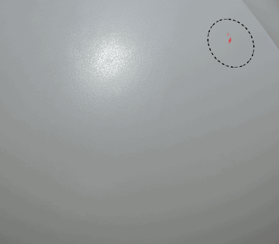

# Traits dynamiques

<table>
<tr style="border: 0;">
<td style="border: 0;" valign="top">

{width="400px"}

</td>
<td style="border: 0;" valign="top">

{width="350px"}

</td>
</tr>
</table>

Les **Traits dynamiques** sont des coups de pinceau réguliers optimisés par des **fichiers de Substance** qui peuvent **changer** pour chaque tampon à l&#39;intérieur d&#39;un **coup de pinceau**.

Chaque élément individuel peut être modifié en fonction d’un comportement spécifique défini dans le fichier de Substance lui-même.

Pour plus d’informations, consultez les pages suivantes :

* [Activation de la fonction de contour dynamique](enabling-dynamic-stroke-feature.md)
* [Performances de contour dynamiques](dynamic-stroke-performances.md)
* [Création de Traits dynamiques personnalisés](creating-custom-dynamic-strokes.md)
