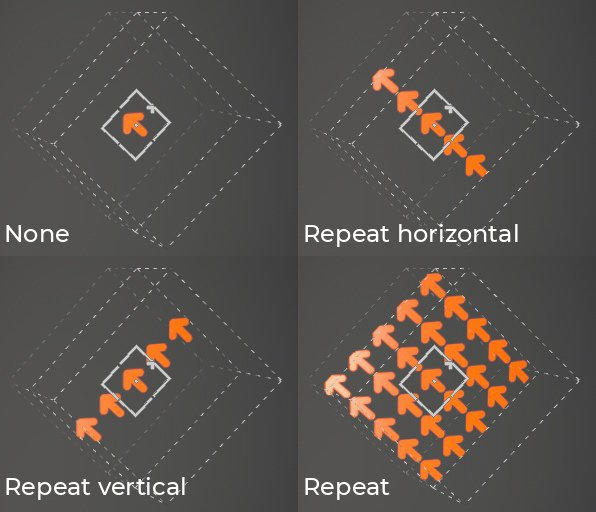

# Projection planaire

La projection planaire du remplissage est une projection 3D qui projette une image dans une direction en tant que plan. Il peut être utilisé pour projeter des panneaux, décalcomanies et autres motifs sur la surface ou à travers le modèle 3D.

## Propriétés

| *Paramètre* | *Description* |
| --- | --- |
| **Filtrage** | Détermine le mode de filtrage de la texture ou de la matière. Ce paramètre peut avoir un impact sur l’aspect de la texture lorsqu’elle est répétée plusieurs fois. Avec des valeurs de mise à l’échelle élevées, l’utilisation d’un filtrage différent du filtre par défaut peut produire un résultat plus esthétique. Paramètres actuels disponibles :<ul data-preserve-html="true"><li data-preserve-html="true"><strong>Quartier général `\|` bilinéaire</strong> (par défaut) : filtrage bilinéaire avancé qui tente d&#39;améliorer la qualité de la texture lorsque les valeurs de mosaïque sont élevées.</li><li data-preserve-html="true"><strong>Bilinéaire `\|` Net</strong> : filtrage bilinéaire simple qui lisse légèrement la texture, mais essaie de préserver les détails.</li><li data-preserve-html="true"><strong>Le plus proche</strong> : aucun filtrage. Ceci est utile si le filtrage bilinéaire donne un résultat flou et casse les détails fins. Peut introduire un crénelage dans la texture.</li></ul> |
| **Pliage des UV** | Contrôlez la façon dont la texture se répète dans la projection. Les valeurs possibles sont :<ul data-preserve-html="true"><li data-preserve-html="true"><strong>Aucun</strong> : la texture ne se répète pas. Tout ce qui se trouve en dehors de la texture est noir/transparent.</li><li data-preserve-html="true"><strong>Répétition horizontale</strong> : la texture se répète uniquement horizontalement.</li><li data-preserve-html="true"><strong>Répétition verticale</strong> : la texture se répète uniquement verticalement.</li><li data-preserve-html="true"><strong>Répétition</strong> (par défaut) : la texture se répète sur les deux axes.</li></ul>  

 |
| **Recadrage de forme** | Définissez si la texture projetée doit être visible en dehors de la zone de projection. Les valeurs possibles sont :<ul data-preserve-html="true"><li data-preserve-html="true"><strong>Projet recadré pour prendre une forme</strong> : la projection est confinée dans la zone de projection.</li><li data-preserve-html="true"><strong>La projection s&#39;étend à l&#39;extérieur de la forme</strong> (par défaut) : la projection se poursuit au-delà de la zone de projection.</li></ul>  

 |
| **Culling de profondeur** | Si cette option est activée, la projection s’estompera/se découpera le long de son axe de projection au lieu d’être infinie.  <ul class="steps" data-preserve-html="true"> <li class="step" data-preserve-html="true">    <strong>Activé</strong>:           </li> <li class="step" data-preserve-html="true">    <strong>Désactivé</strong>:         </li> </ul>  Un paramètre est disponible :<ul data-preserve-html="true"><li data-preserve-html="true">Le paramètre de <strong>dureté</strong> contrôle la dureté ou la souplesse du culling de profondeur le long de l&#39;axe de projection.</li></ul>  

 |
| **Abattage du dos** | Si cette option est activée, la projection n&#39;apparaîtra pas sur les faces du modèle 3D qui sont éloignées de l&#39;axe de projection.Deux paramètres sont disponibles :<ul data-preserve-html="true"><li data-preserve-html="true"><strong>Angle</strong> : définissez l&#39;angle minimum qui détermine quand les visages qui détournent le regard doivent être ignorés.</li><li data-preserve-html="true"><strong>Dureté</strong> : définissez la dureté ou la souplesse de la transition.</li></ul>  

 |

>[!NOTE]
>
> Le réglage de l’échelle de transformation permet également de contrôler la profondeur de projection :
> 
> 

### transformation UV

Les paramètres de transformation UV contrôlent la texture/la matière dans la projection.

<table data-preserve-html="true" style="width: 100.0%;"><colgroup> <col style="width: 40.0%;"/> <col style="width: 20.0%;"/> <col style="width: 40.0%;"/> </colgroup><tbody><tr><th>Mode de mise à l’échelle</th><th>Paramètre</th><th>Description</th></tr><tr><td>
<strong>Limites</strong> (par défaut)<strong>  </strong>

Permet de définir manuellement la quantité de répétition de la texture actuelle.
</td><td><strong>Répétition</strong></td><td>Détermine le nombre de répétitions de la texture.</td></tr><tr><td rowspan="2">  </td><td colspan="1"><strong>Rotation</strong></td><td colspan="1">Détermine l’angle selon lequel la texture est projetée sur le filet.</td></tr><tr><td colspan="1"><strong>Décalage</strong></td><td colspan="1">Définit l’emplacement de projection de la texture. La valeur par défaut signifie que le centre de la texture est au centre des UV du maillage.</td></tr><tr><th colspan="1"> </th><th colspan="1"> </th><th colspan="1"> </th></tr><tr><td rowspan="4">
<strong>Taille physique</strong>

Ajustement automatique d’une texture en fonction du maillage et de la taille physique incorporée. Il utilise la largeur et la longueur (mesures X et Y) pour calculer la taille physique correcte. Une mesure n'est pas prise en compte.

(Pour plus d’informations, voir la [page de documentation](https://experienceleague.adobe.com/en/docs/substance-3d-painter/using/features/physical-size) dédiée)
</td><td><strong>Taille personnalisée</strong></td><td>
Si cette option est activée, permet de saisir une taille physique manuellement et de remplacer celle fournie par une ressource.

Elle est automatiquement sélectionnée si aucune taille physique n’est détectée ou si plusieurs ressources avec des tailles physiques différentes sont utilisées dans le même calque/effet.
</td></tr><tr><td colspan="1"><strong>Taille (cm)</strong></td><td colspan="1">Les tailles physiques intégrées sont exprimées en centimètres. Il est possible de travailler avec un fichier de maillage créé avec différentes unités de mesure ; il conservera les proportions correctes. Cependant, la taille de l’actif est actuellement affichée en centimètres uniquement.</td></tr><tr><td colspan="1"><strong>Rotation</strong></td><td colspan="1">Détermine l’angle selon lequel la texture est projetée sur le filet.</td></tr><tr><td colspan="1"><strong>Décalage</strong></td><td colspan="1">
Définit l’emplacement de projection de la texture. La valeur par défaut signifie que le centre de la texture est au centre des UV du maillage.
</td></tr></tbody></table>

### Paramètres de la projection 3D

Les paramètres de projection 3D contrôlent la transformation de la projection dans l’espace 3D.

| Paramètre | Description |
| --- | --- |
| **Décalage** | Position de l’origine de la projection dans l’espace 3D. Les unités sont basées sur le cadre de sélection de toute la scène. 0 est le centre de cette zone. |
| **Rotation** | Angles en degrés pour faire pivoter toute la projection sur chaque axe. |
| **Échelle** | Taille de la projection entière sur chaque axe. |

## Barre d’outils contextuelle

Plusieurs paramètres et outils sont disponibles dans la [barre d&#39;outils contextuelle](../../interface/toolbars.md) située en haut de la fenêtre d&#39;affichage, qui permet de contrôler le manipulateur et la projection :

| Icône | Nom | Description |
| --- | --- | --- |
| 

 | Afficher/masquer le manipulateur | Si cette option est activée, le manipulateur est visible et contrôlable dans la clôture. |
| 

 | Paramètres du manipulateur | Ce menu contient trois paramètres :<ul data-preserve-html="true"><li data-preserve-html="true"><strong>Taille du manipulateur</strong> : contrôle la taille du manipulateur dans la clôture.</li><li data-preserve-html="true"><strong>Étapes de grille</strong> : définissez la taille de l&#39;étape lors de la traduction avec une contrainte.</li><li data-preserve-html="true"><strong>Pas d&#39;angle</strong> : définissez l&#39;angle du pas lors d&#39;une rotation avec une contrainte.</li></ul> |
| 

 | Manipulateur de translation | Permet de déplacer la projection dans la scène le long des axes principaux (X, Y, Z). |
| 

 | Manipulateur de rotation | Permet de faire pivoter la projection dans la scène le long des axes principaux (X, Y, Z). |
| 

 | Manipulateur d’échelle | Permet de mettre à l&#39;échelle la projection dans la scène le long des axes principaux (X, Y, Z). |
| 

 | Manipulateur de surface | Autorisez à déplacer la projection en l&#39;accrochant à la surface du modèle 3D.  **Remarque :** ce manipulateur est uniquement disponible avec les types de projection Planaire et Déformation. |
| 

 | Espace de manipulation | Définissez l’espace dans lequel les transformations sont effectuées. Les valeurs possibles sont :<ul data-preserve-html="true"><li data-preserve-html="true"><strong>Espace local</strong> : les axes sont alignés sur la transformation actuelle.</li><li data-preserve-html="true"><strong>Espace universel</strong> : les axes sont alignés avec la scène.</li></ul> |
| 

 | Mise en miroir sur X | Inversez la transformation sur l’axe X. |
| 

 | Miroir sur Y | Inversez la transformation sur l’axe Y. |
| 

 | Miroir sur Z | Inversez la transformation sur l’axe Z. |
| 

 | Réinitialiser la transformation | Rétablissez la transformation de projection à son état par défaut. |

## Manipulateur

Ce manipulateur de projection est uniquement disponible dans la [fenêtre d&#39;affichage 3D](../../interface/viewport/3d-view.md).

| Action | Raccourci | Description |
| --- | --- | --- |
| **Traduction** | Clic de souris | Avec le manipulateur Translation, cliquez sur les axes pour déplacer la projection :<ul data-preserve-html="true"><li data-preserve-html="true"><strong>Un axe</strong> : ne déplacer la projection que dans une seule direction.</li><li data-preserve-html="true"><strong>Deux axes</strong> : déplacez la projection sur les plans alignés avec les axes.</li><li data-preserve-html="true"><strong>Trois axes</strong> : déplacez la projection dans l&#39;espace de l&#39;appareil photo (faites-la face).</li></ul>   <table> <tr style="border: 0;"> <td style="border: 0;" valign="top">  

  </td> <td style="border: 0;" valign="top">  

  </td> <td style="border: 0;" valign="top">  

  </td> </tr> </table> |
| **Traduction limitée** | MAJ + clic de souris | Avec le manipulateur Translation, déplacez la projection le long des axes sélectionnés, mais seulement à des intervalles spécifiques (pas à pas). La taille de l’intervalle est définie via les paramètres du manipulateur.  

 |
| **Rotation** | Clic de souris | Avec le manipulateur Rotation, cliquez sur un axe pour faire pivoter la projection. Cliquez entre les axes pour faire pivoter tous les axes en même temps.   <table> <tr style="border: 0;"> <td style="border: 0;" valign="top">  

  </td> <td style="border: 0;" valign="top">  

  </td> </tr> </table> |
| **Rotation contrainte** | MAJ + clic de souris | Avec le manipulateur Rotation, cliquer sur un axe pour faire pivoter la projection ne se produit qu&#39;à des intervalles spécifiques. Le pas est défini par un angle via les réglages du manipulateur.  

 |
| **Échelle** | Clic de souris | Avec le manipulateur Échelle, cliquez sur une poignée d’axe pour redimensionner la projection le long de l’axe donné.   <table> <tr style="border: 0;"> <td style="border: 0;" valign="top">  

  </td> <td style="border: 0;" valign="top">  

  </td> <td style="border: 0;" valign="top">  

  </td> </tr> </table> |
| **Échelle limitée** | MAJ + clic de souris | Avec le manipulateur d’échelle, cliquez sur une poignée d’axe tout en conservant le raccourci pour redimensionner la projection par étapes. La taille de pas est la même que pour le manipulateur Translation.  

 |
| **Surface** | Clic de souris | À l’aide du manipulateur Surface, cliquez dessus et faites-le glisser sur le modèle 3D pour l’accrocher à la surface.  

  **Remarque :** ce manipulateur est uniquement disponible avec les types de projection **Planaire** et **Déformation**. |
