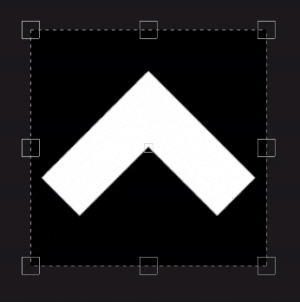

# UV projection

La Projection UV du remplissage est une projection 2D qui ne fonctionne que dans l’espace de texture 2D. Il offre des commandes pour déplacer, faire pivoter et mettre à l’échelle une image.

## Propriétés

| *Paramètre* | *Description* |
| --- | --- |
| **Filtrage** | Détermine le mode de filtrage de la texture ou de la matière. Ces paramètres peuvent avoir un impact sur l’aspect de la texture lorsqu’elle est répétée plusieurs fois. Avec des valeurs de mise à l’échelle élevées, l’utilisation d’une méthode de filtrage différente de la méthode par défaut peut produire de meilleurs résultats. Paramètres actuellement disponibles :<ul data-preserve-html="true"><li data-preserve-html="true"><strong>Bilinéaire `\|` HQ </strong> : (par défaut) Filtrage bilinéaire avancé qui tente d&#39;améliorer la qualité de la texture lorsque les valeurs de mosaïque sont élevées.</li><li data-preserve-html="true"><strong>Bilinéaire `\|` Net </strong> : filtrage bilinéaire simple qui lisse légèrement la texture, mais tente de préserver les détails.</li><li data-preserve-html="true"><strong>Au plus proche </strong> : aucun filtrage, utile si le filtrage bilinéaire donne un résultat flou et casse les détails fins. Peut introduire un crénelage dans la texture.</li></ul> |
| **Pliage des UV** | Contrôle la façon dont la matière/image projetée doit se répéter à l’intérieur de la forme de projection. Les valeurs possibles sont :<ul data-preserve-html="true"><li data-preserve-html="true"><strong>Aucune</strong> : il n&#39;y a pas de répétition de la projection.</li><li data-preserve-html="true"><strong>Répéter horizontalement</strong> : répéter uniquement horizontalement.</li><li data-preserve-html="true"><strong>Répéter verticalement</strong> : répéter uniquement verticalement.</li><li data-preserve-html="true"><strong>Répéter</strong> (par défaut) : répéter à la fois horizontalement et verticalement.</li></ul> 

 |

### transformation UV

Les paramètres de transformation UV contrôlent la texture/la matière dans la projection.

<table data-preserve-html="true" style="width: 100.0%;"><colgroup> <col style="width: 40.0%;"/> <col style="width: 20.0%;"/> <col style="width: 40.0%;"/> </colgroup><tbody><tr><th>Mode de mise à l’échelle</th><th>Paramètre</th><th>Description</th></tr><tr><td>
<strong>Limites</strong> (par défaut)<strong>  </strong>

Permet de définir manuellement la quantité de répétition de la texture actuelle.
</td><td><strong>Répétition</strong></td><td>Détermine le nombre de répétitions de la texture.</td></tr><tr><td rowspan="2">  </td><td colspan="1"><strong>Rotation</strong></td><td colspan="1">Détermine l’angle selon lequel la texture est projetée sur le filet.</td></tr><tr><td colspan="1"><strong>Décalage</strong></td><td colspan="1">Définit l’emplacement de projection de la texture. La valeur par défaut signifie que le centre de la texture est au centre des UV du maillage.</td></tr><tr><th colspan="1"> </th><th colspan="1"> </th><th colspan="1"> </th></tr><tr><td rowspan="4">
<strong>Taille physique</strong>

Ajustement automatique d’une texture en fonction du maillage et de la taille physique incorporée. Il utilise la largeur et la longueur (mesures X et Y) pour calculer la taille physique correcte. Une mesure n'est pas prise en compte.

(Pour plus d’informations, voir la [page de documentation](https://experienceleague.adobe.com/fr/docs/substance-3d-painter/using/features/physical-size) dédiée)
</td><td><strong>Taille personnalisée</strong></td><td>
Si cette option est activée, permet de saisir une taille physique manuellement et de remplacer celle fournie par une ressource.

Elle est automatiquement sélectionnée si aucune taille physique n’est détectée ou si plusieurs ressources avec des tailles physiques différentes sont utilisées dans le même calque/effet.
</td></tr><tr><td colspan="1"><strong>Taille (cm)</strong></td><td colspan="1">Les tailles physiques intégrées sont exprimées en centimètres. Il est possible de travailler avec un fichier de maillage créé avec différentes unités de mesure ; il conservera les proportions correctes. Cependant, la taille de l’actif est actuellement affichée en centimètres uniquement.</td></tr><tr><td colspan="1"><strong>Rotation</strong></td><td colspan="1">Détermine l’angle selon lequel la texture est projetée sur le filet.</td></tr><tr><td colspan="1"><strong>Décalage</strong></td><td colspan="1">
Définit l’emplacement de projection de la texture. La valeur par défaut signifie que le centre de la texture est au centre des UV du maillage.
</td></tr></tbody></table>

## Barre d’outils contextuelle

Plusieurs paramètres et outils sont disponibles dans la [barre d&#39;outils contextuelle](../../interface/toolbars.md) située en haut de la fenêtre d&#39;affichage, qui permettent de contrôler le manipulateur et la projection :

| Icône | Nom | Description |
| --- | --- | --- |
| 

 | Afficher/masquer le manipulateur | Si cette option est activée, le manipulateur est visible et contrôlable dans la clôture. |
| 

 | Taille des poignées du manipulateur | Ce menu contient trois paramètres qui définissent la taille des poignées de la transformation dans la clôture :<ul data-preserve-html="true"><li data-preserve-html="true"><strong>Petit</strong></li><li data-preserve-html="true"><strong>Moyenne</strong></li><li data-preserve-html="true"><strong>Grand</strong></li></ul> |
| 

 | Mise en miroir sur X | Inversez la transformation sur l’axe X. |
| 

 | Miroir sur Y | Inversez la transformation sur l’axe Y. |
| 

 | Réinitialiser le point de pivot | Rétablissez le point pivot au milieu de la transformation. |
| 

 | Réinitialiser la transformation | Rétablissez la transformation de projection à son état par défaut. |

## Manipulateur

La Projection UV utilise un manipulateur qui est uniquement disponible dans la [vue 2D](../../interface/viewport/2d-view.md).

| Action | Raccourci | Description |
| --- | --- | --- |
| **Traduire** | Clic de souris | Cliquez et faites glisser n’importe quelle zone à l’intérieur de la transformation pour la déplacer. 

 |
| **Traduire avec contrainte** | MAJ + clic de souris | Cliquez et faites glisser une zone à l’intérieur de la transformation tout en maintenant le raccourci enfoncé pour la déplacer le long d’un seul axe. L’axe peut être horizontal ou vertical et aligné avec la caméra. Il est basé sur la direction de la souris. 

 |
| **Rotation** | Clic de souris | Cliquez et faites glisser depuis l’extérieur de la transformation pour la faire pivoter. Le déplacement du pivot permet également de modifier le point d&#39;origine de la rotation.   <table> <tr style="border: 0;"> <td style="border: 0;" valign="top">  

  </td> <td style="border: 0;" valign="top">  

  </td> </tr> </table> |
| **Rotation contrainte** | MAJ + clic de souris | Cliquer et faire glisser depuis l’extérieur de la transformation tout en maintenant le raccourci enfoncé permet de la faire pivoter tous les 45 degrés uniquement. 

 |
| **Échelle** | Clic de souris | Cliquer et faire glisser les poignées du manipulateur permet de déformer la transformation.   <table> <tr style="border: 0;"> <td style="border: 0;" valign="top">  

  </td> <td style="border: 0;" valign="top">  

  </td> </tr> </table> |
| **Échelle limitée** | MAJ + clic de souris | En appuyant sur le raccourci et en le maintenant enfoncé tout en faisant glisser une poignée, la transformation est forcée de conserver son rapport.   <table> <tr style="border: 0;"> <td style="border: 0;" valign="top">  

  </td> <td style="border: 0;" valign="top">  

  </td> </tr> </table> |
| **Mise à l&#39;échelle en miroir** | CTRL + clic de la souris | Lorsque vous déplacez une poignée tout en appuyant sur le raccourci, les autres poignées effectuent un mouvement similaire. Elle permet de déformer la transformation en symétrie autour du point pivot.   <table> <tr style="border: 0;"> <td style="border: 0;" valign="top">  

  </td> <td style="border: 0;" valign="top">  

  </td> </tr> </table> |
| **Mise à l&#39;échelle en miroir et limitée** | MAJ+CTRL+Clic de souris | La combinaison des deux raccourcis permet de déformer la transformation en symétrie tout en préservant le rapport L/H. 

 |
