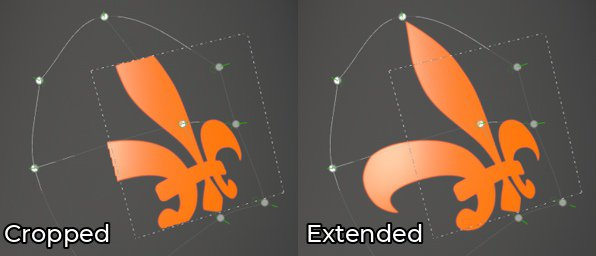
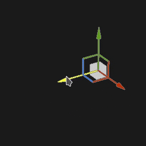
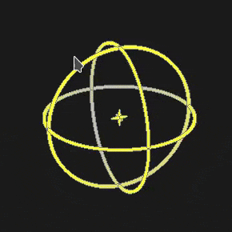
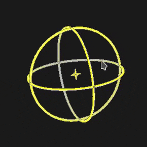

# Projection de la déformation

La projection Déformation du remplissage est une projection 3D qui permet de déformer une texture en modifiant les points d’une grille. Il peut être utilisé pour ajuster des motifs et un logo sur une surface non plane.

## Configuration rapide

Il est possible de configurer rapidement un calque avec la projection de déformation en faisant glisser une ressource de la [fenêtre Actifs](../../interface/assets/assets.md) vers le filet. Lorsque vous relâchez la souris, un menu s’ouvre, permettant de choisir dans quel canal la ressource doit être affectée.

Les types de ressources compatibles sont :

* **Alpha**
* **Procédural**
* **Texture**
* **Matière** (nécessite d&#39;appuyer sur la touche ALT)

## Propriétés

| Paramètre | Description |
| --- | --- |
| **Filtrage** | Détermine le mode de filtrage de la texture ou de la matière. Ce paramètre peut avoir un impact sur l’aspect de la texture lorsqu’elle est répétée plusieurs fois. Avec des valeurs de mise à l’échelle élevées, l’utilisation d’un filtrage différent du filtre par défaut peut produire un résultat plus esthétique. Paramètres actuels disponibles :<ul data-preserve-html="true"><li data-preserve-html="true"><strong>Bilinéaire | HQ</strong> (par défaut) : filtrage bilinéaire avancé qui tente d&#39;améliorer la qualité de la texture lorsque les valeurs de mosaïque sont élevées.</li><li data-preserve-html="true"><strong>Bilinéaire | Net</strong> : filtrage bilinéaire simple qui lisse légèrement la texture, mais essaie de préserver les détails.</li><li data-preserve-html="true"><strong>Le plus proche</strong> : aucun filtrage. Ceci est utile si le filtrage bilinéaire donne un résultat flou et casse les détails fins. Peut introduire un crénelage dans la texture.</li></ul> |
| **Pliage des UV** | Contrôlez la façon dont la texture se répète dans la projection. Les valeurs possibles sont :<ul data-preserve-html="true"><li data-preserve-html="true"><strong>Aucun</strong> : la texture ne se répète pas. Tout ce qui se trouve en dehors de la texture est noir/transparent.</li><li data-preserve-html="true"><strong>Répétition horizontale</strong> : la texture se répète uniquement horizontalement.</li><li data-preserve-html="true"><strong>Répétition verticale</strong> : la texture se répète uniquement verticalement.</li><li data-preserve-html="true"><strong>Répétition</strong> (par défaut) : la texture se répète sur les deux axes.</li></ul> |
| **Recadrage de forme** | Définissez si la texture projetée doit être visible en dehors de la zone de projection. Les valeurs possibles sont :<ul data-preserve-html="true"><li data-preserve-html="true"><strong>Projet recadré pour prendre une forme</strong> : la projection est confinée dans la zone de projection.</li><li data-preserve-html="true"><strong>La projection s&#39;étend à l&#39;extérieur de la forme</strong> (par défaut) : la projection se poursuit au-delà de la zone de projection.</li></ul> 

 |
| **profondeur de projection** | Permet de définir la distance de projection le long de son axe Z. Ce paramètre permet d’atteindre la surface du filet lorsque le point de grille ou le plan de projection est trop éloigné.Les flèches vertes indiquent la direction et la distance de la projection pour chaque point de la grille. 

 **Alerte :** une valeur élevée peut avoir un impact important sur les performances. Il est recommandé de maintenir ce paramètre aussi bas que possible. |
| **Culling de profondeur** | Atténuez la projection en fonction de la distance. Un paramètre est disponible :<ul data-preserve-html="true"><li data-preserve-html="true"><strong>Dureté</strong> : contrôlez la dureté ou la douceur de la transition de fondu.</li></ul> 

 |

### transformation UV

Les paramètres de transformation UV contrôlent la texture/la matière dans la projection.

<table data-preserve-html="true" style="width: 100.0%;"><colgroup> <col style="width: 40.0%;"/> <col style="width: 20.0%;"/> <col style="width: 40.0%;"/> </colgroup><tbody><tr><th>Mode de mise à l’échelle</th><th>Paramètre</th><th>Description</th></tr><tr><td>
<strong>Limites</strong> (par défaut)<strong>  </strong>

Permet de définir manuellement la quantité de répétition de la texture actuelle.
</td><td><strong>Répétition</strong></td><td>Détermine le nombre de répétitions de la texture.</td></tr><tr><td rowspan="2">  </td><td colspan="1"><strong>Rotation</strong></td><td colspan="1">Détermine l’angle selon lequel la texture est projetée sur le filet.</td></tr><tr><td colspan="1"><strong>Décalage</strong></td><td colspan="1">Définit l’emplacement de projection de la texture. La valeur par défaut signifie que le centre de la texture est au centre des UV du maillage.</td></tr><tr><th colspan="1"> </th><th colspan="1"> </th><th colspan="1"> </th></tr><tr><td rowspan="4">
<strong>Taille physique</strong>

Ajustement automatique d’une texture en fonction du maillage et de la taille physique incorporée. Il utilise la largeur et la longueur (mesures X et Y) pour calculer la taille physique correcte. Une mesure n'est pas prise en compte.

(Pour plus d’informations, voir la [page de documentation](https://experienceleague.adobe.com/en/docs/substance-3d-painter/using/features/physical-size) dédiée)
</td><td><strong>Taille personnalisée</strong></td><td>
Si cette option est activée, permet de saisir une taille physique manuellement et de remplacer celle fournie par une ressource.

Elle est automatiquement sélectionnée si aucune taille physique n’est détectée ou si plusieurs ressources avec des tailles physiques différentes sont utilisées dans le même calque/effet.
</td></tr><tr><td colspan="1"><strong>Taille (cm)</strong></td><td colspan="1">Les tailles physiques intégrées sont exprimées en centimètres. Il est possible de travailler avec un fichier de maillage créé avec différentes unités de mesure ; il conservera les proportions correctes. Cependant, la taille de l’actif est actuellement affichée en centimètres uniquement.</td></tr><tr><td colspan="1"><strong>Rotation</strong></td><td colspan="1">Détermine l’angle selon lequel la texture est projetée sur le filet.</td></tr><tr><td colspan="1"><strong>Décalage</strong></td><td colspan="1">
Définit l’emplacement de projection de la texture. La valeur par défaut signifie que le centre de la texture est au centre des UV du maillage.
</td></tr></tbody></table>

### Paramètres de la projection 3D

Les paramètres de projection 3D contrôlent la transformation de la projection dans l’espace 3D.

| Paramètre | Description |
| --- | --- |
| **Décalage** | Position de l’origine de la projection dans l’espace 3D. Les unités sont basées sur le cadre de sélection de toute la scène. 0 est le centre de cette zone. |
| **Rotation** | Angles en degrés pour faire pivoter toute la projection sur chaque axe. |
| **Échelle** | Taille de la projection entière sur chaque axe. |

## Barre d’outils contextuelle

Plusieurs paramètres et outils sont disponibles dans la [barre d&#39;outils contextuelle](../../interface/toolbars.md) située en haut de la fenêtre d&#39;affichage, qui permet de contrôler le manipulateur et la projection :

| Icône | Nom | Description |
| --- | --- | --- |
| 

 | Afficher/masquer le manipulateur | Si cette option est activée, le manipulateur est visible et contrôlable dans la clôture pour modifier la transformation de projection ou les points de la grille. Si cette option est désactivée, le manipulateur et la grille sont masqués. |
| 

 | Paramètres du manipulateur | Ce menu contient trois paramètres :<ul data-preserve-html="true"><li data-preserve-html="true"><strong>Taille du manipulateur</strong> : contrôle la taille du manipulateur dans la clôture.</li><li data-preserve-html="true"><strong>Étapes de grille</strong> : définissez la taille de l&#39;étape lors de la traduction avec une contrainte.</li><li data-preserve-html="true"><strong>Pas d&#39;angle</strong> : définissez l&#39;angle du pas lors d&#39;une rotation avec une contrainte.</li></ul> |
| 

 | Menu Déformation | Ce menu contient cinq actions :<ul data-preserve-html="true"><li data-preserve-html="true"><strong>Transformation de déformation</strong> : modifiez la transformation de déformation. Permet de manipuler la position, la rotation et l’échelle globales de la grille.</li><li data-preserve-html="true"><strong>Modifier les sommets</strong> : modifiez les points de la grille de déformation individuellement (ou en groupe).</li><li data-preserve-html="true"><strong>Déformation fractionnée</strong> : démarrez l’outil Déformation fractionnée pour insérer une nouvelle division de grille horizontalement et verticalement.</li><li data-preserve-html="true"><strong>Fractionner la déformation à l’horizontale</strong> : démarrez l’outil de déformation fractionnée pour insérer une nouvelle division de grille à l’horizontale.</li><li data-preserve-html="true"><strong>Déformation fractionnée verticalement</strong> : démarrez l’outil Déformation fractionnée pour insérer un nouveau division de grille verticalement.</li></ul> |
| 

 | Paramètres de projection de déformation | Ce menu regroupe les paramètres qui affectent uniquement la projection de déformation actuelle :<ul data-preserve-html="true"><li data-preserve-html="true"><strong>Ligne et colonnes</strong> : spécifiez le nombre de divisions de la grille de déformation. Ce paramètre ne peut être modifié que si aucun point de la grille n’a été modifié.</li><li data-preserve-html="true"><strong>Taille de la poignée</strong> : définissez la taille des points de la grille en mode <strong>Modifier les sommets</strong>.</li><li data-preserve-html="true"><strong>Couleur de la grille</strong> : définissez la couleur des lignes de la grille de déformation.</li></ul> |
| 

 | Tangentes automatiques | Si cette option est activée, alignez automatiquement les tangentes d’un point vers les points voisins lors du déplacement. |
| 

 | Manipulateur de translation | Permet de déplacer la projection ou les points de la grille le long des axes principaux (X, Y, Z). |
| 

 | Manipulateur de rotation | Permet de faire pivoter la projection ou les points de la grille le long des axes principaux (X, Y, Z). |
| 

 | Manipulateur d’échelle | Permet de mettre à l&#39;échelle la projection dans la scène le long des axes principaux (X, Y, Z). |
| 

 | Manipulateur de surface | Permettre de déplacer la projection ou les points de la grille en les accrochant à la surface du modèle 3D. |
| 

 | Espace de manipulation | Définissez l’espace dans lequel les transformations sont effectuées. Valeurs possibles :<ul data-preserve-html="true"><li data-preserve-html="true"><strong>Espace local</strong> : les axes sont alignés sur la transformation actuelle.</li><li data-preserve-html="true"><strong>Espace universel</strong> : les axes sont alignés avec la scène.</li></ul> |
| 

 | Mise en miroir sur X | Inversez la transformation sur l’axe X. |
| 

 | Miroir sur Y | Inversez la transformation sur l’axe Y. |
| 

 | Miroir sur Z | Inversez la transformation sur l’axe Z. |
| 

 | Réinitialiser la transformation | Ce menu contient trois actions :<ul data-preserve-html="true"><li data-preserve-html="true"><strong>Restaurer la transformation globale</strong> : réinitialisez la position, la rotation et l&#39;échelle de la projection aux valeurs initiales. Cette action n’affecte pas les points de la grille eux-mêmes.</li><li data-preserve-html="true"><strong>Réinitialiser tous les sommets</strong> : réinitialise la position et les tangentes des points de la grille de déformation.</li><li data-preserve-html="true"><strong>Réinitialiser les sommets sélectionnés</strong> : réinitialisez la position et les tangentes des seuls points sélectionnés de la grille de déformation.</li></ul> |

## Manipulateur

Ce manipulateur de projection est uniquement disponible dans la [fenêtre d&#39;affichage 3D](../../interface/viewport/3d-view.md).

| Action | Raccourci | Description |
| --- | --- | --- |
| **Traduction** | Clic de souris | Avec le manipulateur Translation, cliquez sur les axes pour déplacer la projection :<ul data-preserve-html="true"><li data-preserve-html="true"><strong>Un axe</strong> : ne déplacer la projection que dans une seule direction.</li><li data-preserve-html="true"><strong>Deux axes</strong> : déplacez la projection sur les plans alignés avec les axes.</li><li data-preserve-html="true"><strong>Trois axes</strong> : déplacez la projection dans l&#39;espace de l&#39;appareil photo (faites-la face).</li></ul>   <table> <tr style="border: 0;"> <td style="border: 0;" valign="top">  

  </td> <td style="border: 0;" valign="top">  

  </td> <td style="border: 0;" valign="top">  

  </td> </tr> </table> |
| **Traduction limitée** | MAJ + clic de souris | Avec le manipulateur Translation, déplacez la projection le long des axes sélectionnés, mais seulement à des intervalles spécifiques (pas à pas). La taille de l’intervalle est définie via les paramètres du manipulateur. 

 |
| **Rotation** | Clic de souris | Avec le manipulateur Rotation, cliquez sur un axe pour faire pivoter la projection. Cliquez entre les axes pour faire pivoter tous les axes en même temps.   <table> <tr style="border: 0;"> <td style="border: 0;" valign="top">  

  </td> <td style="border: 0;" valign="top">  

  </td> </tr> </table> |
| **Rotation contrainte** | MAJ + clic de souris | Avec le manipulateur Rotation, cliquer sur un axe pour faire pivoter la projection ne se produit qu&#39;à des intervalles spécifiques. Le pas est défini par un angle via les réglages du manipulateur. 

 |
| **Échelle** | Clic de souris | Avec le manipulateur Échelle, cliquez sur une poignée d’axe pour redimensionner la projection le long de l’axe donné.   <table> <tr style="border: 0;"> <td style="border: 0;" valign="top">  

  </td> <td style="border: 0;" valign="top">  

  </td> <td style="border: 0;" valign="top">  

  </td> </tr> </table> |
| **Échelle limitée** | MAJ + clic de souris | Avec le manipulateur d’échelle, cliquez sur une poignée d’axe tout en conservant le raccourci pour redimensionner la projection par étapes. La taille de pas est la même que pour le manipulateur Translation. 

 |
| **Surface** | Clic de souris | À l’aide du manipulateur Surface, cliquez dessus et faites-le glisser sur le modèle 3D pour l’accrocher à la surface. 

 **Remarque :** ce manipulateur est uniquement disponible avec les types de projection **Planaire** et **Déformation**. |

## Modification des points de la grille

La projection de la déformation est représentée par un plan et une grille de points. Chaque point peut être modifié pour que la projection s’adapte mieux au modèle 3D, mais aussi pour déformer la texture.

Pour modifier le point de grille, passez en mode d&#39;édition sur **Modifier les sommets** à partir de la barre d&#39;outils contextuelle :

>[!NOTE]
>
> Un raccourci clavier est disponible pour basculer rapidement entre la **transformation par déformation** et la **modification des sommets**. Voir **Activer/Désactiver le mode d&#39;édition de déformation** dans la page [Raccourcis](../../interface/settings/shortcuts.md).

### Sélection de points

| Action | Description |
| --- | --- |
| 

 | <ul data-preserve-html="true"><li data-preserve-html="true">Un simple clic sur un point le sélectionne.</li><li data-preserve-html="true">Si vous cliquez en dehors d’un point ou du manipulateur, les points seront désélectionnés.</li><li data-preserve-html="true">Cliquer sur des points tout en appuyant sur <strong>MAJ</strong> permet de sélectionner plusieurs points.</li><li data-preserve-html="true">Cliquer sur un point tout en appuyant sur <strong>CTRL</strong> permet de désélectionner uniquement ce point et pas l&#39;autre.</li></ul> |
| 

 | <ul data-preserve-html="true"><li data-preserve-html="true">Cliquer et faire glisser permet d’effectuer une sélection rectangulaire. Tous les points du rectangle seront sélectionnés lorsque vous relâcherez le bouton de la souris.</li><li data-preserve-html="true">Cliquer et faire glisser tout en appuyant sur <strong>MAJ</strong> permet d&#39;ajouter plus de points à la sélection actuelle.</li><li data-preserve-html="true">Cliquer et faire glisser tout en appuyant sur <strong>CTRL</strong> permet de supprimer des points de la sélection actuelle.</li></ul> |

### Déplacement de points

| Action | Description |
| --- | --- |
| 

 | <ul data-preserve-html="true"><li data-preserve-html="true">Utilisez le manipulateur Translation pour déplacer un point.</li><li data-preserve-html="true">Utilisez le manipulateur de surface pour vous déplacer sur un point de la surface du modèle 3D.</li></ul> |
| 

 | <ul data-preserve-html="true"><li data-preserve-html="true">Cliquez et faites glisser un point pour le déplacer rapidement sans avoir à le sélectionner au préalable.</li><li data-preserve-html="true">Cliquer et faire glisser un point le déplacera comme le manipulateur de surface.</li><li data-preserve-html="true">Cliquer et faire glisser un point tout en appuyant sur <strong>CTRL</strong> le déplacera comme le manipulateur de translation (dans l&#39;espace de caméra sur trois axes).</li></ul> |

### Ajustement des tangentes

La grille de projection de déformation est une [pastille de Bézier](https://en.wikipedia.org/wiki/B%C3%A9zier_surface), ce qui signifie que chaque point a son propre ensemble de tangentes pour contrôler la courbe des lignes qui joignent des points entre eux. Le réglage des tangentes permet de mieux contrôler la déformation de la texture.

| Action | Description |
| --- | --- |
| 

 | <ul data-preserve-html="true"><li data-preserve-html="true">Pour modifier les tangentes d’un point (affichées en rouge), sélectionnez simplement le point donné, puis utilisez le manipulateur Rotation ou Échelle.</li></ul> |

>[!NOTE]
>
> La tangente sera réinitialisée et ajustée automatiquement lors du déplacement des points si le paramètre **Tangentes automatiques** de la barre d&#39;outils contextuelle est activé.
> 
> 

### Augmentation ou diminution du nombre de points

La grille de déformation peut être subdivisée pour augmenter le nombre de points et donner plus de contrôle sur la façon de déformer la texture.

| Action | Description |
| --- | --- |
| 

 | <ul data-preserve-html="true"><li data-preserve-html="true">Divisez la grille en lignes et en colonnes à partir du menu des paramètres de déformation. (Ceci n’est possible que si aucun point n’a été déplacé)</li><li data-preserve-html="true">Subdivisez la grille en utilisant l’un des trois outils de fractionnement.</li><li data-preserve-html="true">Tous les outils fractionnés peuvent être annulés en appuyant sur <strong>Échap</strong>.</li></ul> |
