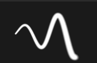
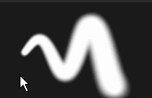
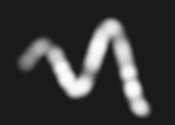

# Pinceau

L’outil Peinture est l’outil par défaut de Substance 3D Painter pour appliquer des couleurs et des propriétés de matière sur un filet 3D. Il comporte des paramètres spécifiques qui peuvent être modifiés via les [propriétés](../../interface/properties.md).

L’outil Peinture simule des traits de pinceau via différents comportements et paramètres pour donner l’impression de peindre sur le filet 3D.

## Barre d’outils

Les [barres d&#39;outils](../../interface/toolbars.md) affichent les raccourcis suivants (voir leur explication dans les sections suivantes) :

* Taille
* Flux
* Opacité du contour
* Espacement

D’autres raccourcis sont disponibles et sont communs à d’autres outils :

* [Retard de la souris](../lazy-mouse.md)
* [Symétrie](../symmetry/symmetry.md)

## Prévisualiser

En haut des [propriétés](../../interface/properties.md) se trouvent les aperçus du pinceau et du matériau. Ils peuvent être utilisés pour jeter un coup d’œil rapide à la configuration actuelle de l’outil.

| *Nom* | *Description* |
| --- | --- |
| **Aperçu du pinceau** | L’aperçu du pinceau affiche le comportement du pinceau en fonction de ses paramètres. Il est possible de cliquer dans l’aperçu pour dessiner un contour personnalisé.   <table> <tr style="border: 0;"> <td style="border: 0;" valign="top">  

  </td> <td style="border: 0;" valign="top">  

  </td> </tr> </table>   **Remarque :** l&#39;aperçu du pinceau ne prend pas en charge la pression du stylet. |
| **Aperçu de la matière** | L’aperçu du matériau affiche les propriétés du matériau actuellement utilisé pour la peinture. Il est possible de cliquer dans l’aperçu pour faire pivoter l’éclairage et voir comment le matériau se comportera avant de peindre.   <table> <tr style="border: 0;"> <td style="border: 0;" valign="top">  

  </td> <td style="border: 0;" valign="top">  

  </td> </tr> </table> |

## Pinceau

Les paramètres du pinceau définissent l’aspect et la convivialité du tracé lorsqu’il est appliqué au filet 3D.

>[!NOTE]
>
> Certains paramètres peuvent être contrôlés par la pression de la plume lors de l’utilisation d’une tablette graphique. Ces informations peuvent également être enregistrées dans les [Paramètres prédéfinis](../presets/presets.md).\
> Cliquez sur le bouton dédié pour activer ou désactiver la pression :
> 
> 

| Nom | Description |
| --- | --- |
| **Taille** | Détermine la taille des tampons sur un tracé. La taille relative du pinceau peut être modifiée en fonction de l’espace relatif défini dans (voir le paramètre Espace de la taille d’alignement ci-dessous). *Ce paramètre peut être contrôlé par la pression du stylet.* |
| **Flux** | Intensité ou opacité des tampons individuels à l’intérieur du contour. *Ce paramètre peut être contrôlé par la pression du stylet.* |
| **Opacité du contour** | Opacité globale maximale d’un contour. Contrairement au paramètre Flux, l’opacité du trait ne peut pas être contrôlée via la pression de la plume, car elle est appliquée à la fin du processus de dessin du trait.Différence entre l’opacité du flux et du contour :<ul data-preserve-html="true"><li data-preserve-html="true"><strong> </strong> : flux à 50 %, opacité du contour à 100 %</li><li data-preserve-html="true"><strong> Droite </strong> : Flux à 100 %, Opacité du contour à 50 %</li></ul> 

 **Remarque :** il est possible de continuer un trait précédent comme dans l&#39;animation ci-dessus en appuyant sur le raccourci « A ». |
| **Espacement** | Distance entre les tampons individuels d’un coup de pinceau. Les valeurs faibles permettent de créer des lignes continues, mais sont plus coûteuses à calculer, car elles dessinent beaucoup plus de tampons au total. Des valeurs élevées permettent de créer un écart entre les tampons, ce qui peut être plus approprié pour des motifs spécifiques (comme les clous sur le bois). |
| **Angle** | Orientation des tampons à l’intérieur du contour. Utile pour faire pivoter l’Alpha s’il n’est pas correctement aligné. Peut être combiné avec le tracé de suivi. |
| **Suivre le chemin** | Oriente les tampons à l’intérieur du tracé pour qu’ils suivent la direction de peinture. 

 **Remarque :** pour calculer la direction du contour, Substance 3D Painter compare le tampon précédent au tampon actuel. C’est pourquoi, lorsque l’option Suivre le tracé est activée, un simple clic pour peindre ne produit aucun résultat. Au moins deux tampons sont requis pour peindre un contour lorsque cette fonctionnalité est activée. |
| **Variation de taille** | Appliquez une valeur de taille aléatoire par tampon à l’intérieur du contour. Une valeur de 0 signifie qu’il n’y a pas d’effet aléatoire, une valeur de 1 signifie que tout est aléatoire. 

 |
| **Variation du flux** | Appliquez une valeur d’enchaînement aléatoire par tampon à l’intérieur du contour. Une valeur de 0 signifie qu’il n’y a pas d’effet aléatoire, une valeur de 1 signifie que tout est aléatoire. 

 |
| **Variation d’angle** | Appliquez un angle de rotation supplémentaire aléatoire par tampon à l’intérieur du contour. Une valeur de 0 signifie qu’il n’y a pas d’effet aléatoire, une valeur de 1 signifie que tout est aléatoire. 

 |
| **Variation de position** | Appliquez un décalage de position aléatoire par tampon à l’intérieur du contour. Une valeur de 0 signifie qu’il n’y a pas d’effet aléatoire, une valeur de 1 signifie que tout est aléatoire. 

 |
| **Alignement** | Détermine comment les tampons à l’intérieur du contour seront projetés/orientés sur la surface du filet 3D. Les valeurs suivantes sont disponibles :<ul data-preserve-html="true"><li data-preserve-html="true"><strong> Caméra </strong> : orienter le tampon vers le point de vue de la fenêtre d&#39;affichage</li><li data-preserve-html="true">Tangente <strong> | Habiller (par défaut) </strong> : Orienter le tampon pour l’aligner avec la surface du filet 3D. Le tampon sera également déformé pour se conformer à la surface.</li><li data-preserve-html="true">Tangente <strong> | Plan </strong> : oriente le tampon pour l’aligner avec la surface du filet 3D. Le tampon estompera sa bordure trop loin de la surface du filet 3D. </li><li data-preserve-html="true"><strong> UV </strong> : oriente le tampon en fonction des UV du filet 3D.</li></ul> |
| **Abattage du dos** | Permet d’ignorer les surfaces du maillage 3D qui ne sont pas alignées avec le tampon. Pour calculer les parties du filet 3D à ignorer, le moteur de peinture examine la normale à la surface du filet 3D et compare son angle par rapport à la valeur définie. |
| **Taille de l&#39;espace** | Détermine l’espace relatif dans lequel la taille du pinceau est calculée. Les valeurs possibles sont :<ul data-preserve-html="true"><li data-preserve-html="true"><strong> Objet (par défaut) </strong> : l’épaisseur du pinceau est synchronisée avec l’épaisseur du filet 3D. Le déplacement de la caméra dans la clôture affecte la taille pour la conserver par rapport au filet 3D.</li><li data-preserve-html="true">Fenêtre d&#39;affichage <strong> </strong> : l&#39;épaisseur du pinceau est liée à la fenêtre d&#39;affichage. Le redimensionnement de l’interface affecte l’épaisseur du pinceau. Le déplacement de la caméra n’aura aucun effet.</li><li data-preserve-html="true"><strong> Texture </strong> : l&#39;épaisseur du pinceau est liée au niveau d&#39;aire d&#39;affichage 2D du zoom.</li></ul> |

## Alpha

L’Alpha est le masque en niveaux de gris qui est appliqué sur chaque tampon à l’intérieur du contour. Il peut s’agir d’un fichier de Substance de données ou d’un bitmap.

>[!NOTE]
>
> Si un graphique de Substance affiche un paramètre « dureté » (identifiant), il peut être contrôlé à l&#39;aide des [raccourcis](../../interface/settings/shortcuts.md) de dureté.

## Physique

Les propriétés Physiques permettent de contrôler les particules projetées lors de la peinture.

Par défaut, les propriétés physiques ne sont pas disponibles, mais peuvent être activées de deux manières :

* En activant l&#39;outil « Physique » dans les [barres d&#39;outils](../../interface/toolbars.md) (ou via le raccourci clavier).
* En cliquant sur un paramètre prédéfini Pinceau particule dans la fenêtre [Actifs](../../interface/assets/assets.md).

## Pochoir

Le Pochoir est un masque en niveaux de gris supplémentaire pour le contour. Contrairement à l&#39;alpha qui est appliqué pour chaque tampon individuel, le Pochoir est un masque global appliqué du point de vue de la [Fenêtre d&#39;affichage](../../interface/viewport/viewport.md).

>[!NOTE]
>
> Il est possible de réinitialiser la transformation du pochoir en appuyant sur la touche **S**, puis en cliquant sur le bouton « **Réinitialiser** » en haut à droite de la fenêtre :
> 
> 

| *Mode* | *Fenêtre d&#39;affichage* |
| --- | --- |
| **Aucune ressource chargée** | Lorsqu’aucune ressource n’est chargée, le gabarit n’a aucun effet. 

 **Remarque :** il est possible de désactiver temporairement le masque Pochoir sans supprimer la ressource en appuyant sur [raccourcis](../../interface/settings/shortcuts.md) « N » et en les conservant. |
| **Déplacer le pochoir** | Le déplacement du pochoir peut être effectué en appuyant sur la touche **S** et en cliquant et en faisant glisser avec le bouton **Souris du milieu**. 

 |
| **Faire Pivoter Le Pochoir** | Pour faire pivoter le pochoir, appuyez sur la touche **S**, puis cliquez et faites glisser avec le bouton **Souris gauche**. En outre, appuyer sur la touche **Maj** permet d&#39;aligner la rotation tous les **90 degrés**. 

 |
| **Redimensionner le pochoir** | Le redimensionnement du pochoir peut être effectué en appuyant sur la touche **S**, puis en cliquant et en faisant glisser avec le bouton **Souris droite**. 

 |

Le paramètre du mode Mosaïque contrôle la façon dont le masque Pochoir est répété dans la clôture (ce paramètre affecte également la texture) :

| *Mode mosaïque* | *Description* |
| --- | --- |
| **Pas de mosaïque (par défaut)** | Le masque Pochoir n’est pas répété. 

 |
| **Mosaïque horizontale** | Répétez le masque Pochoir uniquement sur l’axe horizontal. 

 |
| **Mosaïque verticale** | Répétez le masque Pochoir uniquement sur l’axe vertical. 

 |
| **Limites H et V** | Répétez le masque Pochoir sur les axes horizontal et vertical. 

 |

## Matériau

Un matériau est composé de plusieurs couches dont chacune conserve des propriétés spécifiques. La liste des couches dépend de celles définies dans les [paramètres de l&#39;ensemble de textures](../../interface/texture-set/texture-set-settings.md).

Le bouton **Mode matière** est un moyen simple de charger des fichiers de Substance ou un paramètre prédéfini pour attribuer et modifier rapidement plusieurs canaux à la fois.

Cliquez sur un bouton de canal pour le sélectionner ou le désélectionner. Lorsque cette option est désélectionnée, la propriété de la couche ne peut pas être modifiée et ne sera pas utilisée pendant le processus de peinture.

