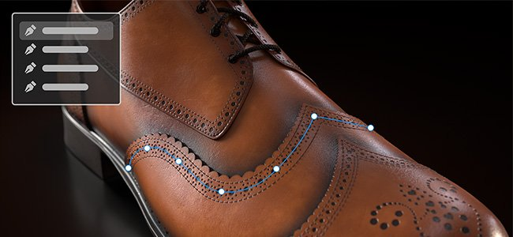
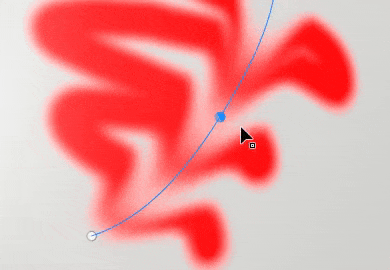
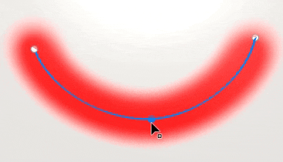
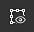

# Présentation de l’outil Tracé

<table>
<tr style="border: 0;">
<td style="border: 0;" valign="top">

<b>Audio</b>

Ajustez ou ajoutez des données audio à votre projet.

* Réglez le volume vidéo source s’il contient de l’audio.
* Ajouter, supprimer ou remplacer un fichier audio externe.
* Réglez le volume du fichier audio externe.

</td>
<td style="border: 0;" valign="top">

</td>
</tr>
</table>

Les <b>outils de tracé</b> vous permettent de définir une courbe avec des points sur la surface de votre filet. Une fois la courbe créée, les différents outils de tracé vous permettent de créer différents effets le long de la courbe.

## Créer un tracé

Des tracés peuvent être créés sur des calques et des effets de peinture. Il existe deux façons d’accéder à l’outil Tracé :

* <b>Via l&#39;interface</b> : accédez à la barre d&#39;outils de l&#39;outil sur le côté gauche et cliquez sur la troisième icône en partant du haut.
* <b>Via un raccourci clavier</b> : par défaut, aucun raccourci clavier n&#39;est attribué à l&#39;outil. Vous pouvez modifier ce paramètre dans le menu Paramètres en modifiant le raccourci « Sélectionner l’outil Peindre le long du tracé ».

Une fois l’outil sélectionné, les points peuvent être placés en cliquant sur la surface du modèle 3D dans la clôture 3D. Au moins deux points (ou sommets) sont nécessaires pour créer un tracé.

L’outil Tracé comporte différents modes, qui peuvent être similaires aux autres outils de peinture disponibles dans l’application :

* Peindre le long du tracé : tracez un trait de pinceau régulier le long d’un tracé défini.
* [Tracé de ruban](ribbon-tool.md) : dessine une image répétée ou étirée le long d&#39;un tracé.
* [Tracé rempli](filled-path.md) : remplissez l’intérieur d’un tracé avec une couleur uniforme.
* Effacer le long du tracé : tracez un trait qui efface/supprime des informations le long d’un tracé défini.
* Doigt le long du tracé : tracez un contour qui estompe/brouille les informations le long d’un tracé défini.

Par exemple, voici l&#39;outil Tracé en mode <b>Doigt</b> qui affecte d&#39;autres informations de peinture :

>[!NOTE]
>
> Les <b>outils de tracé</b> ne fonctionnent que dans l&#39;espace 3D à la surface de la géométrie. La création d’un tracé dans l’espace UV ou en tant que projection de l’espace de l’écran n’est actuellement pas prise en charge.

### Modifier un tracé

Les points (ou sommets) de tracé adhèrent automatiquement à la surface du filet. Ils peuvent être déplacés et ajustés à tout moment. Il est possible d’ajouter de nouveaux sommets à un tracé existant en cliquant n’importe où sur la ligne. 

* Appuyez sur <b>Échap </b> ou <b>Entrée </b> pour quitter l’édition du chemin.
* Une fois la fermeture effectuée, un clic sur une surface vierge du filet lance un nouveau tracé.
* Survolez un tracé existant et cliquez dessus pour le sélectionner, puis continuez ou modifiez-le. Les tracés peuvent également être resélectionnés via le panneau <b>Tracés</b> (voir ci-dessous).

Certaines propriétés sont spécifiques à un tracé dans son ensemble. C’est le cas des options disponibles dans la fenêtre <b>Propriétés</b>. Tout comme avec un contour normal (voir la [documentation de l&#39;outil Peinture](paint-brush.md)), il est possible de définir les propriétés suivantes pour un tracé :

* <b>Pinceau</b>
* <b>Alpha</b>
* <b>Matière</b>

La section <b>Pinceau </b> contient des options supplémentaires qui sont uniquement disponibles avec l’outil Tracé :

| <b>Paramètre</b> | <b>Description</b> |
| --- | --- |
| <b>profondeur de projection</b> | Détermine la proximité du tracé par rapport à la surface du filet pour que les tampons du pinceau apparaissent. Pour voir ce retour visuel directement dans la clôture, il est possible d&#39;activer <b>Normales</b> dans les <b>paramètres d&#39;affichage du chemin </b>(voir ci-dessous). |
| <b>Axe vers le haut</b> | Axe utilisé pour orienter les tampons du pinceau lorsque l&#39;option <b>Suivre le tracé</b> est désactivée.   Dans certains cas, il est plus logique d’aligner tous les tampons le long d’un axe/d’une direction global(e) et non le long du chemin. Par exemple avec des rivets sur une surface métallique. |

D’autres propriétés sont définies par point (sommets) sur le tracé, telles que la pression. Pour modifier un point spécifique, cliquez simplement dessus (ou utilisez la sélection rectangulaire). Utilisez ensuite la barre d’outils contextuelle pour modifier les valeurs des points sélectionnés.

### Contrôle des tangentes

Il peut arriver qu’un tracé lisse ne soit pas idéal, soit parce qu’il ne suit pas au mieux la surface du modèle 3D, soit parce qu’il ne correspond pas à un aspect spécifique. Pour résoudre ces problèmes, il est possible de modifier les tangentes d&#39;un sommet donné. Les tangentes sont les directions d’un point qui contrôlent la courbure du tracé.

Pour basculer entre des tangentes lisses ou linéaires/brisées, double-cliquez simplement sur un sommet (ou utilisez le bouton dédié dans la barre d’outils contextuelle) :

Pour contrôler plus précisément l’orientation des tangentes, utilisez le bouton Tangentes personnalisées de la barre d’outils contextuelle pour les remplacer manuellement :

Utilisez le raccourci clavier <b>ALT</b> pour rompre les tangentes lors du déplacement si le point n&#39;est pas déjà sélectionné.

Utilisez le raccourci clavier <b>CTRL</b> pour mettre à l&#39;échelle les deux tangentes en même temps.

>[!NOTE]
>
> Les contrôles de tangente sont définis le long du plan et s’alignent sur la normale du point donné dans le tracé. Cela signifie que les tangentes ne peuvent pas être courbées dans certaines directions.

### Barre d’outils contextuelle

La <b>barre d&#39;outils contextuelle</b> lorsque l&#39;outil <b>Chemin</b> est sélectionné fournit plusieurs paramètres qui permettent de contrôler le chemin actuellement sélectionné :

| <b>Paramètre</b> | <b>Description</b> |
| --- | --- |
| <b>Afficher/masquer l&#39;interface de la fenêtre d&#39;affichage</b>  

 | Si cette option est activée, l’incrustation des tracés et des sommets est visible dans la clôture. |
| <b>Paramètres d&#39;affichage</b>  

 | Contrôlez l’aspect du retour visuel du tracé dans la clôture :<ul data-preserve-html="true"> <li data-preserve-html="true"><b>Taille de la poignée</b> : contrôle la taille des points du tracé.</li> <li data-preserve-html="true"><b>Largeur du tracé</b> : contrôle le thickness de la ligne du tracé.  </li> <li data-preserve-html="true"><b>Couleur du tracé</b> : contrôle la couleur de la ligne du tracé.  </li> <li data-preserve-html="true"><b>Couleur de tracé non sélectionnée</b> : contrôlez la couleur des tracés non actifs.  </li> <li data-preserve-html="true"><b>Normales</b> : si cette option est activée, affichez la direction de projection sur chaque point d&#39;un tracé.  </li> <li data-preserve-html="true"><b>Tangentes</b> : si cette option est activée, affichez la direction de la courbe des points de contrôle du tracé.  </li> <li data-preserve-html="true"><b>Direction du tracé</b> : si cette option est activée, affichez une petite flèche à la fin du tracé pour indiquer sa direction de peinture. Il est utile de savoir comment les tampons seront orientés dans le contour.</li> </ul>  

 |
| <b>Inverser la direction du tracé</b>  

 | Inversez la direction du tracé en cours. La direction définit l’orientation générale utilisée pour peindre les tampons à l’intérieur du contour. L’inversion du tracé peut aider à réorienter le motif dessiné. |
| <b>Basculer entre les angles/lisse</b>  

 | Rompre ou aligner la tangente des sommets actuellement sélectionnés, ce qui permet de passer d&#39;une courbe lisse ou linéaire à l&#39;autre.  

  **Remarque :** vous pouvez également basculer entre le comportement d&#39;angle/lisse en double-cliquant sur un point directement sur le tracé. |
| <b>Tangentes personnalisées</b>  

 | Si cette option est activée, vous pouvez contrôler manuellement les tangentes d’un point donné du tracé.  

 |
| <b>Ouvrir/fermer le chemin</b>  

 | Ouvrez ou fermez le tracé en cours. Pour fermer un tracé, vous devez d’abord sélectionner l’une des deux extrémités du tracé en cours.  

 |
| <b>Supprimer le sommet</b>  

 | Supprimer les sommets actuellement sélectionnés sur un tracé. |
| <b>Symétrie</b>  

 | Activez ou désactivez la symétrie pour le tracé en cours. Pour plus d&#39;informations, consultez la [documentation relative à la symétrie](../symmetry/symmetry.md).  

 |
| <b>Masquer/ignorer la géométrie exclue</b>  

 | Si cette option est activée, peignez le tracé en cours à travers la géométrie masquée. Pour plus d&#39;informations, consultez la [documentation sur les masques de géométrie](../../interface/layer-stack/geometry-mask.md). |

### Panneau Tracés

>[!NOTE]
>
> Le panneau est masqué lorsque l’outil actif n’est pas l’outil Tracé ou si un calque de remplissage/dossier est sélectionné.

Dans la fenêtre d’affichage se trouve le panneau <b>Tracés</b> dans lequel sont répertoriés tous les tracés du calque/effet de peinture actuellement sélectionné. Il permet de sélectionner et de gérer facilement les tracés.

Avec ce panneau, il est possible de:

* Double-cliquez sur un chemin pour le <b>renommer</b>.
* <b>Supprimez</b> un tracé en le sélectionnant, puis en appuyant sur la touche Suppr.
* <b>Copier</b>/<b>Coller</b>/<b>Dupliquer</b> un chemin avec les raccourcis clavier dédiés.
* <b>Afficher</b> ou <b>masquer</b> un tracé avec l’icône en forme d’œil (qui contrôle si le tracé est appliqué à la texture).

Pour plus de commodité, il est également possible de cliquer avec le bouton droit de la souris sur un chemin pour ouvrir le menu contextuel qui propose les mêmes actions :

Le menu contextuel permet également d’ouvrir des actions permettant de copier les propriétés ou la position d’un tracé sur un autre. Cela permet de partager ou de synchroniser facilement des fonctionnalités entre différents chemins :

>[!NOTE]
>
> Les propriétés de copier-coller ne fonctionnent que lorsque les tracés sont basés sur le même outil de peinture. Par exemple, il n’est pas possible de partager les propriétés d’un tracé à l’aide des paramètres Doigt et d’un autre à l’aide des paramètres de pinceau.

## Outils prédéfinis

{width="400px"}

Lorsqu’un outil de tracé est sélectionné, une section Paramètres prédéfinis est disponible en haut du panneau Propriétés. À partir de là, vous pouvez accéder rapidement aux paramètres prédéfinis pour les différents outils de tracé.

### Paramètres prédéfinis de tracé favoris

L’option Favoris de la section Paramètres prédéfinis ne contient que les paramètres prédéfinis que vous avez préférés pour un accès encore plus rapide. Pour commencer à ajouter des favoris, sélectionnez Favoris, puis « Afficher les paramètres prédéfinis compatibles dans les actifs » pour obtenir une liste complète des paramètres prédéfinis de chemin disponibles.

Pour mettre en favori un paramètre prédéfini, faites un clic droit dessus dans le panneau Actifs ou dans la section Paramètres prédéfinis du panneau Propriétés, puis sélectionnez « Ajouter aux favoris ». 

Vous pouvez également supprimer des paramètres prédéfinis de la liste des favoris. Cliquez avec le bouton droit sur un paramètre prédéfini Favori, puis sélectionnez « Supprimer des favoris ».

{width="400px"}

### Création de tracés prédéfinis

Comme d’autres outils, des paramètres prédéfinis peuvent être créés pour restaurer rapidement les paramètres/configurations du pinceau. Pour ce faire, il vous suffit de cliquer avec le bouton droit de la souris dans la fenêtre <b>Propriétés</b> et de choisir <b>Créer un outil prédéfini</b>. Ce paramètre prédéfini nouvellement créé bascule automatiquement vers l&#39;outil Chemin lorsqu&#39;il est sélectionné dans la fenêtre <b>Actifs</b>.
