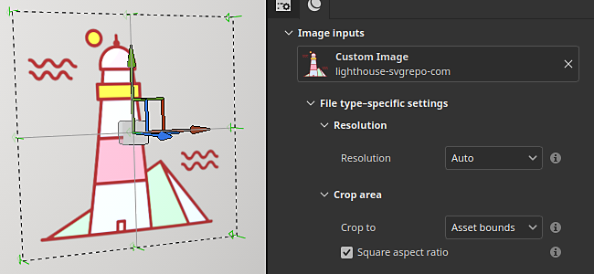

# Graphique vectoriel (.svg et .ai)

Les fichiers graphiques vectoriels (à la fois <b>.svg</b> et Illustrator <b>.ai</b>) peuvent être importés comme des images normales dans Painter. Quelques paramètres sont disponibles pour ajuster l’aspect de l’image et mieux l’adapter au reste de la texture.

* Pour plus d&#39;informations sur les fichiers SVG, [consultez cette page](https://www.adobe.com/creativecloud/file-types/image/vector/svg-file.html).
* Pour plus d&#39;informations sur les fichiers AI, [consultez cette page](https://www.adobe.com/ie/creativecloud/file-types/image/vector/ai-file.html).

Les fichiers SVG et AI sont automatiquement convertis en images pixellisées lorsqu&#39;ils sont utilisés dans la [pile de calques](../interface/layer-stack/layer-stack.md) (selon le paramètre sélectionné). Il s’agit d’un processus non destructif. La modification de la résolution ou la mise à jour du fichier source met à jour le résultat final en conséquence.

## Propriétés

Après avoir importé un fichier vectoriel et l’avoir chargé dans un calque ou dans les propriétés de l’outil, un ensemble de paramètres sera disponible :

| Section | Paramètre | Description |
| --- | --- | --- |
| <b>Plan de travail</b> | <b>Plan de travail</b> | Sélectionnez le plan de travail inclus dans le fichier à utiliser.  **Remarque :** ce paramètre est uniquement disponible avec les fichiers Illustrator (.ai). |
| <b>Résolution</b> | Résolution | Définissez la taille à laquelle le fichier svg sera converti en image bitmap (pixels) lors de son utilisation pour la texturation dans la pile de calques.   Valeurs possibles :<ul data-preserve-html="true"> <li data-preserve-html="true"><b>Auto</b> : la résolution est déterminée par la résolution du jeu de textures actuel (lorsqu’il est utilisé dans un calque/effet de remplissage) ou à 512 pixels lorsqu’il est utilisé dans un outil Pinceau.  </li> <li data-preserve-html="true"><b>Ressource</b> : la résolution est déterminée par la taille en pixels définie dans le fichier SVG lui-même.  </li> <li data-preserve-html="true"><b>Personnalisé</b> : la résolution est déterminée par le paramètre de résolution juste en dessous dans l&#39;interface.</li> </ul>  

 |
|  |  |  |
| <b>Zone de recadrage</b> | Recadrer sur | Définissez la façon dont les formes SVG seront limitées à la zone rendue.   Valeurs possibles :<ul data-preserve-html="true"> <li data-preserve-html="true"><b>Limites des ressources</b> : la zone est définie par les limites définies dans le fichier du SVG.</li> <li data-preserve-html="true"><b>Personnalisé</b> : la zone est définie par des valeurs explicites via les paramètres de l&#39;interface juste en dessous.  </li> </ul> |
|  | Format carré | Si la zone de recadrage est définie par des <b>limites d’actifs</b>, ce paramètre permet de s’assurer que le rapport d’origine est conservé, évitant ainsi tout étirement incorrect lors du rendu du SVG sous la forme d’une image carrée.   Ce paramètre peut rendre certains éléments visibles de manière inattendue. Pour éviter ce problème, désactivez ce paramètre et ajustez plutôt les paramètres UV manuellement à l’intérieur d’un calque/effet de remplissage. |
|  | En haut à gauche En bas à droite | Si la zone de recadrage est définie sur Zone personnalisée, ces paramètres permettent de définir la zone manuellement en spécifiant les coins supérieur gauche et inférieur droit. |
|  |  |  |
| <b>Portée</b> | Portée | Définissez les éléments à l’intérieur du fichier de SVG à inclure avant de le rendre.   Il est défini par défaut sur <b>Document</b>, ce qui signifie que tout le contenu du fichier du SVG est utilisé. Utilisez le bouton <b>Modifier</b> pour ajuster les éléments à inclure. |

### Fenêtre Etendue

Lors de la modification de l’étendue d’une image vectorielle (voir le paramètre ci-dessus), une fenêtre s’affiche avec une liste d’éléments à sélectionner pour spécifier ce qui doit être inclus ou exclu de l’image rendue finale.

Utilisez la case à cocher <b>Afficher les vignettes</b> pour afficher une image pour chaque élément.

