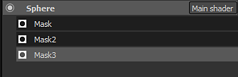

# Version 2.2

**La Substance Painter 2.2** ajoute un nouveau workflow qui est la Superposition dynamique de matériaux.

Date de publication : *21 juillet 2016*

## Principales fonctionnalités

### Nouveau workflow de Superposition dynamique de matériaux

Avec cette nouvelle version, nous ajoutons un nouveau **workflow** appelé **Calque de matière**. Les workflows de texturation traditionnels s&#39;appuient sur la création de textures en **haute résolution** pour **préserver les détails**, mais cela n&#39;est **pas pratique** pour l&#39;exemple d&#39;utilisation. Une approche plus intéressante consiste à **créer de petits matériaux de labour** et à **les répéter dans un nuanceur**. Cela permet de préserver une certaine qualité et la possibilité de **zoomer vraiment près** de l&#39;objet à l&#39;aide de cet ombrage **sans perdre de détails**. Le seul problème est que pour prévisualiser le résultat final, il était auparavant obligatoire d&#39;aller au moteur de jeu/moteur de rendu qui affiche le nuanceur final. Ce n&#39;est plus vrai, car dans cette nouvelle version, il est désormais possible d&#39;utiliser un nuanceur similaire à l&#39;intérieur de la Substance Painter, ce qui vous permet de **visualiser le résultat final et de peindre en même temps**.

Un **nouveau projet d&#39;exemple** nommé « **FireHydrant** » a été ajouté pour présenter le nouveau workflow.

Ce nouveau workflow offre deux méthodes de travail :

* Les matières sont définies dans l’ombrage, vous ne pouvez peindre que des masques pour les fusionner
* Les matériaux et les masques peuvent être peints ensemble

Dans tous les cas, il est possible de définir une nouvelle pile de calques à chaque fois, ce qui donne plus de liberté lors de la création des masques et des matériaux. La gestion des calques est beaucoup plus facile de cette façon et chaque pile peut avoir son propre ensemble de canaux spécifiques qui peuvent être fusionnés dans le shader final.\
Nous avons également un shader spécial pour Unity 5 et Unreal Engine 4 disponible sur Share :

* [Unité 5](https://share.allegorithmic.com/libraries/2126)
* [Unreal Engine 4](https://share.allegorithmic.com/libraries/2125)

Pour plus de détails, consultez la page dédiée de la documentation : [Superposition dynamique de matériaux](../../features/dynamic-material-layering.md)

### Nouveau champ de recherche de mini-rayon

Nous avons amélioré la **mini-étagère** qui apparaît à divers endroits de l&#39;application avec un champ de recherche dédié. Cette amélioration rend la recherche de ressources beaucoup plus pratique et agréable à utiliser. La recherche personnalisée est conservée pendant la session en cours de l’application. Par exemple, si vous utilisez beaucoup de bruits d’usure/salissures, l’utilisation de ce mot-clé entraînera

## Tutoriel

Notre dernier tutoriel vidéo couvre les nouvelles fonctionnalités :

## Notes de mise à jour

### 2.2.0

(Publié le 21 juillet 2016)

**Ajouté :**

* [Shelf] Améliorer le système de recherche et les requêtes
* [Étagère] Ajouter un champ de recherche pour les mini-étagères
* [Shader] Permet de définir la précision de pas pour les curseurs
* [Shader] Ajouter un bouton Annuler/Rétablir pour les paramètres du shader
* [Shader] Le rechargement d&#39;un shader ne doit pas réinitialiser ses paramètres
* [MatLayering] Prise en charge supplémentaire de la Superposition dynamique de matériaux et des sous-piles
* [MattLayering] Autoriser l’importation d’un fichier json pour configurer les paramètres du nuanceur
* [MatLayering] Déverrouiller la limite des échantillonnages de texture (passer aux textures sans reliure)
* [Scripting] Permet de définir les paramètres de baker et de lancer leur calcul
* [Substance] Utiliser « usage » pour les connexions d’entrées/sorties en plus des identificateurs
* [Outil] Permet de sélectionner la couche de prévisualisation dans la clôture pour l&#39;outil Projection

**Fixe :**

* Blocage lors du lancement si les substances se trouvent dans un mauvais dossier
* Le rapport d’incident ne fonctionne parfois pas en raison d’un fichier journal incorrect
* [Iray] Les effets de post-traitement ne s’actualisent pas lorsqu’Iray est en pause
* [Iris] Le raccourci de mise au point automatique ne fonctionne plus
* [Iris] Le comportement du curseur Ouverture change en fonction de la taille de la ressource.
* [Calques] La première couche de matériau n’est pas activée par défaut si toutes les couches sont désactivées
* [Shader] Aucune erreur n’est imprimée si un paramètre automatique est incorrect

**Problème Connu :**

* [Mac] La limite des échantillons de texture est verrouillée à 16 (problème de pilote GPU)
