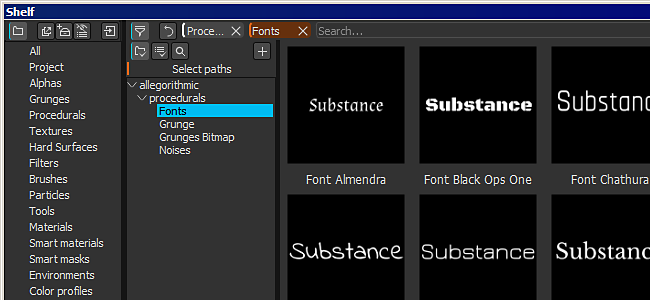

# Version 2.5

**La Substance Painter 2.5** introduit de nombreuses nouvelles fonctionnalités : de la prise en charge de l&#39;opacité dans les paramètres du pinceau (en plus du flux) à la possibilité de créer une carte supplémentaire en 8K et bien plus encore.

Date de publication : *21 février 2017*

## Principales fonctionnalités

### Nouvelle opacité du pinceau

{width="650px"}

Un nouveau paramètre est désormais défini dans les **paramètres du pinceau** lors de la peinture en Substance Painter : l&#39;**opacité**.\
L&#39;**opacité** contrôle l&#39;**intensité globale d&#39;un coup de pinceau**, contrairement au paramètre **flux** qui contrôle l&#39;intensité de **chaque tampon** à l&#39;intérieur d&#39;un coup de pinceau. Cela signifie qu&#39;il est désormais possible de peindre et de repeindre la même zone **sans créer de valeurs qui se chevauchent**. Pour ce faire, réglez l’écoulement sur 100 et la valeur d’opacité sur l’intensité de votre choix. En raison du fonctionnement de l’opacité, il n’est pas possible de la lier à la pression du stylet. Pour ce type de contrôle, le débit reste le meilleur choix.

Nous avons également ajouté un **nouveau modificateur** en plus de ce nouveau paramètre qui se trouve sur la clé **« A »** par défaut. Appuyez sur cette touche pour permettre à **de continuer le coup de pinceau précédent** au lieu d&#39;en créer un nouveau. Cela signifie que vous pouvez peindre une couleur uniforme avec l’opacité souhaitée tout en conservant la possibilité de déplacer l’appareil photo, par exemple. Un autre exemple serait de poursuivre la copie que vous faisiez avec l’outil de duplication.

### Nouveau baking avec des résolutions 8K et non carrées

Les boulangers ont été améliorés pour prendre en charge des résolutions allant jusqu&#39;à **8192x8192** (8K plus anticrénelage), ce qui signifie que vous pouvez désormais exporter au format 8K avec un rapport de 1:1 avec les mappages supplémentaires.\
Nous avons également pris en charge les résolutions **non carrées**. Il est désormais possible de cuire une texture de **4096x2048** par exemple. Pour ce faire, il vous suffit de cliquer sur l&#39;icône « **Verrouiller** » en regard du menu déroulant pour sélectionner la résolution.

### Prise en charge du profil colorimétrique dans la clôture

Nous avons ajouté la prise en charge de **LUT** (textures) pour contrôler le rendu de la **fenêtre d&#39;affichage** dans la Substance Painter. Pour appliquer un profil, il vous suffit d&#39;activer le paramètre « **Profil de couleur** » dans la fenêtre « **Paramètres d&#39;affichage** » et de charger la table LUT dans l&#39;emplacement dédié. Cela fonctionne à la fois avec l&#39;aire d&#39;affichage (peinture) **OpenGL** et le moteur de rendu **IRay**. Par défaut, quelques exemples sont disponibles, allant des **paramètres prédéfinis de l&#39;appareil photo** les plus courants aux **effets artistiques**. Pour plus d&#39;informations, consultez la page dédiée de la documentation : [Profil colorimétrique](../../features/post-processing/color-profile.md)

### Nouveau moteur de Substance compatible avec la Substance Designer 6

Nous avons ajouté la prise en charge de **Substance Designer 6**. Cela signifie que les ressources créées avec **SD6** peuvent être ouvertes et utilisées dans **Substance Painter 2.5** !\
Un bon exemple est la possibilité d&#39;utiliser le **nouveau nœud de texte** de SD6 et de l&#39;intégrer dans une substance. De cette façon, il est possible de créer du **texte dynamique** et de le peindre directement sans avoir besoin de quitter l&#39;application. **Par défaut, nous avons inclus 10 polices** avec chacune un style différent pour couvrir l’utilisation la plus courante. Vous les trouverez dans la section « **procédurale** » du **tiroir**.

{width="400px"}

### Nouveau contenu sur l’étagère

Outre quelques correctifs et améliorations apportés à la nouvelle étagère, nous avons ajouté un ensemble de **nouveaux filtres** pour améliorer la peinture et la texture. Nous avons également **amélioré** le comportement du filtre existant (comme « **TSL** »). Nous avons également ajouté de nouveaux **modèles** lors de la création de **nouveaux projets** (tels que **Unity 5** et **Unreal Engine 4**).

### Nouvelles améliorations des scripts avec prise en charge de l’interface utilisateur de nuanceur personnalisée

Avec cette version, nous avons ajouté un moyen de **script et de contrôler** les **paramètres du shader**. Nous avons également ajouté la prise en charge de l&#39;utilisation d&#39;une **interface utilisateur personnalisée** au lieu de l&#39;interface par défaut, ce qui ouvre de nombreuses nouvelles possibilités, telles que le **shader animé**.\
Pour plus de détails, consultez la documentation sur les scripts disponible dans le menu Aide de l’application.

## Tutoriel

Les nouvelles fonctionnalités majeures sont couvertes dans notre dernier flux Twitch :

## Notes de mise à jour

### 2.5.3

(Publié le 15 mars 2017)

**Fixe :**

* [Baker] Blocage lors de la cuisson avec des maillages spécifiques

**Problème Connu :**

* [Mac] Dans certains cas, les particules peuvent endommager la texture

### 2.5.2

(Publié le 14 mars 2017)

**Fixe :**

* [Outil] Les tablettes Wacom ne fonctionnent pas sous Linux
* [Outil] Artefacts noirs lors de l’utilisation de l’outil Doigt
* [Boulangers] La cuisson échoue si l&#39;option Correspondance au nom est utilisée avec une cage
* [Boulangers] L&#39;Occlusion ambiante ne fonctionne pas lorsque vous cuisinez uniquement avec la carte de normales
* [Étagère] Les filtres génériques ne gèrent pas correctement les couches alpha (Contraste/Luminosité, Passe-haut, etc.)
* [Fenêtre d’affichage] Problème de performances lors du chargement d’un projet avec les ombres activées
* [Fenêtre d’affichage] Problème d’interpolation dans la vue 3D sur MacOS
* [Fenêtre d’affichage] Les aperçus de particule ne s’affichent pas correctement lorsque le profil colorimétrique est activé
* [Iray] Blocage lors du retour du projet à OpenGL si Iray ne parvient pas à s’initialiser
* [IRay] La brillance est ignorée lors du rendu de SpecGloss shader/mdl
* [Shader] Le shader Spec/Gloss ne correspond pas à Iray et SD
* [Shader] Conversion sRGB différente de la conversion linéaire en conversion sRGB LUT
* [Shader] Rendu incorrect lors du chargement du projet avec des shaders obsolètes
* [Shader] Le shader « pbr-coated » ne fonctionne plus
* [Export] Certaines couches sont toujours exportées même si elles ne sont pas présentes dans le jeu de textures
* [Calques] Le mode de fusion « Détail inverse de la carte normale » ne fonctionne pas sur les couches en niveaux de gris
* [UI] Problème dans la « fenêtre de sélection des couleurs » avec un moniteur HDPI et un zoom d’affichage à 150 %

**Problème Connu :**

* [Mac] Dans certains cas, les particules peuvent endommager la texture

### 2.5.1

(Publié le 27 février 2017)

**Fixe :**

* [Mac] La saisie sur tablette Wacom ne fonctionne pas en mode 3D et 2D
* [Boulangers] La correspondance par nom ne fonctionne plus
* [Boulangers] Le réglage « Normales moyennes » ne fonctionne plus
* [Iris] Rendu incorrect avec mappage normal cuit manquant
* [Iray] Les profils colorimétriques se comportent différemment du moteur de rendu OpenGL
* [Iris] L’exportation du rendu au format bitmap n’inclut pas la correction du profil colorimétrique
* [Substance] Les filtres de matière ne fonctionnent plus
* [Outil] L’opacité du contour n’est pas stockée dans les pinceaux prédéfinis
* [Outil] L’alignement UV du pinceau de duplication ne fonctionne plus
* [Export] Le canal Displacement doit être centré à 0,5 lors de l&#39;exportation en entier
* [Template] Le chemin absolu est stocké dans Templates
* [TextureSet] La texture du canal persiste après la suppression du canal

**Problème Connu :**

* [Linux] La saisie sur tablette Wacom ne fonctionne pas en mode 3D et 2D
* [Mac] Dans certains cas, les particules peuvent endommager la texture
* [Export] Dans de très rares cas, des rectangles noirs peuvent apparaître sur les GPU AMD

### 2.5.0

(Publié Le 21 Février 2017)

**Ajouté :**

* Prise en charge des GPU AMD Radeon Pro et AMD FirePro
* [Outil] Prise en charge de l’opacité du contour
* [Outil] Ajout d’un modificateur permettant de continuer le dernier coup de pinceau
* [Iray] Mise à jour pour la prise en charge des GPU Pascal
* [Fenêtre d’affichage] Ajout de la prise en charge des profils colorimétriques (LUT)
* [Substance] Intégrer un nouveau framework (moteur SD6)
* [UI] Augmenter la liste des tailles de « fichiers récents » dans le menu Fichier
* [Importer] Utilisez la catégorie des substances pour remplir le préfixe dans la boîte de dialogue d’importation
* [Boulangers] Laisser cuire les textures 8K
* [Boulangers] Laisser cuire des résolutions non carrées
* [Boulangers] Améliorer la consommation de mémoire lors de la cuisson de maillages lourds à poly
* [Shelf] Verrouiller les étagères (et les projets) pour interdire la modification simultanée et éviter les corruptions
* [Tablette] Lire la catégorie et les mots-clés des substances pour les utiliser pour le filtrage
* [Shelf] Autoriser à exclure des ressources du résultat d&#39;une requête
* [Shelf] Amélioration du calcul du temps des vignettes
* [Shelf] Autoriser l’incorporation de paramètres prédéfinis dans les projets
* [Shelf] Permet de réduire/développer rapidement la vue de l’arborescence avec SHIFT
* [Shelf] Autoriser l’enregistrement des vignettes lorsque les actifs sont en lecture seule (cache local)
* [Shelf] Nouveau contenu : nouveaux filtres (transformation, miroir, triplan, etc.)
* [Shelf] Nouveau contenu : nouveaux profils LUT (classiques et artistiques, tels que Film Noir, Vintage, etc.)
* [Shelf] Nouveau contenu : 10 nouvelles Substances de polices pour générer rapidement des textes personnalisés
* [Shelf] Nouveaux modèles : Unity 5 et Unreal Engine 4
* [Tablette] Filtre TSL amélioré pour être plus convivial envers les artistes
* [Shader] Ajout de la prise en charge du canal specular level dans les shaders PBR
* [Shader] Ajout de la prise en charge du tramage dans le shader de test d’Alpha
* [Shader] Ajout de la prise en charge du mappage d’occlusion parallaxe dans les shaders PBR
* [Shader] Autoriser à définir une interface utilisateur personnalisée pour les paramètres du shader
* [MatLayering] Créer une nouvelle couche de masque pour le workflow de calque de matériau
* [Scripting] Autoriser à écrire des métadonnées dans un projet SP
* [Scripts] Autoriser l’exportation avec un paramètre prédéfini d’exportation spécifique
* [Scripting] Autoriser à récupérer les paramètres de shader au format JSON
* [Scripting] Ajout de la prise en charge des connexions WebSocket
* [Scripting] Ajout de la possibilité de charger des instances de shader
* [Scripting] Ajouter la possibilité de créer un nouveau projet
* [Scripts] Autoriser à récupérer l’URL du filet importé dans un projet
* [Scripting] Autoriser la cuisson non carrée
* [Scripting] Signale les erreurs lors de la définition de données via une API de script
* [Substances] Ajout d’une balise de données utilisateur pour spécifier le format de map normal

**Fixe :**

* Blocage lors de la sélection de couleurs avec des substances
* Blocage lors du chargement d’une image non RGBA32f en tant que mappage d’environnement
* Blocage lié à la peinture sur les GPU AMD
* [Filet] L’importation OBJ ne reconnaît pas les matériaux sans fichier mtl
* [Filet] La génération du nom du jeu de textures UDIM peut être incorrecte sur certains filets
* [UI] Bouton Annuler/Rétablir dans les paramètres du visualiseur pour voler la mise au point et arrêter le défilement de la souris
* [UI] Certains libellés sont recadrés de manière incorrecte en haute résolution
* [Calque] Le mode Remplacer pour l’effet de peinture a un comportement incorrect sur Masque
* [Calque] Le mode de fusion Soustraction a un comportement incorrect avec alpha
* [Outil] L’épaisseur du pinceau devient énorme dans la vue 2D lorsque vous peignez sur les bordures UV
* [Outil] La ligne droite alignée a un comportement erratique avec la haute résolution
* [Outil] La résolution du pochoir est parfois incorrecte
* [Bakers] Les valeurs de « distance d’occlusion maximale » sont bridées si « par rapport au cadre de sélection » est désactivé.
* [Shader] Les définitions de canal de la pile et du paramètre automatique ne correspondent pas
* [Vue 3D] Affichage incohérent de la couche normale en fonction du paramètre du projet
* [Fenêtre d’affichage] Certaines cartes normales ont des valeurs affichées sous forme d’artefacts
* [Fenêtre d’affichage] Les effets postérieurs sont toujours désactivés par défaut
* [Export] Le paramètre de mixage normal est incorrect si le canal normal est manquant
* [Export] Génération de texture incorrecte dans certains cas sur les GPU AMD
* [Export] Les paramètres du nuanceur ne sont pas exportés correctement s&#39;ils se trouvent dans un groupe
* [Exportation] La modification d’un paramètre prédéfini d’exportation dans un tiroir personnalisé génère une erreur de journal
* [Shelf] Le filtrage de l&#39;arborescence ne correspond pas exactement au nom du dossier
* [Étagère] Le renommage d’une étagère prédéfinie est difficile à lire
* [Tablette] La ressource Shader importée dans la tablette n’est pas conservée après le redémarrage
* [Rayon] Contenu : outil de soudure prédéfini manquant
* [Tablette] Contenu : le Tile Generator ne fonctionne pas correctement
* [Étagère] Contenu : correction d’un masque incorrect sur le matériau dynamique sale du pneu en caoutchouc
* [Étagère] Contenu : correction du nom de groupe incorrect sur le matériau du sac en cuir
* [En Irlande] La moitié des maillages sont manquants en Irlande
* [Linux] Blocage lors du déplacement d’une ressource au-dessus de la vue 3D
* [Mac] Les préférences sont réinitialisées à chaque lancement sur Sierra

**Problème Connu :**

* [Export] Dans de très rares cas, des rectangles noirs peuvent apparaître sur les GPU AMD
* [Iris] Les profils colorimétriques peuvent parfois se comporter de manière étrange
