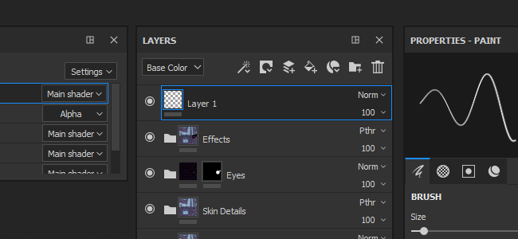
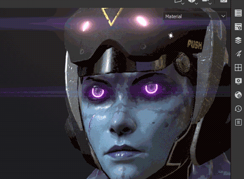
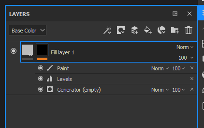

# Version 2018.1

**Substance Painter 2018.1** introduit une toute nouvelle interface avec de nombreux comportements améliorés. Les performances ont également été améliorées dans de nombreux domaines.

Date de publication : *15 mars 2018*

## Principales fonctionnalités

### Nouvelle interface et nouveaux comportements

{width="650px"}

Substance Painter 2018.1 introduit une **refonte complète de l&#39;interface**, allant de la couleur et des icônes aux comportements des widgets.

* La **nouvelle interface** se concentre sur l&#39;introduction d&#39;un tout nouveau design, ce qui facilite la lecture et simplifie la navigation.\
  Nous avons retravaillé toutes nos icônes pour être plus explicites. Nous avons également retravaillé notre palette de couleurs qui devrait maintenant être plus cohérente.\
  
* Nous avons amélioré de nombreux widgets, en particulier nos **curseurs**, pour qu&#39;ils soient plus **faciles à utiliser** avec un **Stylet tablette**.\
  Vous pouvez cliquer sur la barre pour déplacer le curseur ou utiliser le champ de valeur pour modifier les nombres avec plus de précision.\
   
* Nous avons une **nouvelle barre d&#39;outils** qui permet d&#39;ouvrir des **docks** à la volée.\
  En cliquant sur l’un des boutons de la barre d’outils, le Dock s’affiche à côté de son bouton et flotte au-dessus du reste de l’interface. En cliquant à nouveau sur le bouton, vous le fermez.\
  Si le dock s&#39;éloigne de son bouton, il devient une fenêtre flottante normale qui peut être ancrée dans l&#39;interface. S’il est fermé, le bouton sera à nouveau disponible dans la barre d’outils Ancrer.\
  Ce nouveau système de dock fonctionne plus facilement avec le plein écran. Il n&#39;est plus nécessaire que chaque dock soit toujours présent dans l&#39;interface.\
  
* Les docks utilisent désormais notre nouvelle **disposition de tabulation**, qui organise les éléments en sections tout en permettant un défilement rapide à l&#39;intérieur.\
  Cette disposition Onglet permet de **grandes fenêtres** et peut présenter **toutes les informations** en même temps, contrairement aux systèmes d&#39;onglets normaux qui masquent les informations.\
    
* Il existe désormais un **menu rapide**, qui rend les **propriétés de l&#39;outil** disponibles **directement dans le viewport**.\
  Pour ouvrir le menu rapide, il vous suffit de **cliquer avec le bouton droit de la souris dans le viewport**. Pour **fermer** le menu rapide, **cliquez à nouveau dans le viewport**.\
  Le menu ne se ferme que lorsque vous cliquez dans le viewport, ce qui permet de glisser-déposer des ressources de l’étagère directement dans le menu rapide.\
  
* Il y a maintenant une nouvelle **barre d&#39;outils contextuelle** en haut pour le viewport.\
  Cette barre d’outils modifie ses paramètres en fonction de l’outil actuellement utilisé. C’est un moyen d’accéder rapidement aux fonctionnalités de base des outils (comme l’épaisseur du pinceau).\
  
* Il est désormais possible de **réorganiser les effets** à l&#39;aide de la **fonction glisser-déposer** dans la **pile de calques**.\
  
* Bien que les raccourcis « **C** » et « **B** » vous permettent de visualiser rapidement le **canal** et les **textures Bakées** dans le **viewport**, il est désormais possible d&#39;utiliser la **liste déroulante unifiée** pour modifier l&#39;affichage du viewport.\
  En **haut à droite** du **viewport**, il y a maintenant une liste déroulante **Tous les canaux et toutes les Maps de maillage** (auparavant Mappages supplémentaires). Cette liste déroulante unifiée est également disponible dans le dock **Paramètres d&#39;affichage**.\
  
* Les **paramètres d&#39;affichage** et les **paramètres du visualiseur** ont été **fusionnés** dans un seul dock.\
  Les paramètres **Environnement**, **Caméra** et **Viewport** sont désormais regroupés **ensemble**, tandis que les paramètres **Shaders** ont été **déplacés** dans un **dock dédié**.\
  Les paramètres d&#39;affichage tirent désormais parti de la nouvelle **disposition de l&#39;onglet** pour naviguer rapidement dans la fenêtre.\
  

### Glissez-déposez des Matériaux et des Matériaux intelligents dans le Viewport

{width="650px"}

Vous pouvez désormais **glisser-déposer** des Matériaux et des Matériaux adaptables **directement dans le viewport**.\
Cette nouvelle action **mettra en surbrillance la géométrie** de l&#39;élément du **Jeu de textures cible** en même temps. Cette action permet de créer les nouveaux calques en haut de la pile de calques du Jeu de textures.

### Amélioration du comportement du stylet des tablettes

Dans cette version, nous avons amélioré la façon dont nous traitons les mouvements et les entrées du stylet de la tablette graphique, en particulier lorsque la Substance Painter est soumise à une charge importante.\
Nous ne perdons plus les intrants pendant que nous effectuons des calculs consécutifs. Cela devrait permettre des coups de pinceau précis dans toutes les situations.

### Amélioration du remplissage du seam

Nous avons retravaillé la façon dont nous produisions notre remplissage en dehors des Îlots UV. Au lieu de prendre le pixel courant et de le dilater sur une certaine distance, nous recherchons maintenant le pixel voisin de l’autre côté de l’UV et interpolons les deux valeurs.\
Cela donne un résultat final bien meilleur et réduit la visibilité de la division entre les Îlots UV, même lorsque les ratios textel ne correspondent pas.

<table>
<tr style="border: 0;">
<td style="border: 0;" valign="top">

{width="200px"}

</td>
<td style="border: 0;" valign="top">

{width="200px"}

</td>
</tr>
</table>

Ce nouveau remplissage est automatiquement généré après chaque coup de pinceau, changement de résolution ou modification de calque.

### Performances améliorées

{width="650px"}

Nous avons également amélioré les performances de cette version à plusieurs niveaux :

* L’ouverture et l’enregistrement du projet devraient être un peu plus rapides qu’auparavant.\
  Nous avons retravaillé la façon dont nous codons/décodons nos **données de peinture**. Cela affecte particulièrement les projets contenant beaucoup d’informations sur la peinture (coups de pinceau).
* Nous prenons désormais en charge de nombreux **sous-objets** avec des maillages.\
  Il n&#39;est plus obligatoire de fusionner un maillage en une seule pièce avant de le charger en Substance Painter. Les performances doivent rester bonnes même avec **8 000 sous-objets** dans un projet.
* Nous avons modifié la façon dont notre **viewport** est **actualisé** pour réduire la charge sur le GPU lors de la peinture.\
  Cela signifie que nous ne mettons plus à jour l’image entière, mais plutôt une petite zone dans laquelle vous travaillez actuellement.\
  Vous pouvez sentir la différence sur les GPU moins puissants ou lorsque vous utilisez un nombre d’échantillons élevé dans votre shader.
* Le système **étagère** est désormais **plus rapide** à découvrir lors du lancement de l&#39;application.\
  Les matériaux de Substance avec bitmaps intégrés sont **deux fois plus rapides** à découvrir (s&#39;ils sont cuits comme non solides). Des améliorations devraient également être apportées aux **paramètres prédéfinis**.

### Baker de position de scène globale

Nous avons maintenant un nouveau paramètre qui permet de baker une carte de position par Jeu de textures qui prend en compte la taille totale de la scène.\
Ce nouveau comportement permet d’utiliser dans les Générateurs de masque des projections triplanaires qui correspondent à l’ensemble de la scène au lieu de créer des seams comme auparavant. Cela est vraiment utile pour les projets qui ont beaucoup de Jeux de textures (comme les projets basés sur des UDIM).

Dans les paramètres du baker de position, modifiez le paramètre « **Échelle de normalisation** » de « **Par Matériau** » à « **Scène totale** » pour activer ce nouveau comportement.

### Nouveau contenu

Nous avons également ajouté du nouveau contenu dans cette version :

* Nouveaux **bruits 3D.**\
  Importé directement de la Substance Designer, 4 nouveaux bruits 3D et totalement homogènes ont été ajoutés à l&#39;étagère par défaut.\
  Ces nouveaux bruits s&#39;appuient sur la carte de position du projet pour générer un résultat sans aucun seam.
* **bruits non carrés**\
  Les bruits de base ont été mis à jour vers la dernière version de Substance Designer.\
  Cela signifie que la fonction d&#39;expansion non carrée est désormais disponible dans les paramètres de bruit.
* Nouveau générateur de masque **3D linear gradient.** Ce nouveau générateur de masque vous permet de créer un dégradé linéaire dans n’importe quelle direction de l’espace 3D.\
  La direction peut être définie avec deux positions 3D, qui peuvent être sélectionnées directement sur la carte de position.\
  Exemple :

1. &#x200B;
   1. Créez le générateur de masque **3D linear gradient** dans l&#39;un de vos calques
   1. Basculer l&#39;affichage du viewport vers « **Position** » (via la liste déroulante du viewport ou en utilisant la touche « **B** »)
   1. Cliquez sur le paramètre « **Début de la position 3D** » pour ouvrir le **Sélecteur de couleurs** contextuel
   1. **Choisissez une couleur** sur votre maillage **dans le viewport**
   1. Répétez le processus pour le deuxième paramètre « **Fin de la position 3D** »

      

* Nouveau modèle **Lens-studio** (application Contraindre Chat 3D).\
  Nous avons un nouveau modèle pour créer facilement des projets qui ciblent l&#39;application Lens-Studio créée par Contraint.\
  Un shader dédié et un paramètre prédéfini d’exportation sont également disponibles. Pour plus de détails sur Lens Studio, voir : <https://lensstudio.snapchat.com/>
* **Matériaux adaptables** et **Masques adaptables** ont été mis à jour avec la dernière version de nos Générateurs de masque.\
  Nos paramètres prédéfinis Smart prennent désormais tous en charge la fonctionnalité **micro détails** qui peut être utilisée avec **points d&#39;ancrage**.

### Nouvel exemple de projet

{width="650px"}

Il existe désormais un nouveau projet d&#39;exemple nommé « **TilingMaterial** » que vous pouvez ouvrir via l&#39;action de menu « **Fichier > Ouvrir un échantillon** ».\
Ce projet utilise un maillage plan simple avec des UV qui se chevauchent, ce qui permet de **peinture transparente** des matériaux et des coups de pinceau pour **créer des matériaux de répétition**.

{width="400px"}

## Tutoriel

Un nouveau tutoriel a été ajouté à Substance Academy pour couvrir notre nouvelle interface : [Prise en main de Substance Painter 2018](https://academy.allegorithmic.com/courses/a97b433a5997fd800b5ed300d783cc41/youtube-e-zpEL0Wcqg)

## Notes de mise à jour

### 2018.1.3

(Publié le 28 juin 2018)

**Ajouté :**

* Résumé : correctif
* [Préférences] Proposer d’enregistrer le projet au redémarrage de Painter

**Fixe :**

* [Module externe] La Substance Source de recherche ne fonctionne pas
* [Matériaux adaptables] L’importation de Matériaux adaptables entraîne parfois un crash
* [Matériaux adaptables] La suppression de Matériaux adaptables entraîne parfois un crash
* [Enregistrer] L’enregistrement entraîne un crash dans de rares cas
* [Étagère] L’option Inverser ne fonctionne pas sur les Cellules 2 et 3
* [Étagère] Erreur typographique dans certains Alpha
* [Étagère] Certains matériaux Substance ne s’affichent pas correctement

**Problèmes Connus :**

* Calcul bloqué sur les GPU AMD VEGA

### 2018.1.2

(Publié Le 6 Juin 2018)

**Ajouté :**

* Résumé : vitesse de Baking améliorée, système d’enregistrement amélioré, curseurs mis à jour, API de plug-in mise à jour, traduction chinoise, remplissage amélioré désormais facultatif
* [Baker] Amélioration des performances avec la nouvelle version de baker
* Forcer l’affichage de la boîte de dialogue avec un GPU incompatible
* [Enregistrer] Exposer la nouvelle fonctionnalité de projet compact (mode d’enregistrement complet/compact)
* [Enregistrer] Informer l’utilisateur en cas d’erreur d’enregistrement
* [Nettoyer] Prochain enregistrement en mode complet/compact
* [Curseurs] Amélioration de la précision des barres et curseurs de couleur/niveaux de gris
* [Curseurs] Ajout de commandes fléchées Haut/Bas
* [Curseurs] Même zone de détection pour les curseurs de couleur et de barre en niveaux de gris
* [Module externe] Enregistrement automatique toujours en mode incrémentiel
* [Plug-in] Option permettant de changer le style d’interface des plug-ins
* [Langue] Ajouter la traduction chinoise
* [Remplissage] Option permettant de basculer entre le remplissage voisin d’espace 3D et d’UV par Jeu de textures dans les paramètres de Jeu de textures
* [Script] Exposer le mode d’enregistrement : complet/compact ou incrémentiel
* [Script] Mise à jour de la documentation relative aux scripts/XML
* [Journal] Indiquer le mode d’enregistrement dans le journal (complet/compact ou incrémentiel)

**Fixe :**

* [Outil] Emplacement de canal transforme dans un emplacement de matériau sur les remplissages d&#39;un seul canal
* Crash lors du chargement d’un maillage (FBX) avec certaines faces non attribuées par un matériau
* Crash en Iray avec NVIDIA GRILLE 5.2 sur la machine virtuelle
* Crash lors de l’annulation d’une suppression de paramètre prédéfini de matériau
* Crash lors du chargement de certains projets
* [Ligne de commande] Nouvelle ligne de commande pour les maillages UDIM fractionnés par udim
* [Barre d’outils] Réduction de la barre d’outils
* [Instanciation] Impossible d’instancier aux bitmaps sur plusieurs jeux de textures
* [Viewport] L’actualisation n’est pas terminée lorsque vous peignez sur un maillage avec des UV en mosaïque
* [Iray] La Map normal est appliquée deux fois pour les diélectriques
* [Étagère] Fautes de frappe dans certains paramètres de Substance (alphas, procédures et matfx)
* [Étagère] Faute de frappe pour l’image bitmap « Personnel autorisé uniquement »
* [Script] La fonction alg.shaders.matériaux() ne fonctionne plus

**Problèmes Connus :**

* Calcul bloqué sur les GPU AMD VEGA

### 2018.1.1

(Publié Le 3 Avril 2018)

**Fixe :**

* [Tablette] Problème lors de la modification des choix d’interaction par défaut
* [Bakers] Crash avec la bibliothèque Assimp
* [Bakers] Régression sur la performance avec la carte A.O.
* [Iray] La Distorsion de l’objectif n’est pas appliquée au Canal Alpha
* [Pilotes] Mise à jour de la configuration minimale requise
* [3Dview] Les normales ne sont pas correctement générées sur les maillages UDIM sans informations de normales
* [Intel] Crash avec Substance Painter 2018.1.0
* [Intel]&#x200B;[Viewport] Problème de remplissage (artefacts noirs)

**Problèmes Connus :**

* Calcul bloqué sur les GPU AMD VEGA

### 2018.1

(Publié Le 15 Mars 2018)

**Ajouté :**

* Nouveau style global (icônes, couleur, comportement)
* Nouvelle disposition par défaut
* [Tablette] Amélioration de l’expérience utilisateur lors de la peinture
* [Menu principal] Trier d’abord les éléments natifs dans les affichages et les barres d’outils
* [Menu principal] Déplacer les actions de masque rapide dans la section viewport
* [Menu principal] Déplacer les actions de clic droit dans la section viewport
* [Menu principal] Renommez le menu « Affichage » en « Fenêtre ».
* [Menu rapide] Nouvelles propriétés d’outil par un clic droit dans viewport
* [Widget Ancrage] Nouvelle barre d’outils Ancrage pour une réduction/un rappel rapides
* [Paramètres d’affichage] Fenêtre de paramètres de la Caméra et de la visionneuse fusionnée
* [Pile de calques] Menu contextuel de clic droit
* [Pile de calques] Faites glisser et déposez pour déplacer n’importe quel effet dans le même calque
* [Barre d’outils] Réorganisation de la barre d’outils et nouvelle barre d’outils contextuelle
* [Barre d’outils] Diviser l’outil de duplication en deux outils distincts
* [Propriétés des outils] Valeur de niveaux de gris d’arrière-plan plus claire dans l’aperçu
* [Propriétés des outils] Organisation dans les onglets (remplissage et outils)
* [Outil] Le résultat de la peinture correspond au pochoir
* [Viewport] Nouveau curseur pour le calque de remplissage
* [Viewport] Navigation et peinture plus fluides (taux de cadre plus élevé)
* [Viewport] Zone de liste déroulante de sélection Matériau/Canal/Mappage dans viewport
* [Viewport] Réduire le scintillement lors de la rotation (ombre activée)
* [Étagère] Afficher les matériaux par défaut lors de l’ouverture de Painter
* [Étagère] Amélioration du temps de chargement des textures et matériaux de Substance (2 à 6 fois plus rapide)
* [Étagère] Réorganisez les dossiers des matériaux pour les adapter à la structure de la Substance Source
* [Étagère] Faites glisser et déposez les matériaux directement sur le maillage dans le viewport
* [Étagère] Nouveaux Bruits 3D (Perlin, Perlin Fractal, Simplex et Worley)
* [Étagère] Nouveau générateur de masque utilisant la position du maillage
* [Étagère] Mise à jour des Bruits de base pour prendre en charge l’extension non carrée
* [Étagère] Nouveau modèle et paramètre prédéfini d’exportation pour Lens Studio (application de Contraint) ajoutés
* [Étagère] Mise à jour des Matériaux adaptables et Masques adaptables pour utiliser la dernière version de l’éditeur de masques (micro détails)
* [Étagère] Nouvel exemple de projet « TilingMaterial » pour créer des matériaux de répétition homogènes
* [Étagère] Nouveaux paramètres prédéfinis de pinceau (Calligraphie, Humide, Hachures et ainsi de suite)
* [Curseurs] Nouveaux curseurs et style et comportement des niveaux de gris/barres de couleurs
* [Bakers] Autoriser l’utilisation du cadre de sélection de scène complet pour calculer le mappage de position
* [Shader] Supprimer le paramètre de force height des paramètres de shader par défaut
* [Moteur] moteur de Substance mis à jour
* [Moteur] Pas ou moins de discontinuités entre les UV (nouveau remplissage de seam)
* [Plug-ins] Importation plus rapide des matériaux téléchargés depuis Substance Source
* [Plug-ins] Mettez à jour tous les plug-ins pour qu’ils correspondent au nouveau style global
* [Préférences] Aperçu automatique des modifications de couleur d’arrière-plan
* [Propre] Réduction du risque de corruption du projet
* [Ouvrir] Ouverture de l&#39;amélioration du temps du projet
* [Nouveau projet] Nouveau projet - Amélioration du temps de mise à jour du maillage
* [Enregistrer] Enregistrement de l’amélioration du temps du projet
* [Journal] Type de licence signalé dans le journal
* [TextureSet] Renommez le bouton « Baking Textures » en « Baking Maps de maillage »
* Renommer « Mappages supplémentaires » en « Maps de maillage »

**Fixe :**

* [Viewport] Mauvaises performances avec des maillages contenant beaucoup de sous-objets
* [Propriétés des outils] Couche désactivée lors du glisser-déposer d’une image dans l’emplacement du matériau
* [Propriétés des outils] L’aperçu du pinceau ne fonctionne pas avec les outils Doigt et Dupliquer
* [Jeu de textures] L’ordre des canaux est incorrect lors de l’utilisation de modèles
* [Étagère] Icône manquante pour le générateur de Conversions en niveaux de gris
* [Étagère] Le numéro de cercle du signe alpha est cassé (police manquante).
* Détection incorrecte des GPU intégrés au lancement
* [Crash] Glissez-déposez une ressource importée nommée avec un caractère #
* [Moteur] Problème de détection de Vram sur le GPU intégré
* [Moteur] Correction de nombreux crashs dans l’Éditeur de liens de Substance Engine
* [Moteur] Artefacts carrés lors de la modification de la résolution
* [Effets de post-traitement] Le redimensionnement de l’interface est lent lorsque les effets de post-traitement sont activés
* L&#39;unité de Scène [Bakers] n&#39;est pas correctement respectée pour les valeurs de distance de rayon
* [Bakers] La valeur AO de la Distance d&#39;occlusion du Maillage est fixée à 1 quelle que soit la valeur d’entrée
* [Bakers] La correspondance par nom ignore certains maillages portant des noms spécifiques
* [Bakers] La couleur des paramètres Polygroupe de maillages et ID de sous-maillage renvoie toujours une image noire
* [Bakers] Le Baking d’ID échoue avec les maillages FBX binaires de Blender
* [Shader] Bruit dans la vue 2D avec dota-2 et non-pbr-spec-gloss
* [Linux] Un seul thread de processeur est utilisé lors du baking
* crash [MacOS] avec déplacement du curseur du pinceau sur le viewport

**Problèmes Connus :**

* Calcul bloqué sur les GPU AMD VEGA
* Post-traitement de distorsion non pris en compte lors de l’exportation dans Iray (canal Alpha)
