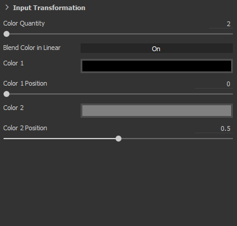

# Version 2018.2

**Substance Painter 2018.2** ajoute des fonctionnalités attendues depuis longtemps, telles que la peinture par diffusion de sous-surface, qui rendent la texturation encore plus facile qu&#39;auparavant.

Date de publication : *2 août 2018*

## Principales fonctionnalités

### Subsurface scattering

La **diffusion de sous-surface** est désormais prise en charge dans la fenêtre d&#39;affichage **en temps réel** et avec le **rendu Iray**.\
La diffusion sous la surface est un mécanisme de la lumière qui pénètre dans un objet ou une surface. Au lieu d&#39;être réfléchie, comme avec les surfaces métalliques, une partie de la lumière est absorbée par le matériau, puis **diffusée à l&#39;intérieur**. De nombreux matériaux dans la vie réelle ont une diffusion sous la surface comme la peau ou la cire.

Notre implémentation de l&#39;effet Subsurface est très proche des implémentations en temps réel d&#39;autres moteurs de jeu ainsi que d&#39;autres rendus hors ligne. Cela facilite la création de textures de diffusion à utiliser dans d&#39;autres applications.

{width="650px"}

Ci-dessus est un exemple avec le bien connu Digital Emily 2. Merci à l&#39;USC Institute for Creative Technologies et aux membres du projet Wikihuman de nous avoir permis de faire la démonstration de nos rendus avec les ressources Digital Emily 2.\
(Veuillez noter que cette comparaison a été effectuée dans des conditions d&#39;éclairage similaires mais non exactes, ce qui peut expliquer des différences visuelles.)

Pour ajouter une diffusion de sous-surface dans un projet, procédez comme suit :

1. Accédez à la fenêtre **Paramètres d&#39;affichage** et **activez** le paramètre **Dispersion de sous-surface**.
1. Ajouter un canal « **Diffusion** » dans le jeu de textures actuel
1. Utilisez un calque de remplissage ou **peignez en blanc** dans la nouvelle couche pour **révéler** l&#39;effet de sous-surface dans la clôture.

Une procédure plus détaillée est disponible dans la [documentation sur la diffusion souterraine](../../features/subsurface-scattering/subsurface-scattering.md).

>[!NOTE]
>
> Afin de prendre en charge la diffusion souterraine dans la fenêtre d&#39;affichage en temps réel, les **nuanceurs** dans les projets doivent être **mis à jour**.\
> Pour les nuanceurs personnalisés, consultez la documentation disponible dans le **menu d&#39;aide** pour savoir ce qui a changé dans le **API de shader**.

### Manipulateurs pour calques de remplissage

Les commandes Calques de remplissage ont été améliorées pour proposer des manipulateurs. Il est désormais plus facile de placer et de contrôler avec précision les projections de remplissage.

Lors de l&#39;utilisation de la **Projection UV**, un manipulateur apparaîtra dans la **vue 2D** :

* En cliquant sur **à l&#39;extérieur**, le manipulateur **fera pivoter** l&#39;élément.
* Cliquez sur le **carré** aux **bordures** pour le **redimensionner**.
* En cliquant sur **à l&#39;intérieur**, le manipulateur le **traduira**.
* Utilisez **CTRL** pour modifier plusieurs angles de **symétrie**.
* Utilisez **MAJ** pour **contraindre** une transformation (translation, rotation ou échelle).\
  

Lors de l&#39;utilisation de la **projection triplanaire**, un manipulateur apparaîtra dans la **vue 3D** :

* Le cube en pointillés représente la projection globale
* Utilisez le raccourci clavier **W**, **E** ou **R** pour basculer entre les modes **Traduire**, **Rotation** et **Échelle**.
* Utilisez le raccourci clavier **T** pour basculer entre les orientations Local et Univers pour le manipulateur.
* Utilisez **MAJ** pour **contraindre** la transformation.
* La projection du cube triplan peut également être modifiée dans les propriétés avancées du calque de remplissage :\
  \
  

La barre d&#39;outils contextuelle en haut de la fenêtre s&#39;adaptera également en fonction du mode de projection actuel, offrant des outils et des commandes supplémentaires :

Pour plus de détails, consultez la [documentation Remplir la couche](../../painting/fill-projections/fill-projections.md).

### Support non carré et sans labour pour l’outil Pochoir et Projection

Le paramètre de pochoir et l’outil de projection ont été améliorés pour prendre en charge les résolutions non carrées et les comportements sans labour.\
Le paramètre par défaut est désormais défini sur non labour par défaut. Ce paramètre peut être modifié dans les propriétés de l’outil :

Le mode de remplissage peut être défini comme suit :

* **Aucun carrelage** (par défaut)
* **Mosaïque horizontale**
* **Mosaïque verticale**
* **Limites H et V** (ancien comportement)

Ce nouveau paramètre peut être enregistré dans un outil ou un pinceau prédéfini, ce qui facilite son partage avec du contenu personnalisé.

>[!NOTE]
>
> * Le rapport de projection s’adaptera également aux fichiers de Substance qui produisent des résolutions autres que carrées. Le rapport sera calculé directement à partir du nœud de sortie.
> * Avec l’outil de projection, si plusieurs canaux ont des rapports différents, le premier rapport trouvé sera appliqué à tous les autres canaux.

### Importation et gestion de la caméra

Il est désormais possible d&#39;**importer des caméras personnalisées** à l&#39;intérieur de la Substance Painter en même temps que l&#39;importation de filet.\
Les caméras peuvent être sélectionnées **pour être parcourues** dans l&#39;**aire d&#39;affichage 3D** et utilisées **pour le rendu en iray**.

Pour plus de détails, consultez la [documentation sur la gestion de l&#39;appareil photo](../../interface/viewport/camera-management.md).

Pour **importer des caméras** dans un projet :

1. Exportez le filet du projet avec les caméras dans le même fichier (avec un format pris en charge tel que FBX, Alembic ou glTF)
1. Sélectionnez les paramètres « importer des caméras » dans la [fenêtre du nouveau projet](../../getting-started/project-creation.md) (ou la [configuration du projet](../../interface/project-configuration.md)).\
   
1. Basculez vers l&#39;appareil photo souhaité avec la liste déroulante dans la clôture ou en utilisant les paramètres dans les [Paramètres d&#39;affichage](../../interface/display-settings/camera-settings.md).\
   

Les paramètres de l’appareil photo dans la fenêtre Paramètres d’affichage ont été étendus pour contrôler les propriétés de l’appareil photo.\
Il est possible de **basculer** entre les appareils photo, de voir son **ratio** et de **verrouiller** ses propriétés pour éviter de le modifier. Un bouton de restauration peut être utilisé pour rétablir les valeurs initiales de la caméra.

Le cadre de la caméra (et son portail) est également pris en compte, ce qui permet de visualiser et de peindre via un point de vue très spécifique. L&#39;image et le portail sont affichés sur la fenêtre d&#39;affichage 3D et son opacité peut être contrôlée dans les **Paramètres de la fenêtre d&#39;affichage** à partir de la fenêtre [Paramètres d&#39;affichage](../../interface/display-settings/camera-settings.md) :

### Améliorations du comportement de la pile de calques

* **Glissez-déposez Matières et Matières intelligentes sur la carte d&#39;ID :**\
  Le glisser-déposer du contenu de l&#39;étagère dans la clôture a été amélioré. En appuyant sur **CTRL** tout en faisant glisser et en déposant un matériau, il est désormais possible de choisir la couleur d&#39;ID qui sera utilisée comme masque.\
  Un masque noir avec un effet de sélection de couleur sera ajouté au nouveau calque créé dans la pile de calques. Si le même matériau est glissé et déposé sur une autre couleur d’ID, le calque existant est mis à jour et les couleurs d’ID sont combinées.\
  
* **Glisser-déposer la pile de calques :**\
  Le déplacement de calques autour de la pile de calques s’effectue désormais dans une petite fenêtre.\
  Lorsqu’une ressource ou un calque est déplacé près des bordures de la fenêtre de la pile de calques, il commence automatiquement à faire défiler son contenu.\
  

### Importation de fichiers glTF et de filets alembic

De nouveaux formats de fichiers sont désormais pris en charge pour l’importation de maillages et la création de projets :

* **glTF** : ce format était déjà disponible lors de l&#39;exportation de textures et peut désormais être utilisé lors de l&#39;importation. Si un fichier glTF contient des textures, celles-ci sont importées et placées à l’intérieur de la pile de calques (pour le flux de production Métal/Rugosité).
* **Alembic** : ce format est largement utilisé dans l’industrie des effets visuels et de l’animation pour les maillages de transfert.

>[!NOTE]
>
> La Substance Painter ne permet pas de contrôler l’image de l’animation à importer pour le moment.\
> Cela signifie que lors de l’exportation d’un fichier Alembic, le cadre de référence à utiliser pour peindre sur la ressource doit déjà être défini.

### Améliorations de l’intégration des Substances

L’intégration de la Substance à l’intérieur de la Substance Painter a été améliorée avec des demandes attendues depuis longtemps :

* <b>Visible Si :</b>\
  Le « si visible » est une grande caractéristique du format de fichier de Substance de données qui permet de masquer les paramètres en fonction des conditions.\
  Cette fonctionnalité fournit une liste plus claire des paramètres et des paramètres contextuels, ce qui donne des matériaux et des filtres globalement plus faciles à utiliser.\
  Pour plus de détails, consultez la [documentation de la Substance Designer](https://experienceleague.adobe.com/en/docs/substance-3d-designer/home).\
  
* Les paramètres prédéfinis de Substance **prédéfinis de Substance** constituent un moyen simple d&#39;apporter des ajustements avancés et des variations de matériaux. De nombreux matériaux sur [Substance Source](https://source.allegorithmic.com) ont des préréglages. Essayez-les !\
  Si un fichier de Substance de données contient un ou plusieurs paramètres prédéfinis, une nouvelle liste déroulante dans la liste des paramètres sera disponible. Sélectionnez le paramètre prédéfini à appliquer pour mettre à jour les paramètres.\
  
* **Attributs de Substance**\
  Les attributs de Substance sont désormais affichés dans l’interface, ce qui facilite la récupération des informations relatives à un fichier spécifique.\
  Les attributs peuvent être affichés à deux endroits différents : au-dessus des paramètres dans la fenêtre des propriétés ou en cliquant avec le bouton droit de la souris sur une ressource dans l’étagère.\
   

### Nouvel exemple de projet « Jade Toad »

Un nouveau projet d&#39;exemple nommé « **JadeToad** » est désormais inclus dans Substance Painter. L&#39;effet **Dispersion de sous-surface** est activé par défaut pour cet exemple de projet.\
Pour trouver le projet, utilisez l&#39;entrée de menu **Fichier** > **Ouvrir l&#39;échantillon...**.

## Notes de mise à jour

### 2018.2.3

(Publié le 25 septembre 2018)

****Fixe :****

* [Vue 2D] La vue 2D est rompue avec certains maillages lors de la création d’un nouveau projet
* [Crash] Le passage de la Projection UV à la projection triplanaire entraîne un crash
* [RayCollider] Plusieurs blocages dus à « RayCollider »
* [Outil] Le changement de calque entraîne la perte des propriétés de forme modifiées
* Les paramètres du pinceau sont réinitialisés lors du passage à la gomme

**Problèmes connus :**

* Gel du calcul sur les GPU AMD VEGA
* Problème de tablette Huion avec les raccourcis sous Windows

### 2018.2.2

(Publié Le 11 Septembre 2018)

**Ajouté :**

* Résumé : correctif avec mise à jour du contenu, nouvelles fonctionnalités de script et possibilité de désactiver la mise à jour automatique
* [Contenu][Étagère] Ajouter une préconfiguration d’étagère Peau
* [Contenu][étagère] Conversion de 19 normales de peau en matériaux pour la diffusion sous la surface
* [Scripts] Créer un modèle de projet à partir d’un projet ouvert
* [Scripts] Obtenir/définir les paramètres d’exportation d’un projet ouvert
* [Mises à jour] Possibilité de désactiver la fenêtre contextuelle de mise à jour automatique à partir des paramètres et des variables d’environnement
* [Mises à jour] Ne pas afficher avant la prochaine version dans la fenêtre contextuelle de maintenance obsolète

**Fixe :**

* [Caméra] Zoom incorrect en passant de l’orthographique à la perspective
* [Affichage] Certaines cartes sont affichées en sRVB au lieu de sRVB
* [Fenêtres] Le focus de maillage ne se comporte pas correctement
* [Vue 2D] Le projet avec caméra cassée a des coques UV qui disparaissent
* [SSS][Info-bulle] les info-bulles de diffusion de la sous-surface apparaissent dans le journal
* Certains projets ne peuvent pas être ouverts dans 2018.2 et le message d’erreur ne peut pas enregistrer un package substance nulle
* [Masque] La couleur de l’outil Peinture peut être bloquée dans certains cas lorsque vous travaillez dans un masque
* [Matière] Cartes n&#39;apparaissant pas dans des situations spécifiques
* [Proj][Outils] Manipulateur actif avec un générateur
* [Substance] Groupes de paramètres de Substance manquants
* [Scripting] Nom de logiciel incorrect dans la documentation
* [UDIMs] Aucune information dans le journal sur les coques UV sur plusieurs tuiles UVs

**Problèmes connus :**

* Gel du calcul sur les GPU AMD VEGA
* Problème de tablette Huion avec les raccourcis sous Windows

### 2018.2.1

(Publié Le 3 Août 2018)

**Fixe :**

* Paramètres d&#39;ombrage de diffusion de sous-surface manquants dans les projets de mise à niveau

**Problèmes Connus :**

* Gel du calcul sur les GPU AMD VEGA
* Problème de tablette Huion avec les raccourcis sous Windows

### 2018.2

(Publié Le 2 Août 2018)

**Ajouté :**

* Résumé : version estivale, prise en charge de la diffusion sous la surface, améliorations de la projection et du remplissage, importation et sélection de l’appareil photo, prise en charge d’Alembic/glTF, glisser-déposer sur la carte d’identité, prise en charge améliorée du format de Substance et nouveau contenu
* [SSS][Fenêtre d&#39;affichage][Iray] Diffusion sous la surface générique
* [SSS] Synchronisation des paramètres de diffusion MDL et de subsurface
* [SSS] Ajout d’une nouvelle couche en niveaux de gris nommée « Diffusion »
* [SSS][Paramètres du nuanceur] Paramètre de type Diffusion pour la diffusion sous la surface (peau ou translucide)
* [SSS][Shader Settings] Paramètre d&#39;échelle de diffusion pour la diffusion de sous-surface
* [SSS][Paramètres de nuanceur] Paramètre de couleur de diffusion pour la diffusion de sous-surface
* [SSS][Paramètres d&#39;affichage] Nombre d&#39;échantillons de diffusion pour la diffusion de sous-surface
* [Shader][Iray] Intégrer la diffusion sous la surface MDL pour Iray
* [Shader] Mise à jour du shader via le programme de mise à jour des ressources
* [Shader] Mise à jour de l’API et de la documentation du journal des modifications
* [Propriétés de l&#39;outil][Proj] Nouveaux paramètres pour la projection triplanaire
* [Fenêtre d’affichage][Proj] Contrôle les propriétés du calque de remplissage dans la vue 3D directement avec les manipulateurs (projection triplanaire)
* [Raccourcis][Proj] Nouveaux raccourcis Q, W, E, R, T pour les manipulateurs de projection triplanaire
* [Fenêtre d’affichage][Proj] Contrôle les propriétés du calque de remplissage dans la vue 2D directement avec les manipulateurs (Projection UV)
* [Raccourcis][Proj] Nouveau raccourci Q pour les manipulateurs de Projection UV
* [Barre d’outils contextuelle][Proj] Contrôle des manipulateurs de projection triplanaire
* [Barre d’outils contextuelle][Proj] Manipulateurs de Projection UV de contrôle
* [Propriétés de l’outil] Désactiver la juxtaposition de textures avec les outils Projection et Pochoir
* [Pochoir] Utiliser des images non carrées avec l’outil de projection/le pochoir
* [Pochoir] Autoriser le contrôle du mode de mosaïque dans la fenêtre Propriétés
* [Pochoir] Le zoom n’est pas centré sur un pochoir sans mosaïque
* [Caméras] Importer des caméras depuis Maya, Max, Blender, Modo, DAE
* [Caméras][Fenêtre] Sélectionner et contrôler les caméras importées dans la fenêtre
* [Appareils photo][Iray] Sélectionnez et contrôlez les appareils photo importés en Iray
* [Caméras][Interface utilisateur][Nouveau projet][Configuration du projet] La case « Importer des caméras » est cochée par défaut
* [Appareils photo][Raccourcis] Ajoutez des raccourcis « &lt; » et « > » pour basculer entre les appareils photo
* [Caméras][Fenêtre] Ajouter une image dans la fenêtre
* [Caméras][Paramètres de la fenêtre] Contrôle de l’opacité de l’image
* [Appareils photo][Paramètres de l’appareil photo] distance focale maximale à 500 mm
* [Appareils photo][Paramètres de l’appareil photo] Ratio d’exposition
* [Caméras][Paramètres de la caméra] Ajouter une option de verrouillage
* [Caméras][Paramètres de la caméra] Ajouter une option de restauration
* [Caméras][Paramètres de la caméra] Ajouter l’attribut de distance focale
* [glTF] Importation d’un fichier glTF
* [glTF] Importer la carte d&#39;occlusion ambiante
* [Alembic] Importer l’image Alembic 1 avec une géométrie statique
* [Tablette] Faites glisser et déposez des matières directement sur le filet à l’aide de cartes d’ID avec un modificateur (CTRL/Commande)
* [Pile de calques] Création automatique d’un masque d’identification par glisser-déposer de matières sur le maillage avec des cartes d’identité
* [Pile de calques] Défilement automatique des calques avec glisser-déposer sur la pile de calques
* [UI][Propriétés de l’outil] Exposer le paramètre prédéfini de la Substance
* [UI][Menu Aide] Amélioration du menu Aide
* [UI][Nouveau projet][Configuration du projet] Réorganisation de la fenêtre
* [UI][Nouveau projet][Configuration du projet] Remplacer le terme « Filet » par « Fichier »
* [UI][Substance] Afficher les attributs de Substance dans l’interface utilisateur
* [Raccourcis] « F4 » passe de la vue 2D à la vue 3D
* [Raccourcis] Nouveaux raccourcis pour le gabarit à bascule « N » et le masque rapide « U »
* [Intégration de Substance de données] Tenir compte des instructions « visible if » dans les paramètres de Substance de données
* [Fenêtre d’affichage] Les ombres ne doivent pas être calculées de manière forcée après le déplacement de la caméra
* [Contenu] Mise à jour de MeetMat avec des caméras importées
* [Contenu] Ajouter un échantillon avec la diffusion de sous-surface activée - JadeToad
* [Content] Ajouter un nouveau modèle de projet PBR avec la diffusion de sous-surface activée
* [Contenu] Mise à jour des paramètres prédéfinis d’exportation pour ajouter un nouveau canal de diffusion
* [Contenu][Étagère] Ajout de la prise en charge de la diffusion sous la surface pour : pbr-metal-rugueux, pbr-metal-rugueux-alpha-test, pbr-coated, pbr-spec-gloss
* [Contenu][Étagère] Ajout d’un canal de diffusion à 5 matériaux intelligents (marbres et peaux)
* [Contenu][Étagère] 1 nouveau matériau en jade
* [Contenu][Étagère] 1 nouveau matériau en cire

**Fixe :**

* [CMD] Résultats différents avec la même ligne de commande et des versions différentes
* [TDR] Si TdrLevel est configuré, votre journal ne contient aucune erreur
* [Baker] La carte d’occlusion ambiante est inversée
* [ID Map] Blocage lors du prélèvement en dehors de la plage 0-1
* [Iris] Blocage lors du changement de texture et du retour au mode Peinture
* [Fenêtre d’affichage] Synchronisation des zones de dépôt entre les fenêtres par glisser-déposer
* [Moteur] Plus d’artefacts lors de la mosaïque de calques de remplissage ou de la peinture au pinceau
* [Licence] Vérification de la version du logiciel du service de licence incorrecte
* [Licence] Retravailler la façon dont nous traitons l’authentification
* [API] Appeler l&#39;événement d&#39;API de script `onNewProjectCreated` même lors de la création avec un modèle
* [Shader] Le shader compilé n&#39;est pas chargé du cache lorsque le fichier shader n&#39;est pas compilé
* [Tablette] L’exportation d’un fichier HDR à partir du tablette génère un fichier avec des valeurs verrouillées
* [Export] L&#39;export EXR colle des valeurs de couleur RGB comprises entre 0 et 1
* [Contenu] Le bruit procédural « 3D Perlin Noise Fractal » est pixellisé

**Problèmes Connus :**

* Gel du calcul sur les GPU AMD VEGA
* Problème de tablette Huion avec les raccourcis sous Windows
